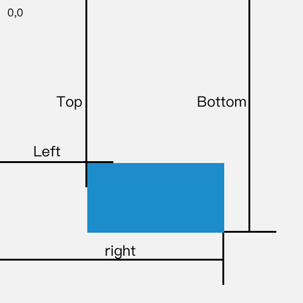

# 图片延迟加载


## Catalog
1. 图片延迟加载 (lazy loading of images)


## New Words


## Content
### 1. 图片延迟加载 (images lazy load)
- 图片懒加载是指图片元素滚动进入浏览器的可视区域后再进行加载.
  这是为了节省宽带资源和提高页面加载速度. 
  
  图片懒加载的实现, 牵扯到两个知识点: 
    + (1) 一个是**当前(页面)可视窗口(viewport)的高度**;
        - 可视窗口的高度, 在 IE9+ 以上的浏览器中可以使用 `window.innerHeight`
          属性获取. 在低版本 IE 的标准模式中, 可以使用
          `document.documentElement.clientHeight` 获取, 这里我们兼容 2
          种情况:
          ```js
            const viewportHeight = window.innerHeight ||
                    document.documentElement.clientHeight;
          ```
    + (2) 另一个是**元素距离可视窗口顶部的高度**.
        - 而**元素距离可视窗口顶部的高度**, 可以使用 `getBoundingClientRect()`
          方法来获取返回元素的大小及其相对于视口的位置. MDN 给出了非常清晰的解释:
          > 该方法的返回值是一个 DOMRect 对象, 这个对象时由该元素
            `getClientRects()` 方法返回的一组矩形的集合.
          
          > DOMRect 对象包含了一组用于描述边框的只读属性 --
            `left`, `top`, `right` 和 `bottom`, 单位为像素.
            除了 `width` 和 `height` 外的属性都是相对于视口的左上角位置而言的.
          
          其中需要引起我们注意啊的是 `left`, `top`, `right` 和 `bottom`,
          它们对应到元素上是这样的:
          
          
- **Additional Info:** 上面 2 个知识点在:
  `../../《JavaScript高级程序设计》/  Chapter12-DOM2和DOM3/chapter12-DOM2和DOM3.md` 的 `12.2.3`有更详细的讲解.

- 讲完了实现原理, 我们给出基础的图片懒加载的实现代码:
  ```js
    // - 获取所有的图片标签.
    const images = document.querySelectorAll('.lazy-element');
    
    // - 获取可视窗口的高度
    const viewportHeight = window.innerHeight
            || document.documentElement.clientHeight;
    
    // - num 用于统计当前显示了哪一张图片, 避免每次都从第一章图片开始检查是否露出
    let num = 0;
    function lazyLoading() {
        for (let i = num; i < images.length; i++) {
            // - 用可视窗口的高度 - 元素距离可视区域顶部的距离(top)
            let distance = viewportHeight
                    - images[i].getBoundingClientRect().top;
            // - 如果 distance >= 0, 说明元素已经出现在可视窗口中
            if (distance >= 0) {
                // - 给元素添加 src 属性以展示图片
                images[i].src = images[i].dataset.src;
                // - 前 i 张图片已经加载完毕, 下次从第 i + 1
                //   章开始检查图片是否在当前可视窗口中
                num = i + 1;
            }
        }
    }
    // - 监听 scroll 事件
    window.addEventListener('scroll', lazyLoading, false)
  ```
  上面的实现是一个最基本的图片懒加载. 但是大家要注意一点: 这个 scroll 事件,
  是一个**危险**的事件——它太容易被触发了。试想, 用户在访问网页的时候,
  是不是可以无限次地去触发滚动？尤其是一个页面死活加载不出来的时候,
  疯狂滚动鼠标滚轮（或者浏览器滚动条）的用户可不在少数啊！

  按照上面的逻辑, 用户的每一次滚动都将触发监听函数,
  频繁地响应某个事件将造成大量不必要的页面计算.
  因此, 我们需要针对那些有可能被频繁触发的事件作进一步地优化.
  这里就需要使用 `../01-事件的节流和防抖` 来改进代码.

  完整的代码示例见当统计目录的: `./lazy-image.html`
