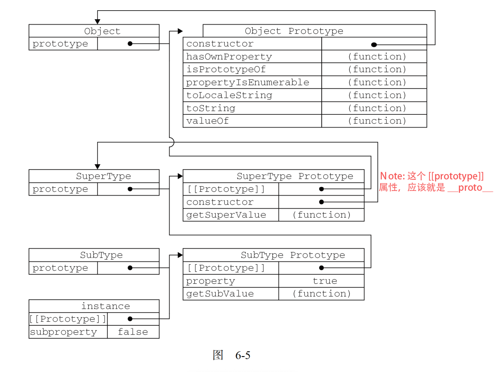

# JS 原型图讲解

> [待看文章](https://ulivz.com/2016/12/20/javascript-prototype/)


## ▲ Pre-Content

我们使用 `new` 创建一个构造函数的实例(一个对象)经历了什么?

答: 见 `../《Javascript设计模式与开发实践》/第1部分--基础知识/Chapter01-面向对象的javascript.md` 中的 `1.4.5` 


## 1. JS 原型图


## 2. JS 高程 6.3.1 原型链图



## 3. 结合 1 和 2 图的代码输出解说
```js
console.log(Object.prototype.__proto__);    // null

if (Object.__proto__ === Function.prototype) {
    // Object.__proto__  = Function.prototype: true
    console.log('Object.__proto__  = Function.prototype:', true);
}

// - Note: Function.prototype.__proto__ 指向 Object.prototype.
if (Function.prototype.__proto__ === Object.prototype) {
    console.log(true);  // true
}
```
