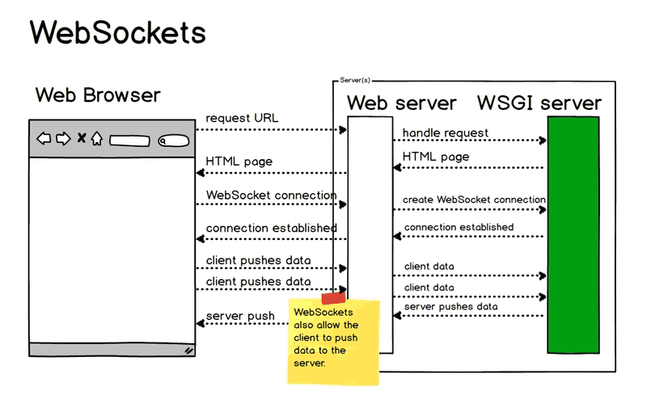

# JavaScript 集锦


## 目录(Catalog)
- (1) 考查 `var`、`let`、`const`:
- (2) 使用 `console.time()` 计算代码执行时间
- (3) `for` 循环和异步执行
- (4) 判断是否相等:
- (5) `break` / `continue` 使用:
- (6) `String` 知识点
- (7) `Array.prototype.reduce()` 方法考查
- (8) `this` 知识点
- (9) 判断一个对象是否为数组
- (10) 数组的 `splice()` 方法
- (11) `bind` 的实现
- (12) css 实现垂直居中的方法
- (13) 数组扁平化, 再去重
- (14) 正则相关知识
- (15) 继承
- (16) `Object.keys()` / `Object.getOwnPropertyNames()`
- (17) 网络安全
- (18) 从输入 `url` 到展示的过程
- (19) 负载均衡
- (20) JavaScript 排序
- (21) Vue 知识点
- (22) Webpack 相关知识
- (23) 怎么与服务器端保持连接
- (24) CND 的原理
- (25) 性能监控平台是如何捕获错误的
- (26) 性能优化从哪些方面入手?
- (27) 如何加快首屏渲染, 你有哪些方案?


## 生词(New Words)


## 内容(Content)
### (1) 考查 `var`、`let`、`const`
- ```js
    function sayHi() {
        console.log(name); // undefined
        console.log(age); // 报错: Cannot access 'age' before initialization
        var name = 'Jettech';
        let age = 21;
    }
  ```

### (2) 使用 `console.time()` 计算代码执行时间
- ```js
    var arr = [];
    for (var i = 0; i < 10000; i++) {
        arr.push(Math.random());
    }
    console.time("Code Runtime");
    arr.sort();
    console.timeEnd("Code Runtime");    
  ```

### (3) `for` 循环和异步执行
- ```javascript
    for (let i = 0; i < 3; i++) {
        setTimeout(()=> {console.log(i);}, 1);
    }
    console.log("i: ", i);

    for (var j =0; j < 3; j++) {
        setTimeout(() => {console.log(i);}, 1)
    }   
    console.log("j: ", j);
  ```

### (4) 判断是否相等
- ```javascript
    var a;
    var b = null;
    var c = NaN;
    console.log("a==b: ", a == b);
    console.log("a!=b: ", a != b);
    console.log("a==c: ", a == c);
    console.log("a!=c: ", a != c);
    console.log("b==c: ", b == c);
    console.log("b!=c: ", b != c);
    console.log("c==c: ", c == c);
    console.log("c!=c: ", c != c);
  ```

### (5) `break` / `continue` 使用
- ```javascript
    for (let i = 1; i < 5; i++) {
        if (i === 3) {
            continue;
        }
        console.log(i); // 1, 2, 4
    }
  ```

### (6) `String` 知识点
- ```javascript
    String.prototype.giveLydiaPizza = () => {
        return 'Just give...';
    };
    const name = new String('Lydia');
    console.log(name.giveLydiaPizza()); //
  ```

### (7) `Array.prototype.reduce()` 方法考查
+ ```javascript
    // - accumulator /ə'kjuːmjʊleɪtə/ n.累加器
    // - reduce /rɪ'djuːs/ v.减少, 降低, 缩小
    // - reducer /rɪ'djuːsə/ n.减速器, 还原剂

    // - reducer 函数接受 4 个参数:
    //    + 1. Accumulator (acc) (累加器: 上次回掉函数返回值/初始值)
    //    + 2. Current Value (cur) (数组当前值)
    //    + 3. Current Index (idx) (当前索引: 当前数组下标)
    //    + 4. Source Array (src)(源数组: 调用reduce 方法的数组)
    // - reduce 函数的返回值分配给累计器, 该返回值在数组的每一个迭代中被记住, 并最后成为
    //   最终的单个结值. 
    let arr = [
        [0, 1],
        [2, 3]
    ].reduce((acc, cur) => {
        return acc.concat(cur)
    }, [1, 2]);
    console.log(arr); // [1, 2, 0, 1, 2, 3]
  ```

### (8) `this` 知识点

### (9) 判断一个对象是否为数组
+ ```javascript
    function isArray(arg) {
        if (arg && typeof arg === "object") {
            return Object.prototype.toString.call(arg) === "[object Array]";
        }
        return false;
    }
  ```

### (10) 数组的 `splice()` 方法
+ ```javascript
    // - splice(): 參數1: 要删除的第一项的位置  參數2: 删除的项数
    //   从索引为 1 開始刪除 3 项, 删除后把 5,2,1 插入
    let myArr = [1, 2, 3, 4, 5];
    myArr.splice(1, 3, 5, 2, 1);         // 输出: [1, 5, 2, 1, 5]
    console.log(myArr);
  ```
### (11) `bind` 的实现
+ ```javascript
    Function.prototype.bind = function() {
        // 保存原函数
        let self = this;
        // 需要绑定的 this 上下文
        let context = [].shift.call(arguments);
        // 剩余的参数转成数组
        let args = [].slice.call(arguments);
        return function() {
            // 执行新的函数的时候, 会把之前传入的 context 当作新参数体内的 this
            // 并且组合两次分别传入的参数, 作为新函数的参数
            return self.apply(context, [].concat.call(args, [].slice.call(arguments)))
        }
    };
    const person = { name: "Lydia" };
    function sayHi(age) {
        console.log(`${this.name} is ${age}`);
    }

    // sayHi.call(person, 21);
    sayHi.bind(person, 21)();
  ```

### (12) css 实现垂直居中的方法
+ ```base
     (1)、绝对定位 + margin-top/margin-left 设为自身宽度的一半 + 负号(-)
     (2)、绝对定位 + left/top 设为自身宽度的一半 + 百分号(%)
     (3)、flex 布局 (display:flex)
     (4)、table -> table-cell 布局
  ```
  
### (13) 数组扁平化, 再去重
+ ```javascript
    let nums = [1, [1, [2, [3, [4]]]]];
    // - split(): 基于指定的分隔符将一个字符串分割成多个子字符串, 并将结果放在一个数组中. 
    console.log('nums.toString():', nums.toString());   // 1,1,2,3,4
    // - concat(): 基于当前数组中的所有项创建一个新数组.
let result = nums.toString().split(',').concat();
    
    // - (1) ES5 for 循环去重
    let save = [];
    for (let i = 0; i< result.length; i++) {
        if (save.indexOf(result[i]) === -1) {
            save.push(result[i]);
        }
}
    
    // - (2) ES6 利用 展开运算符(...) 和 new Set() 去重
    let save02 = [...new Set(result)];
console.log("save02: ", save02);
    
console.log(save);  // ["1", "2", "3", "4"]
    
    // ES6 利用 includes
    for (let i = 0; i< result.length; i++) {
        if (!save.includes(result[i])) {
            save.push(result[i]);
        }
}
    
    // ES6 利用 高阶函数reduce
    function uniq(arr){
        return arr.reduce((pre,cur)=>pre.includes(cur) ? pre :[...pre,cur],[])
  }         
  ```

### (14) 正则相关知识
+ ```javascript
    let str = 'today is 2019-07-19';
    let reg = /(\d{4})-(\d{2})-(\d{2})/;
    let splicing = "";
    if (reg.test(str)) {
        splicing += RegExp.$1 + RegExp.$2 + RegExp.$3;
    }
    console.log(splicing);  // 20190719
  ```
+ 更多讲解见仓库: `DataStructure-Algorithm-Learning/正则表达式/README.MD`

### (15) 继承
- 继承的所有知识见同级目录文档: `JS-继承.md` 
### (16) `Object.keys()` / `Object.getOwnPropertyNames()`
- ```javascript
      // - 要取得对象上所有可枚举的实例属性, 可以使用 ES5 的 Object.keys() 方法. 
      //   这个方法接受一个对象作为参数, 返回一个包含所有可枚举属性的字符串数组. 
      function Person(name, age, job) {
          this.name = name;
          this.age = age;
          this.job = job
      }

      Person.prototype.sayName = function () {
          console.log(this.name);
      };

      let p1 = new Person("Rob", 36, 'Software Engineer');

      let keys = Object.keys(Person.prototype);
      console.log("keys:",keys);          // ['sayName' ]

      let p1keys = Object.keys(p1);
      console.log(p1keys);        // [ 'name', 'age', 'job' ]

      // ~~~~~~ 示例 2: ~~~~~~
      let introduction = {
          name: 'W',
          age: 30,
          job: 'Software Engineer',
          doing: true
      };
      // ['name', 'age', 'job', 'doing' ]
      console.log(Object.keys( introduction));
    
      // - 如果想得到所有实例属性, 无论它是否可枚举, 可以使用
      //   Object.getOwnPropertyNames() 【取得自身属性名】方法:
      let keys2 = Object.getOwnPropertyNames(Person.prototype);
    
      // - 注意结果包含了不可枚举的 constructor 属性
      console.log("keys2:", keys2); // keys2: [ 'constructor', 'sayName' ]
  ```
  
### (17) 网络安全
- ```base
    XSS攻击: 注入恶意代码
    1.cookie 设置 httpOnly
    2.转义页面上的输入内容和输出内容
    
    CSRF: 跨站请求伪造, 防护:
    1.get 不修改数据
    2.不被第三方网站访问到用户的 cookie
    3.设置白名单, 不被第三方网站请求
    4.请求校验
  ```

### (18) 从输入 `url` 到展示的过程
1. DNS 解析
    
    + 完整讲解见: `\HTTP-Learning\DNS-解析.md`
2. TCP 连接
    + TCP连接的重要目的, 是为了保证消息的有序和不丢包, 为了建立可靠的数据传输,
      TCP 通信双方相互告知初始化序列号, 并确定对方已经收到ISN的,
      整个链接的过程就是我们俗称的 `三次握手`.
3. HTTP 请求和响应:
    + 发送 HTTP 请求的过程就是构建 HTTP 请求报文并通过 TCP
      协议发送到服务器指定端口的过程.

      当在地址栏输入 url 后, 浏览器会`分析`这个`url`, 并`设置好请求报文`发出. 
      请求报文中包括请求行(包括请求的方法, 路径和协议版本)、
      请求头(包含了请求的一些附加的信息, 一般是以键值的形式成对存在)、
      空行(协议中规定请求头和请求主体间必须用一个空行隔开)、
      请求主体(对于post请求, 所需要的参数都不会放在url中, 这时候就需要一个载体了,
      这个载体就是请求主体). 
      
      服务端收到这个请求后, 会根据 url 匹配到的路径做相应的处理, 
      最后返回浏览器需要的页面资源. 处理后, 浏览器会收到一个响应报文, 
      而所需要的资源就就在报文主体上. 与请求报文相同, 
      响应报文也有与之对应的起始行(响应报文的起始行同样包含了协议版本, 
      与请求的起始行不同的是其包含的还有状态码和状态码的原因短语)、
      响应头(对应请求报文中的请求头, 格式一致, 但是各自有不同的首部)、空行、
      报文主体(请求所需要的资源), 不同的地方在于包含的东西不一样. 
4. 浏览器渲染
    + 4.1 HTML parser --> DOM Tree
        - 4.1.1 标记化算法, 进行元素状态的标记
        - 4.1.2 dom 树构建
    + 4.2 CSS parser --> Style Tree
        - 4.2.1 解析 css 代码, 生成样式树
    + 4.3 attachment --> Render Tree
        - 4.3.1 结合 dom树 与 style树, 生成渲染树
    + 4.4 layout: 布局
    + 4.5 GPU painting: 像素绘制页面

### (19) 负载均衡

### (20) JavaScript 排序
- 见仓库: `《学习JavaScript数据结构与算法》/chapter13-排序和搜索算法/chapter13-排序和搜索算法.md`


### (21) Vue 知识点
#### Vue 的响应式原理中 Object.defineProperty 有什么缺陷？
- (1) Object.defineProperty 无法监控到数组下标的变化, 导致通过数组下标添加元素, 
  不能实时响应；
- (2) Object.defineProperty只能劫持对象的属性, 从而需要对每个对象, 每个属性进行遍历, 
   如果, 属性值是对象, 还需要深度遍历. Proxy可以劫持整个对象, 并返回一个新的对象. 
- (3) Proxy不仅可以代理对象, 还可以代理数组. 还可以代理动态增加的属性. 

#### 什么是RESTful API, 然后怎么使用？
- RESTful 是一个 api 的标准, 无状态请求. 请求的路由地址是固定的.  
- RESTful：给用户一个 url, 根据 method 不同在后端做不同处理：
  比如 post 创建数据, get 获取数据, put 和 patch 修改数据, delete 删除数据

#### v-if和v-show的区别
- v-show 只是在 display: none 和 display: block 之间切换, 只需要切换 CSS, DOM 
  还是一直保留着, v-show 在初始渲染时有更高的开销, 但是切换开销很小, 更适合频繁切换的场景.
  
- v-if 涉及到 vue 底层的编译, 当属性初始为 false 时组件不会被渲染, 直到条件为 true, 
  并且切换条件时会触发销毁/挂载组件, 切换时开销更高, 更适合不经常切换的场景

#### route和router的区别
- route 是路由信息对象, 包括 path, params, hash, query, fullPath, matched, name 
  等路由信息参数. 
- router 是路由实例对象, 包括了路由的跳转方法, 钩子函数

#### 怎么定义vue-router的动态路由？怎么获取传过来的值
- 在 router 目录下的index.js文件, 对path属性加上:id, 使用 router 对象的 params.id 获取

#### active-class是哪个组件的属性？嵌套路由怎么定义
- active-class 是 vue-router 模块中 router-link 组件的属性
- 使用 children 定义嵌套路由

#### 对keep-alive的了解
- keep-alive是一个内置组件, 可使被包含的组件保留状态或避免重新渲染, 有include
 （包含的组件缓存）和 exclude（排除的组件不缓存）两个属性. 

#### vue-cli如何新增自定义指令
```vue
    <template>
        // 3.指令的使用
        <div v-dir1></div>
        <div v-dir2></div>
    </template>
    <script type="text/javascript">
        export default {
            // 1.创建局部指令
            directives:{
                // 指令名称
                dir1: {
                    inserted(el){
                        // 第一个参数是当前使用指令的DOM
                        el.style.width = '200px';
                        el.style.height = '200px';
                        el.style.background = '#000'
                    }
                }
            }
        }
        // 2.全局指令
        Vue.directive('dir2', {
            inserted(el){
                console.log(el)
            }
        })
    </script>
```
#### vue如何自定义一个过滤器
```vue
    <template>
        <input type="text" v-model="msg" />
           <span>{{msg | capitalize}}</span>
    </template>
    <script type="text/javascript">
        export default  {
            data(){
                return{
                    msg: ''
                }
            },
            filters: {
                capitalize: function(value){
                    if(!value) return "";
                    value = value.toString();
                    return value.charAt(0).toUpperCase()+value.slice(1)
                }
            }
        } 
    </script>
```

#### extend能做什么
```javascript
    // 作用是扩展组件生成一个构造器, 通常与$mount一起使用. 
    // 创建组件构造器
        let Component = Vue.extend({
            template: '<div>test</div>'
        });
        // 挂载到#app上
        new Component().$mount('#app');

        // 扩展已有组件
        let SuperComponent = Vue.extend(Component);
        new SuperComponent({
            created(){
                console.log(1)
            }
        });
        new SuperComponent().$mount('#app')
```
#### computed和watch区别
- computed是计算属性, 依赖其他属性计算值, 并且 computed 的值有缓存, 只有当计算值变化
  才会返回内容 watch 监听到值的变化就会执行回调, 在回调中可以进行一些逻辑操作. 

#### vue中的MVVM模式
- 即 Model-View-ViewModel. 
- Vue 是以数据为驱动的, Vue自身将 DOM 和数据进行绑定, 一旦创建绑定, DOM 和数据将保持同步, 
  每当数据发生变化, DOM 会跟着变化. 
- ViewModel 是Vue的核心, 它是Vue的一个实例. Vue实例时作用域某个HTML元素上的, 这个 HTML 
  元素可以是body, 也可以是某个id所指代的元素. 
- DOM Listeners 和 Data Bindings 是实现双向绑定的关键. DOM Listeners 监听页面所有 
  View 层 DOM 元素的变化, 当发生变化, Model 层的数据随之变化；Data Bindings 监听 
  Model层的数据, 当数据发生变化, View 层的 DOM 元素随之变化. 

#### vue-router 有哪几种导航钩子
- A: 3种 
    + 1st 种是全局导航钩子: `router.beforeEach(to,from,next)`
        - 作用：跳转前进行判断拦截. 
    + 2nd 种：组件内的钩子；
    + 3rd 种：单独路由独享组件


### (22) Webpack 相关知识
#### webpack打包体积 优化思路
- (1) 提取第三方库或通过引用外部文件的方式引入第三方库
- (2) 代码压缩插件UglifyJsPlugin
- (3) 服务器启用gzip压缩
- (4) 按需加载资源文件 require.ensure
- (5) 优化devtool中的source-map
- (6) 剥离css文件, 单独打包
- (7) 去除不必要插件, 通常就是开发环境与生产环境用同一套配置文件导致
- (8) 开发环境采用增量构建, 启用热更新
- (9) 开发环境不做无意义的工作如提取css计算文件hash等
- (10) 配置devtool
- (11) 选择合适的loader
- (12) 个别loader开启cache 如babel-loader
- (13) 第三方库采用引入方式
- (14) 提取公共代码
- (15) 优化构建时的搜索路径 指明需要构建目录及不需要构建目录
- (16) 模块化引入需要的部分


### (23) 怎么与服务器端保持连接
- 第 (1) 种: 最简单粗暴的方法: 通过请求轮询(长轮询)保持跟服务端的通信, 
    + 缺点: 客户端不光要花成本维护定时轮询器, 还会使得服务器压力变大, 所以不推荐. 
- 第 (2) 种: 借助请求超时的设置, 将超时时间设置一个足够大的值, 客户端发起连接后,
  只要服务端不返回消息, 整个连接阶段都会受到阻塞, 所以这种方式也不推荐. 
- 第 (3) 种: 使用 WebSocket, 当服务器完成协议从 HTTP 到 WebSocket 的升级后,
  服务端可以主动推送信息给客户端, 解决了轮询造成的同步延迟问题. 由于 WebSocket
  只需要一次 HTTP 握手, 服务端就能一直与客户端保持通信, 直到关闭连接, 
  这样就解决了服务器需要反复解析 HTTP 协议, 减少了资源的开销. <br/>
  

### (24) CND 的原理
- CDN 的基本原理是**广泛采用各种缓存服务器**, 
  将这些缓存服务器分布到用户访问相对集中的地区或网络中, 在用户访问网站时,
  利用全局负载技术将用户的访问指向距离最近的工作正常的缓存服务器上,
  由缓存服务器直接响应用户请求. 最简单的 CDN 网络由一个 DNS
  服务器和几台缓存服务器就可以组成, 当用户输入 URL 按下回车, 经过本地 DNS 系统解析,
  DNS 系统会最终将域名的解析权交给
  [CNAME](https://zh.wikipedia.org/wiki/CNAME%E8%AE%B0%E5%BD%95)
  指向的 CDN 专用 DNS 服务器,
  然后将得到全局负载均衡设备的 IP 地址, 用户向全局负载均衡设备发送内容访问请求,
  全局负载均衡设备将实时地根据网络流量和各节点的连接,
  负载状况以及到用户的距离和响应时间等综合信息,
  将用户的请求重新导向离用户最近的服务节点上, 使用户可就近取得所需内容, 
  解决 Internet 网络拥挤的状况, 提高用户访问网站的响应速度.

### (25) 性能监控平台是如何捕获错误的
1. 全局捕获: 通过全局的接口, 将捕获代码集中写在一个地方, 可以利用的接口有:
    + (1) `window.addEventListener('error')` 或
      `window.addEventListener('unhandledrejection')` 或 `document.addEventListener(click')` 等.
    + (2) 框架级别的全局监听, 例如 aixos 中使用 interceptor 进行拦截,
      vue、react 都有自己的错误采集接口
    + (3) 通过对全局函数进行封装包裹, 实现在在调用该函数时自动捕获异常.
    + (4) 对实例方法重写（Patch）, 在原有功能基础上包裹一层, 例如对 
      console.error 进行重写, 在使用方法不变的情况下也可以异常捕获
2. 单点捕获: 在业务代码中对单个代码块进行包裹, 或在逻辑流程中打点, 
   实现有针对性的异常捕获:
    + (1) `try…catch`
    + (2) 专门写一个函数来收集异常信息, 在异常发生时,调用该函数.
    + (3) 专门写一个函数来包裹其他函数, 得到一个新函数, 
      该新函数运行结果和原函数一模一样, 只是在发生异常时可以捕获异常
    + 注: 详情可参见 Fundebug 发表的 《前端异常监控解决方案研究》

### (26) 性能优化从哪些方面入手?
1. 分屏加载: 当页面需要渲染的数据较多时, 先渲染首屏, 下滑时再加载第二屏的数据.
2. 图片大小优化: 在不影响视觉效果的前提下, 把图片尺寸降到最小.
3. 图片懒加载: on appear 时再加载图片.
4. Code Splitting(代码分割) / 拆包: 应用下的某些组件不需要立刻 import, 
   可以采用动态 import 的方式, 打包时也可以将它们打到不同的 bundle 里, 
   给 index bundle 瘦身.
5. Chrome Devtools - Trace & Timeline 等一系列强大的分析工具可以去研究一下,
   它们可以深入到内核分析应用的性能问题所在.
6. lighthouse
### (27) 如何加快首屏渲染, 你有哪些方案?
1. 降低请求量: 合并资源, 减少 HTTP 请求数, minify/gzip 压缩, webP, lazyload.
2. 加快请求速度: 预解析DNS, 减少域名数, 并行加载, CDN 分发.
3. 增加缓存: HTTP 协议缓存请求, 离线缓存 manifest, 离线数据缓存 
   localStorage, PWA.
4. 渲染优化: 首屏内容最小化, JS/CSS优化, 加载顺序, 服务端渲染, pipeline.


