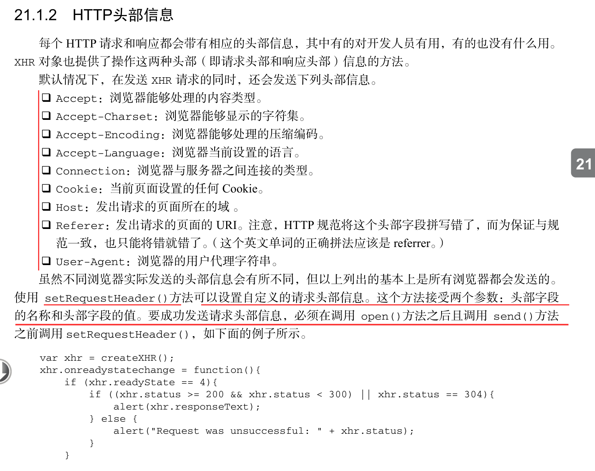
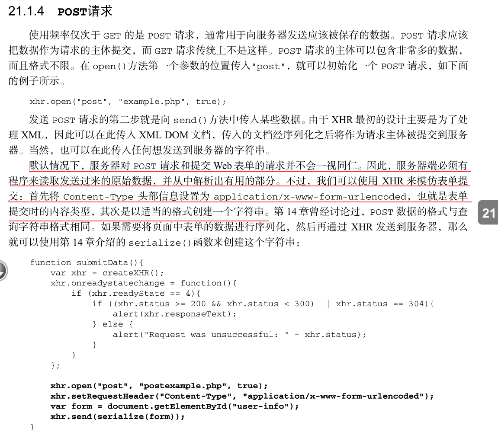

# 封装 Ajax 


## Table Of Contents
1. 封装 ajax


## New Words
- **asynchronous [ei'siŋkrənəs] (asyn-chro-nous) --adj.异步的**
    + Asynchronous task runner 异步任务执行器
- **splice [splaɪs] --vt.拼接; 接合. --n.拼接**
    + He spliced(vt) the two lengths of film together. 
      他把两段胶卷粘接起来.


## Content
### 1. 封装 ajax
- 原生 `ajax` 是 `Asynchronous Javascript + XML` 的简写.
  ajax 技術的核心 `XMLHttpRequest` 對象(簡稱 `XHR`).
  這是由微軟首先引入的一個特性其他瀏覽器後來都提供了相同的實現. 

  

  
##### (1) 先规定使用方法
- ```js
    let obj = {
        url: 'xxx',
        data: {key: value},
        type: 'get/post',
        success: function() {},
        error: function() {}
    };
  ```
##### (2) 实现源码
- 辅助函数: 拼接 JSON 
  ```js
    let spliceJson = function(data) {
        let arr = [];
        for (let name of data) {
            arr.push(name + '=' + data[name]);
        }
        // - 数组的 join() 方法: 把数组转换为字符串.
        // - 利用 '&' 拼接查询参数, 即这样: name:wang&gender:male
        return arr.join('&');       // {flag 1}
    };
  ```
  `flag 1`: 最常见的 URL 组成部分分析:
  `http://www.joes-hardware.com/inventory-check.cgi?item=12731&color=blue`
    + `http:` -- 方案(scheme)
    + `www.joes-hardware.com:80` -- 主机(host) 和 端(port)，此处端口省略
    + `inventory-check.cgi` -- 路径(path)
    + `item=12731&color=blue` -- 查询(query)

- 发送 ajax 的前提条件: **域名**, **端口**, **协议** 都必须相同.
  
  (1). XHR 对象, 第一个调用的方法是 `open()`, 接受三个参数
  `xhr.open('get', 'data.txt', true);` (Tip: 第三个参数默认为 true)
  
  (2). 要发送请求必须调用 `send()` 方法.  `send()` 方法接收一个参数, 
  即要作为请求主题发送的数据. 调用 `send()` 之后, 请求就会分派到服务器. 
    
  ```js
    let ajax = function(obj) {
        obj = obj || {};
        if (!obj.url) return;
        obj.data = obj.data || {};
        obj.type = obj.type || 'get';

        let timer = null;
        let xhr = null;

        if (window.XMLHttpRequest){
            xhr = new XMLHttpRequest();
        } else {
            xhr = new ActiveXObject('Microsoft.XMLHTTP');
        }

        switch(obj.type) {
            case 'get':
                // - `data.length > 0` 代表有参数时
                if (obj.data.length > 0) {
                    xhr.open('GET', obj.url + '?' + spliceJson(obj.data));
                } else {
                    xhr.open('GET', obj.url);
                }
                // - `send()` 发送请求
                xhr.send();
                break;
            case 'post':
                xhr.open('POST', obj.url, true);
                // - 使用 XHR 来模仿表单提交: 将 Content-Type 头部信息设置为
                //   `application/x-www-form-urlencoded.
                xhr.setRequestHeader('Content-Type',
                    'application/x-www-form-urlencoded');
                xhr.send(spliceJson(obj.data));
                break;
        }
        
        // - on ready state change 准备就绪状态更改
        xhr.onreadystatechange = function() {
            // - ready state 就绪状态.
            if (xhr.readyState === 4) {                             // {1}
                clearTimeout(timer);
                if (xhr.status >= 200 && xhr.status < 300
                    || xhr.status === 304) {                        // {2}
                    // - 接受成功返回的数据
                    obj.success && obj.success(xhr.responseText);   // {3}
                } else {
                    obj.error && obj.error(xhr.status);
                }
            }
        }
    }
  ```
  `行{1}` 多数情况下我们都是发送异步请求, 才能让 JavaScript 继续执行而不必等待响应. 
  此时, 可以检测 XHR 对象的 `readyState`(就绪状态) 属性, 该属性表示 请求/响应
  过程的当前活动阶段.  这个属性可取的值如下: 
    + `0`: 未初始化. 尚未调用 open()方法. 
    + `1`: 启动. 已经调用 open()方法, 但尚未调用 send()方法. 
    + `2`: 发送. 已经调用 send()方法, 但尚未接收到响应. 
    + `3`: 接收. 已经接收到部分响应数据. 
    + `4`: 完成. 已经接收到全部响应数据, 而且已经可以在客户端使用了
  
  `行{2}`. 在接收到响应后, 第一步是检查 `status` 属性, 以确定响应已经成功返回.
   一般来说, 可以将 HTTP 状态码作为返回的标志: 
    + `200`: 作为成功的标志. 此时, responseText 属性的内容已经就绪. 
    + `304`: 304状态码表示请求的资源没有被修改可以直接使用浏览器中缓存的版本. 

  `行{3}`. 在收到响应后, 响应的数据会自动填充 XHR 对象的属性, 相关属性如下:
    + (1) `responseText: 作为相应主题被返回的文本. 
    + (2) `responseXML: 如果响应的内容类型是"text/xml"或"application/xml", 
      这个属性中将保存包含着响应数据的 XML DOM 文档. 
    + (3) `status: 响应的 HTTP 状态. 
    + (4) `statusText: HTTP 状态的说明. 