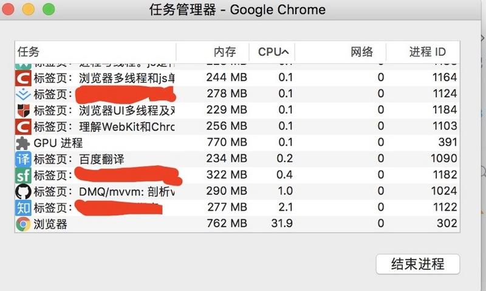
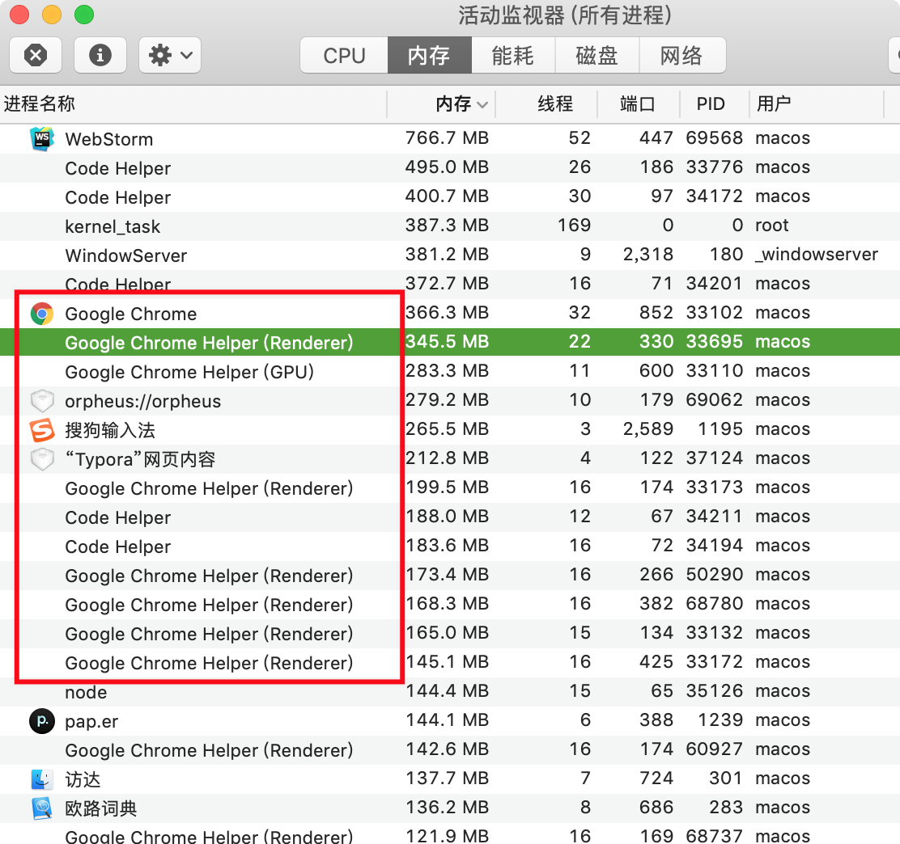
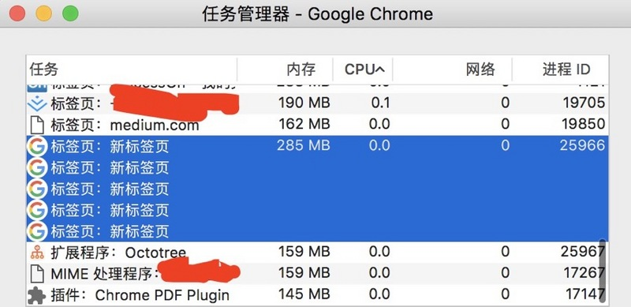
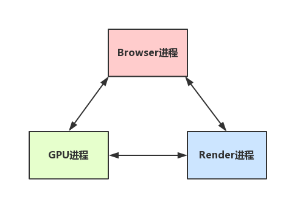

# 从浏览器多进程到  JS  单线程,  JS  运行机制最全面的一次梳理

- 原文章
  [从浏览器多进程到 JS 单线程,  JS 运行机制最全面的一次梳理](https://segmentfault.com/a/1190000012925872)

> Tip: 文章前半部分还是可以的, 后半部分(`5`, `6`, `7`.) 内容杂乱,
  请自行判断内容的正确度.

## Catalog
1. 区分进程和线程
2. 浏览器是多进程的
    + 2.1 浏览器都包含哪些进程？
    + 2.2 浏览器多进程的优势
    + 2.3 重点是浏览器内核(渲染进程)
    + 2.4 Browser进程和浏览器内核(Renderer进程)的通信过程
3. 梳理浏览器内核中线程之间的关系
    + 3.1 GUI渲染线程与 JS 引擎线程互斥
    + 3.2  JS 阻塞页面加载
    + 3.3 WebWorker, JS 的多线程？
    + 3.4 WebWorker与SharedWorker
4. 简单梳理下浏览器渲染流程
    + 4.1 load事件与DOMContentLoaded事件的先后
    + 4.2 css加载是否会阻塞dom树渲染？
    + 4.3 普通图层和复合图层
5. 从Event Loop谈 JS 的运行机制
    + 5.1 事件循环机制进一步补充
    + 5.1 单独说说定时器
    + 5.1 setTimeout而不是setInterval
6. 事件循环进阶: macrotask与microtask
7. 写在最后的话

## New Words
- **crash [kræʃ] --n.崩溃; 死机; 坠毁; 相撞. --vi.撞击声; 哗啦, 撞到.**
    + The plane crash was branded on his mind.
      飞机坠毁的情景铭刻在他的心中.
- **composite ['kɒmpəzɪt] --adj.混合的; 复合的. --n.复合材料, 合成物**
    + composite function. 复合函数
    + a composite photograph. 合成照片
    + English is a composite of many languages. 英语是多种语言混合而成的.

## Content

### 1. 区分进程和线程
- **Additional Info:** `进程(process)` 和 `线程(thread)` 的概念见仓库:
  `../../Node.js/进程和线程.md`

- 如果是windows电脑中, 可以打开任务管理器, 可以看到有一个后台进程列表. 对,
  那里就是查看进程的地方, 而且可以看到每个进程的内存资源信息以及cpu占有率. 

  

### 2. 浏览器是多进程的
- 理解了 `进程` 与 `线程` 了区别后, 接下来对浏览器进行一定程度上的认识:
    + (1) 浏览器是多进程的
    + (2) 浏览器之所以能够运行, 是因为系统给它的进程分配了资源(cpu、内存)
    + (3) 简单点理解, 每打开一个Tab页, 就相当于创建了一个独立的浏览器进程. 

  关于以上几点的验证, **再上一张图验证**;

  

  图中打开了 Chrome 浏览器的多个标签页, 然后可以在 `Chrome 的任务管理器`
  中看到有多个进程(分别是每一个 Tab 页面有一个独立的进程, 以及一个主进程). 
  感兴趣的可以自行尝试下, 如果再多打开一个Tab页, 进程正常会+1以上

- **注意:** 在这里浏览器应该也有自己的优化机制, 有时候打开多个 Tab页后, 
  可以在 Chrome 任务管理器中看到, 有些进程被合并了
  (所以每一个Tab标签对应一个进程并不一定是绝对的)

#### 2.1 浏览器都包含哪些进程？
- 目前 Chrome 浏览器的架构进程有下面几个:
    + (1) `Browser 进程(浏览器主进程))`: 浏览器的主进程(负责协调、主控),
      只有一个. 作用有:
        - 负责浏览器界面显示, 与用户交互. 如前进, 后退等
        - 负责各个页面的管理, 创建和销毁其他进程
        - 将 Renderer 进程得到的内存中的 Bitmap, 绘制到用户界面上
        - 网络资源的管理, 下载等
        - 也提供存储等等功能.
    + (2) `Render Process(渲染进程)`: 核心任务是将 HTML, CSS 和 JavaScript
      转换为用户可以与之交互的网页, 排版引擎 Blink 和 JavaScript 引擎 V8
      都是运行在该进程中, 默认情况下, Chrome 会为每个 Tab 标签创建一个渲染进程.
      处于安全考虑, 渲染进程都是运行在沙箱模式下.
    + (3) `GPU 进程 (GPU Process)`: 其实, Chrome
      刚开始发布的时候是没有 GPU 进程的. 而 GPU 的使用初衷是为了实现 3D CSS 的效果,
      只是随后网页、Chrome 的 UI 界面都选择采用 GPU 来绘制, 这使得 GPU
      成为浏览器普遍的需求. 最后, Chrome 在其多进程架构上也引入了 GPU 进程. 
    + (4) `插件进程(Plugin Process)`: 主要负责插件的运行, 因插件易崩溃,
      所以需要插件进程来隔离, 以保证插件进程崩溃不会对浏览器和页面造成影响.
      每种类型的插件对应一个进程, 仅当使用该插件时才创建.
    + (5) `网络进程(Network Process)`: 主要负责页面的网络资源加载,
      之前是作为一个模块运行在浏览器进程里的, 直到最近才独立出来, 成为一个单独的进程.
- 浏览器未来面向服务的架构(Services Oriented Architecture, 简称 SOA)
    + 更多内容见此
      [文章](https://blog.poetries.top/browser-working-principle/guide/part1/lesson01.html#%E7%9B%AE%E5%89%8D%E5%A4%9A%E8%BF%9B%E7%A8%8B%E6%9E%B6%E6%9E%84)
      
      例如下图:

      
      
      **Added:** 图中的信息提示
        + (1) `PID (Process Identifier 进程控制符)`: 又略称为 `进程 ID`
          是大多数操作系统的内核用于唯一标识进程的一个数值,
          这一数值可以作为许多函数调用的参数,
          以使调整进程优先级、杀死进程之类的进程控制行为成为可能. 
        + (2) `线程` 一列, 每行中的 `线程` 数, 显示的是当前进程使用的线程数,
          即当前进程有几个线程.
- 强化记忆: **在浏览器中打开一个网页相当于新起了一个进程(进程内有自己的多线程)**

  当然, 浏览器有时会将多个进程合并(譬如打开多个空白标签页后,
  会发现多个空白标签页被合并成了一个进程), 如图

  

  另外, 可以通过 Chrome 的 `更多工具 -> 任务管理器` 自行验证

#### 2.2 浏览器多进程的优势
- 相比于单进程浏览器, 多进程有如下优点: 
    + (1) 避免单个 page crash 影响整个浏览器
    + (2) 避免第三方插件 crash 影响整个浏览器
    + (3) 多进程充分利用多核优势
    + (4) 方便使用沙盒模型隔离插件等进程, 提高浏览器稳定性
- 当然, 内存等资源消耗也会更大, 有点空间换时间的意思. 

#### 2.3 对前端比较重要的 `Renderer 进程(渲染进程)` (浏览器内核)
- 可以这样理解, 页面的渲染, JS 的执行, 事件的循环, 都在这个进程内进行.
  接下来重点分析这个进程
- **请牢记, 浏览器的渲染进程是多线程的**
- 那么接下来看看它都包含了哪些线程(列举一些主要常驻线程): 
    1. `GUI 渲染线程`
        - 负责渲染浏览器界面, 解析 HTML, CSS, 构建 DOM 树和 RenderObject 树,
          布局和绘制等. 
        - 当界面需要重绘(Repaint) 或由于某种操作引发回流(reflow) 时,
          该线程就会执行.
        - 注意, **`GUI 渲染线程` 与 `JS 引擎线程`是互斥的**,
          当 JS 引擎执行时 GUI 线程会被挂起(相当于被冻结了),
          GUI 更新会被保存在一个队列中**等到 JS 引擎空闲时** 立即被执行. 
    2. `JS 引擎线程`
        - 也称为 JS 内核, 负责处理 Javascript 脚本程序. (例如 V8 引擎)
        - JS 引擎线程负责解析 Javascript 脚本, 运行代码. 
        - JS 引擎一直等待着任务队列中任务的到来, 然后加以处理, 一个 Tab 页
          (renderer 进程)中无论什么时候都只有一个 JS 线程在运行 JS 程序.
        - 同样注意, **`GUI 渲染线程` 与 `JS引擎线程` 是互斥的**,
          所以如果 JS 执行的时间过长, 这样就会造成页面的渲染不连贯,
          导致页面渲染加载阻塞. 
    3. `事件触发线程`
        - 归属于浏览器而不是 JS 引擎, 用来控制事件循环(可以理解,  JS
          引擎自己都忙不过来, 需要浏览器另开线程协助);
        - 当 JS 引擎执行代码块如 `setTimeOut` 时 (也可来自浏览器内核的其他线程,
          如鼠标点击、AJAX 异步请求等), 会将对应任务添加到事件线程中;
        - 当对应的事件符合触发条件被触发时, 该线程会把事件添加到待处理队列的队尾,
          等待 JS 引擎的处理;
        - 注意, 由于 JS 的单线程关系, 所以这些待处理队列中的事件都得排队等待 JS
          引擎处理(当 JS 引擎空闲时才会去执行)
    4. `定时触发器线程`
        - 传说中的 `setInterval` 与 `setTimeout` 所在线程
        - 浏览器定时计数器并不是由 `JS 引擎线程` 计数的,
          (因为 JS 引擎是单线程的, 如果处于阻塞线程状态就会影响记计时的准确);
        - 因此通过单独线程来计时并触发定时(计时完毕后, 添加到事件队列中, 
          等待 JS 引擎空闲后执行);
        - 注意, W3C 在 HTML 标准中规定, 规定要求 `setTimeout`
          中低于 4ms 的时间间隔算为 4ms. 
    5. `异步 http 请求线程`
        - 在 XMLHttpRequest 在连接后是通过浏览器新开一个线程请求;
        - 将检测到状态变更时, 如果设置有回调函数, 异步线程就**产生状态变更事件**,
          将这个回调再放入事件队列中. 再由 JS 引擎执行. 
- **Additional Info:** 我们平时所说的 `Web 应用编程接口 (Web API)` 是什么?
    + A: 我现在的理解是, 它是对 `渲染(Render) 进程` 中多个线程的集合称谓,
      上面的 `事件触发线程`/`定时触发线程`/`异步 http 请求线程` 等等,
      都包含在 `WebAPI` 之内. (**Warning:** 由于没有找到资料,
      所以不知道这个理解到底对不对!)

#### 2.4 `Browser 进程` 和 `Renderer 进程` 的通信过程
- 如果自己打开任务管理器, 然后打开一个浏览器, 就可以看到:
  任务管理器中出现了两个进程(一个是`主控进程`, 一个则是打开 Tab 页的 `渲染进程`), 
  然后在这前提下, 看下整个的过程: (简化了很多很多!!!)
    + (1) `Browser 进程` 收到用户请求, 首先需要获取页面内容
      (譬如通过网络下载资源), 随后将该任务通过 `RendererHost 接口`
      传递给 `Render 进程`.
    + (2) `Renderer 进程` 的 `Renderer 接口` 收到消息, 简单解释后,
      交给 `渲染线程`, 然后开始渲染:
        - `渲染线程` 接收请求, 加载网页并渲染网页, 这其中可能需要 `Browser 进程`
          获取资源和需要 `GPU 进程` 来帮助渲染.
        - 当然可能会有 `JS 线程`操作 DOM(这样可能会造成回流并重绘)
        - 最后 `Render 进程` 将结果传递给 `Browser进程`
    + (3) `Browser 进程` 接收到结果并将结果绘制出来.

  这里绘一张简单的图: (很简化)

  
  
### 3. 梳理浏览器内核中线程之间的关系
#### 3.1 GUI渲染线程与 JS 引擎线程互斥
- 由于 JavaScript 是可操纵 DOM 的, 如果在修改这些元素属性同时渲染界面
  (即 `JS 线程` 和 `GUI 线程` 同时运行),
  那么渲染线程前后获得的元素数据就可能不一致了. 

  因此为了防止渲染出现不可预期的结果, 浏览器设置 `GUI 渲染线程` 与 `JS 引擎`
  为互斥的关系, 当 `JS 引擎` 执行时 `GUI 线程` 会被挂起,
  GUI 更新则会被保存在一个队列中等到 `JS 引擎线程` 空闲时立即被执行.

#### 3.2 JS 阻塞页面加载
- 从上述的互斥关系, 可以推导出, JS 如果执行时间过长就会阻塞页面. 
  
  譬如, 假设 JS 引擎正在进行巨量的计算, 此时就算 GUI 有更新, 也会被保存到队列中,
  等待 JS 引擎空闲后执行. 如果 JS 引擎的计算时间过长, GUI 线程无法工作,
  便会出现我们所说的卡顿现象.
  
  所以, 要尽量避免 JS 执行时间过长, 这样就会造成页面的渲染不连贯,
  导致页面渲染加载阻塞的感觉. 

  **TIP:** 不止浏览器中需要避免 JS 计算时间过长的问题, 在 Node.js
  中也要非常注意这个问题.

#### 3.3 WebWorker, JS 的多线程？
- 前文中有提到 JS 引擎是单线程的, 而且 JS 执行时间过长会阻塞页面, 
  那么 JS 就真的对 CPU 密集型计算无能为力么?

  所以, 后来 HTML5 中支持了 `Web Worker`. 

- `Web Worker` 的创建和执行过程如下:
    + (1) 创建 `Worker` 时, JS 引擎向浏览器申请开一个 `子线程`
      (子线程是浏览器开的, 完全受主线程控制, 而且不能操作 DOM)
    + (2) `JS 引擎线程` 与 `Worker 线程` 间通 过特定的方式通信
      (`PostMessage API`, 需要通过序列化对象来与线程交互特定的数据)
    
  所以, 如果有非常耗时的工作, 请单独开一个Worker线程, 
  这样里面不管如何翻天覆地都不会影响 JS 引擎主线程, 只待计算出结果后, 
  将结果通信给主线程即可, perfect!
  
  而且注意下, JS 引擎是单线程的, 这一点的本质仍然未改变, `Worker`
  可以理解是浏览器给 JS 引擎开的外挂, 专门用来解决那些大量计算问题. 

  其它, 关于Worker的详解就不是本文的范畴了, 因此不再赘述. 
#### 3.4 WebWorker 与 SharedWorker
- 既然都到了这里, 就再提一下 `SharedWorker` (避免后续将这两个概念搞混)

  `Web Worker` 只属于某个页面, 不会和其他页面的 `Render 进程`(浏览器内核进程)
  共享, 所以 Chrome 在 `Render 进程` 中 (每一个 Tab 页就是一个 `Render 进程`)
  创建**一个新的线程**来运行 Worker 中的 JavaScript 程序. 
  
  `SharedWorker` 是浏览器所有页面共享的, 不能采用与 Worker 同样的方式实现,
  因为它不隶属于某个 Render 进程, 可以为多个 Render 进程共享使用.
  
  所以 Chrome **浏览器为 `SharedWorker` 单独创建一个进程**来运行 JavaScript
  程序,在浏览器中每个相同的 JavaScript 只存在一个 `SharedWorker 进程`,
  不管它被创建多少次. 
  
  看到这里, 应该就很容易明白了, 本质上就是 `进程` 和 `线程` 的区别. 
  **SharedWorker 由独立的进程管理, WebWorker 只是属于 Render 进程下的一个线程**.

### 4. 简单梳理下浏览器渲染流程
- 此章节讲解过于简单, 请参考别的文章: 应该主要有两部分
    + (1) 浏览器中输入网址:
        - (1) DNS 解析, 将域名解析成 IP 地址 
        - (2) TCP 连接: TCP 三次握手
        - (3) 发送 http 请求 
        - (4) 服务器处理请求并返回 HTTP 报文
        - (5) 浏览器解析并渲染页面
        - (6) 断开连接: TCP 四次挥手
    + (2) 浏览器拿到内容后, 渲染大概分为以下几步:
        - (1) 解析 html 建立 DOM 树
        - (2) 解析 CSS 构建 render 树(注: 将 CSS 代码解析成树形的数据结构,
          然后结合 DOM 合并成 render 树)
        - (3) 布局 render 树(layout/reflow), 负责各元素尺寸, 位置的计算.
        - (4) 绘制 render 树(paint), 绘制页面像素信息
        - (5) 浏览器会将各层的信息发个给 GPU (GPU Process 进程), GPU
          会将各层合成(composite), 显示在屏幕上.
        - (6) 渲染完毕后是 `load` 事件, 之后就是 JS 逻辑处理了.

  
#### 4.1 load事件与DOMContentLoaded事件的先后
- 上面提到, 渲染完毕后会触发 `load` 事件, 那么 `load` 事件与
  `DOMContentLoaded` 事件谁的触发事件更早?

  答: 顺序是 `DOMContentLoaded` --> `load`

  当 `DOMContentLoaded` 事件触发时, 仅当 DOM 加载完成, 不包括样式表, 图片.
  (譬如如果有 `async` 加载的脚本就不一定完成)

  当 `onload` 事件触发时, 页面上所有的 DOM, 样式表, 脚本, 图片都已经加载完成了
  (渲染完毕了).

#### 4.2 css加载是否会阻塞dom树渲染？
#### 4.3 普通图层和复合图层

### 5. 从Event Loop谈 JS 的运行机制
#### 5.1 事件循环机制进一步补充
#### 5.1 单独说说定时器
#### 5.1 setTimeout而不是setInterval

### 6. 事件循环进阶: macrotask与microtask

### 7. 写在最后的话

