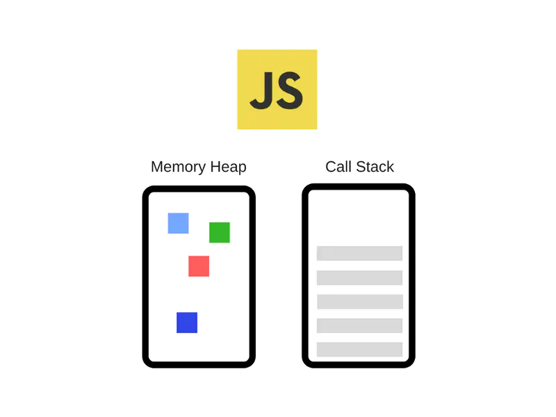
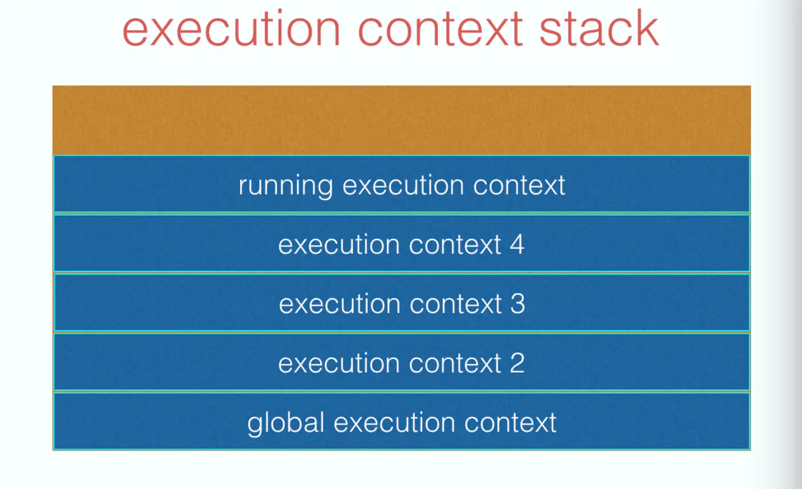
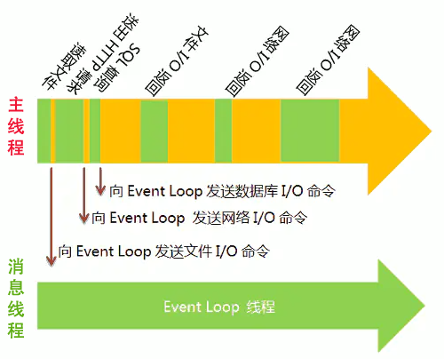
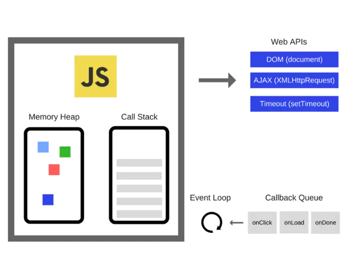

# 详解: 执行栈, 任务队列, 事件循环

- Hint: 本文内不包含  `变量对象`, `this`, 
  `引用类型 (Reference Type)`, `作用域链 (Scope Chain)`... 这些概念的讲解, 
  
- 参考文章
    + [浏览器事件循环机制(event loop)](https://juejin.im/post/5afbc62151882542af04112d#comment)
    + [宏任务和微任务: 不是所有的任务都是一个待遇](https://blog.poetries.top/browser-working-principle/guide/part4/lesson18.html#%E5%AE%8F%E4%BB%BB%E5%8A%A1)


## Catalog
1. JavaScript 单线程的由来
2. JS 引擎的主要组成
3. 执行栈 (Call Stack)
4. 事件循环(event loop) 是什么?
5. Web API 是什么?
6. 浏览器中的事件循环 和 任务队列/回调队列(Callback Queue/ Event Queue)
7. 宏任务(macro-task)和微任务(micro-task)
8. event loop 中的 Update the rendering (更新渲染)


## New Words
- **asynchronous [ei'siŋkrənəs] (asyn-chro-nous) --adj.异步的**
    + Asynchronous task runner 异步任务执行器
- **heap [hiːp] --n.堆, 积累**
    + Heap sort 堆排序
    + Heap memory 堆内存
    + heaps of: 大量；许多
    + a heap of: [口]一大堆, 许多
    + heap up: 堆积
    + Not to say these things, here to do what heap ah!
        这些东西说了不要了, 堆在这里做什么啊！
- **stack [stæk] --n.堆; [常 -s] 大量[of]; 堆栈,栈.  --v.堆放, 堆积**
    + a stack of firewood. 一堆木材. 
    + stacks of work. 堆积如山的工作
    + a stack of boxes. 一堆盒子. 
    + call stack. 调用栈, 调用堆栈
    + Mathematics Stack Exchange 数学堆栈交换
- **execution [ˌeksɪ'kjuːʃ(ə)n] --n.执行, 实行**
    + execution context 执行上下文
    + execution command 执行指令
    + break execution 中断执行


## Content

### 1. JavaScript 单线程的由来
- **Additional Info:** `进程` 和 `线程` 的概念见仓库:
  `../../Node.js/进程和线程.md`
- JS 是单线程的, 就是它一次只能执行一段代码.
  JS 中其实是没有线程概念的, 所谓的单线程也只是相对于多线程而言.
  我们把 JS 这种不具备并行任务处理的特性, 我们称之为 "单线程". 
  
  虽然 JS 运行在浏览器中是**单线程**的, 但是不要忘记, 浏览器本身是**多进程**的.
    + 多进程: multi-process
    + 单线程: single thread 
    + JS 运行在: 单个进程(Process)的单个线程(thread)上.
        - 好处是: 在没有多线程的情况下, 没有锁, 没有线程同步问题. 

### 2. JS 引擎的主要组成
- JavaScript 引擎是一个专门处理 JavaScript 脚本的虚拟机, 一般会附带在网页浏览器中,
  比如最出名的就是 Chrome 浏览器的 V8 引擎, 如下图所示, JS 引擎主要有 2 个组件构成:
    + (1) `堆(Memory Heap)` -- 内存分配发生的地方
    + (2) `栈(Call Stack)` -- 函数调用时会形成一个个栈帧(frame)
  
  


### 3. 执行栈 (Call Stack)
- `执行栈` 的详细概念见当前仓库:
  `../《深入理解JavaScript系列》--汤姆大叔/11-执行上下文` 

  


### 4. 事件循环(event loop) 是什么?
- Wikipedia 这样定义:
    + `Event Loop` 是一个程序结构, 用于等待和发送消息和事件.
      (a programming construct that waits for and dispatches events
      or message in a program).
- 简单说, 就是在程序中设置 2 个**线程**, 
    + (1) 一个负责程序本身的运行, 称为 "主线程" ;
    + (2) 另一个负责主线程与其他线程(主要是各种 I/0 操作) 的通信, 被称为
      `Event Loop 线程` (可以译为 `消息线程`).

  

  **Added:** 在下面 `### 6` 中会从浏览器的角度来解说 
  主线程(JS 引擎线程) 和 事件循环(Event Loop)线程, 

### 5. Web API(Web Application Programming Interface) Web 应用编程接口
- **Hint:** 请先看下 `### 6` 中的 `Web APIs` 在浏览器事件循环中的扮演的作用.

- Web API 是什么? :
  WebAPIs 是由 C++ 实现, 浏览器创建的线程(Web API 是多个线程的集合称呼),
  `Web 应用编程接口 (Web API)` 用于执行各种任务, 例如:
    + (1) 操作 DOM,
    + (2) http 请求,
    + (3) 定时器等异步事件
    + (4) 播放音频或视频, 
    + (5) 以及生成 3D 图形, 等等...
  
  **注意:** 在浏览器中 `Web API` 处理的是回调函数, 回调函数全部都会异步执行的,
  即: 所有的异步操作几乎全部都是由 `Web API` 负责完成的.
- [Web API 接口参考](https://developer.mozilla.org/zh-CN/docs/Web/API)
  列出了 Web 开发时你能使用的所有对象类型(构造函数的实例).
    + 在使用 JavaScript 编写 Web 代码时, 有许多 Web API 可供调用.
      以下是所有接口 (即对象类型) 的列表, 你可以在开发网站或 Web 应用程序时使用他们.
      (Web API 主要用于 JavaScript, 但也可能有例外.)
    + 规范: 这是一个所有 API 的列表:
        - |字母排列|对应 API|
          |:------|:------|
          |A | `Ambient Light Events`|
          |B | `Background Tasks`<br>`Battery API`<br>`Beacon`<br>`Bluetooth API`<br>`Broadcast Channel API` |
          |C | `CSS Counter Styles`<br>`CSS Font Loading API`<br>`CSSOM`<br>`Canvas API`<br>`Channel Messaging API`<br>`Console API`<br>`Credential Management API`|
          |D | `DOM`|
          |E | `Encoding API`<br>`Encrypted Media Extensions`|
          |F | `Fetch API`<br>`File System API`<br>`Frame Timing API`<br>`Fullscreen API`|
          |G | `Gamepad API`|
          |H | `HTML Drag and Drop API`<br>`High Resolution Time`<br>`History API`|
          |I | `Image Capture API`<br>`IndexedDB`<br>`Intersection Observer API`|
          |J | |
          |K | |
          |L | `Long Tasks API`|
          |M | `Media Capabilities API`<br>`Media Capture and Streams`<br>`Media Session API`<br>`Media Source Extensions`<br>`MediaStream Recording`|
          |N | `Navigation Timing`<br>`Network Information API`|
          |O | |
          |P | `Page Visibility API`<br>`Payment Request API`<br>`Performance API`<br>`Performance Timeline API`<br>`Permissions API`<br>`Pointer Events`<br>`Pointer Lock API`<br>`Proximity Events`<br>`Push API`|
          |Q | |
          |R | `Resize Observer API`<br>`Resource Timing API`|
          |S | `Server Sent Events`<br>`Service Workers API`<br>`Storage`<br>`Storage Access API`<br>`Streams` |
          |T | `Touch Events`|
          |U | |
          |V | `Vibration API`|
          |W | `Web Animations`<br>`Web Audio API`<br>`Web Authentication API`<br>`Web Crypto API`<br>`Web Notifications`<br>`Web Storage API`<br>`Web Workers API`<br>`WebGL`<br>`WebRTC`<br>`WebVR API`<br>`WebVTT`<br>`Websockets API` |
          |X ||
          |Y ||
          |Z ||
    + 接口: 这是一个所有接口 (即对象类型) 的列表: 略
- [WebAPI 页](https://developer.mozilla.org/zh-CN/docs/WebAPI) 列出了所有
  你可以在 Web 应用中使用的通信, 硬件访问等 API.
    + WebAPI指一组设备兼容套件和访问接口, 它允许Web应用及其内容访问设备硬件（比如
      电池状态或设备振动器）, 同时也可以获取设备上的数据 (比如日历或联系人等信息). 
      通过这些API, 我们希望对Web应用进行扩展, 实现过去只有专有平台才可以实现的功能. 
- [Web API 事件参考](https://developer.mozilla.org/zh-CN/docs/Web/Events)
  列出了你可以用于追踪和响应你的网页或应用的事件.


### 6. 浏览器中的事件循环 和 任务队列/回调队列(Callback Queue/ Event Queue)
- 浏览器中一个完整的 `事件循环(Event Loop)` 过程可以概括为以下阶段:
    + (1) 函数入栈(JS 引擎线程), 当 `栈(Stack)` 中执行到异步任务的时候,
      就将它放入到 `WebAPIs` 中, 接着继续执行同步任务, 直到 `Stack(栈)`为空;
    + (2) 当`(1)` JS 引擎线程继续执行期间, `WebAPIs` 线程若在此时内完成了一个事件,
      便把此事件的回调函数放入 `Callback Queue(回到队列)` 中等待;
    + (3) 当执行栈为空时, `Event Loop` 把 `Callback Queue` 中的一个任务放入
      `Stack` 中, 回到第 1 步.
    
      

- `Event Loop` 是由 JavaScript 宿主环境(像浏览器) 来实现的;
- JavaScript 的并发模型基于 "事件循环";
- `Callback Queue(任务队列)`, 存放异步任务的回调函数.


### 7. 宏任务(macro-task)和微任务(micro-task)
- 从上面的内容中我们知道 `Call Queue(任务队列)` 中存放的是 `Web API`
  返回的回调函数, 也就是说, 这个任务队列实际上是个 `异步队列`, 在浏览器中,
  这个异步队列根据不同的 API 的调用又可以分为 2 类:
    + (1) `Macro Task(宏任务)`队列: 

      | #                       | 浏览器 | Node |
      | :---------------------- | :----: | :--: |
      | `I/O`                   |   ✅    |  ✅   |
      | `setTimeout`            |   ✅    |  ✅   |
      | `setInterval`           |   ✅    |  ✅   |
      | `setImmediate`          |   ❌    |  ✅   |
      | `requestAnimationFrame` |   ✅    |  ❌   |

      有些地方会列出来 `UI Rendering`, 说这个也是宏任务,
      可是在读了HTML规范文档以后, 发现这很显然是和微任务平行的一个操作步骤.

      `requestAnimationFrame` 姑且也算是宏任务吧, `requestAnimationFrame`
      在 MDN 的定义为, 下次页面重绘前所执行的操作,
      而重绘也是作为宏任务的一个步骤来存在的, 且该步骤晚于微任务的执行.

    + (2) `Micro Task(微任务)`队列: 

      | #                            | 浏览器 | Node |
      | :--------------------------- | :----: | :--: |
      | `process.nextTick`           |   ❌    |  ✅   |
      | `MutationObserver`           |   ✅    |  ❌   |
      | `Promise.then catch finally` |   ✅    |  ✅   |

- 那上面的 `微任务` 和 `宏任务` 有什么却别呢?

  实际上我们在浏览器的渲染进程中做的异步操作, 一般情况下都是在默认的 `宏任务`队列中,
  但是为了更细粒度的监控 `DOM` 的变化, 在权衡了效率和实时性后, 推出了一个 `微任务`
  的概念, 它的执行机制是这样的, 每个宏任务队列都包含了一个微任务队列,
  在执行宏任务的过程中, 如果 DOM 有变化, 那么就会将该变化添加到 `微任务` 队列中,
  这样不会影响到 `宏任务` 的继续执行, 因此也就解决了执行效率的问题.

  等宏任务中的主要工作都直接完成之后, 这时候, 渲染引擎并不着急去执行下一个宏任务,
  而是执行当前宏任务中的微任务, 因为 DOM 变化的事件都保存在这些微任务队列中,
  这样也就解决了实时性问题.
  
  更多详细的讲解见此
  [文章](https://blog.poetries.top/browser-working-principle/guide/part4/lesson15.html#%E4%BD%BF%E7%94%A8%E5%8D%95%E7%BA%BF%E7%A8%8B%E5%A4%84%E7%90%86%E5%AE%89%E6%8E%92%E5%A5%BD%E7%9A%84%E4%BB%BB%E5%8A%A1)
  
- 我们来看一下下列代码:
  ```js
    console.log('sync1');

    setTimeout(function() {
        console.log('setTimeout1')
    }, 0);

    var promise = new Promise(function(resolve, reject) {
        setTimeout(function() {
            console.log('setTimeoutPromise')
        }, 0);
        console.log('promise');
        resolve();
    });

    promise.then(() => {
        console.log('pro_then');
        setTimeout(() => {
            console.log('pro_timeout');
        }, 0)
    } );

    setTimeout(function() {
        console.log('lat_setTimeout');
    }, 0);
    
    console.log('sync2');

    // sync1
    // promise
    // sync2
    // pro_then
    // setTimeout1
    // setTimeoutPromise
    // lat_setTimeout
    // pro_timeout
  ```

### 8. event loop 中的 Update the rendering (更新渲染)
- 这是 event loop 中很重要部分,  Update the rendering(更新渲染),
  规范(W3C/WHATWG)允许浏览器自己选择是否更新视图.
  也就是说可能不是每轮事件循环都去更新视图, 只在有必要的时候才更新视图。