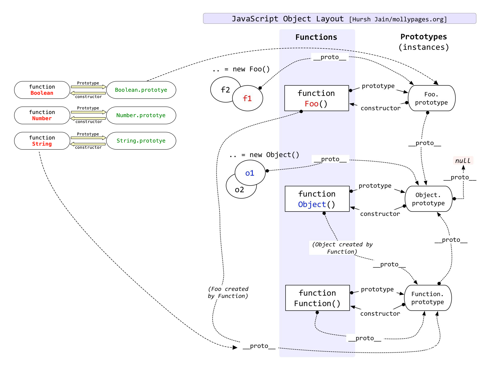
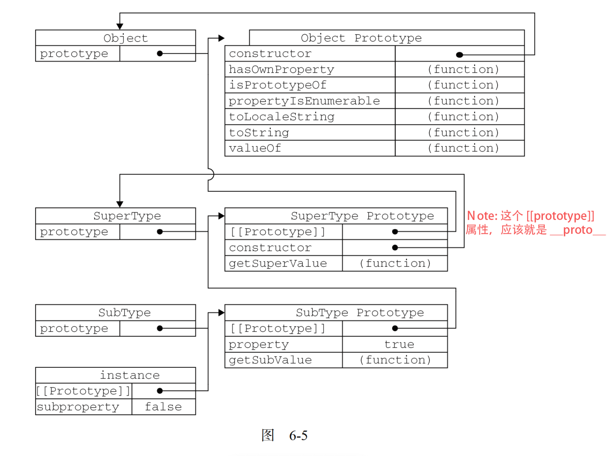

# 第 6 章 -- 面向对象的程序设计

## 本章目录 (Catalog)
- 6.1 理解对象
    + 6.1.1 属性类型
    + 6.1.2 定义多个属性
    + 6.1.3 读取属性的特性
- 6.2 创建对象
    + 6.2.1 工厂模式 
    + 6.2.2 构造函数模式
    + 6.2.3 原型模式
    + 6.2.4 组合使用构造函数模式和原型模式
    + 6.2.5 动态原型模式
    + 6.2.6 寄生构造函数模式
    + 6.2.7 稳妥构造函数模式
- 6.3 继承
    + 6.3.1 原型链
    + 6.3.2 借用构造函数
    + 6.3.3 组合继承
    + 6.3.4 原型式继承
    + 6.3.5 寄生式继承
    + 6.3.6 寄生组合式继承
- 6.4 小结    

## 生词 (New Words)


## 本章内容 (Content)   
- `面向对象(Object-Oriented, OO)` 的语言有一个标志, 就是他们都有`类`的概念,
  而通过类可以创建任意多个具有相同属性和方法的对象. 前面提到过,
  ECMAScript 中没有类的概念, 因此它的对象也与基于类的语言中的对象有所不同. 
  
  ECMA-262 把对象定义为: **"无序属性的集合, 其属性可以包含基本值, 对象, 或者函数"**
  严格来讲, 这就相当于说对象是一组没有特定顺序的值. 对象的每个属性或方法都有一个名字,
  而每个名字都映射到一个值. 正因为这样(以及其他将要讨论的原因),
  我们可以把 ECMAScript 的对象想象成 `散列表(hash)`: 无非就是一组名值对,
  其中值可以是数据或函数. 
  
  **每个对象都是基于一个引用类型**创建的, 这个引用类型可以是第 5 章讨论的原生类型,
  也可以是开发人员定义的类型. 

### 6.1 理解对象
- 创建对象的基本方式: 
    + (1) 通过 `new Object()` 创建 Object 构造函数的实例  
      ```js
        var person = new Object();
        person.name = 'Nicholas';
        person.age = 29;
        person.sayName = function () {
            console.log(this.name);
        };
      ```
    + (2) 对象字面量
      ```javascript
        // - Added:《JavaScript 模式》--我们可以将 JavaScript 中的对象简单地理解为
        //   名值对组成的散列表 (hash table, 也叫哈希表). 在其他编程语言中被称作
        //   "关联数组". 其中的值可以是原始值也可以是对象. 不管是什么类型, 它们都是
        //   "属性"(property),属性值同样可以是函数, 这时属性就被称为“方法”(method). 
        var person2 = {
            name: "Nicholas",
            age: 29,
            job: "Software Engineer",

            sayName: function () {
                console.log(this.name)
            }
        }

        // ---------

        // - Added:《JavaScript 模式》--“创建对象的最佳模式是使用字面量”还有一个原因
        //   , 它强调对象就是一个简单的可变的散列表(Hash Table), 而不必一定派生自某个类.
        let person = {
            getGreeting() {
                return "Hello";
            }
        };
        // - `{}.__proto__` 并不包含 getGreeting 属性, 但却包含下面匿名函数中添加
        //   的 `getHello` 和 `getAge` 方法, 所以可以看出, 对象字面量创建对象, 
        //   内部添加的方法并没有在实例的原型上添加着,
        console.log('{}.__proto__', {}.__proto__);

        // - Object
        console.log('person.__proto__.constructor:', person.__proto__.constructor);
        // - Object
        console.log('{}.__proto__.constructor:', {}.__proto__.constructor);

        // - 通过 new Object() 来创建 Object 构造函数的实例来创建对象, 与上面使用
        //   对象字面量创建对象是不同的,但是具体的不同要看 JS 语言的内部实现, 无法考究!!
        (function() {
            // - WebStorm 会提示:
            //   Object instantiation can be simplified. 对象实例化可以简化.
            let person02 = new Object();
            Object.prototype.getHello = function() {
                return 'Hello';
            };
            Object.prototype.getAge = function() {
                return 31;
            };
            // console.log(Object.prototype);
            console.log('person02.__proto__:', person.__proto__);
        })();
      ```

#### 6.1.1 属性类型
- ECMA-262 第 5 版在定义只有内部才用的 `特性(attribute)` 时,
  描述了 `属性(property)` 的各种特征. ECMA-262 定义这些特性是为了实现
  JavaScript 引擎用的, 因此在 JavaScript 中不能直接访问它们.
  为了表示**特性是内部值**, 该规范把它们放在了两对儿方括号中,
  例如 `[[Enumerable]]`. 尽管 ECMA-262 第 3 版的定义有些不同,
  但本书只参考第 5 版的描述. 
    + **Added**: 如何区分元素的 `特性` 和 `属性`? 见同目录:
      `./DOM元素的特性(attribute)和属性(property).md`

  ECMAScript 中有两种属性: `数据属性` 和 `访问器属性`. 
##### (1) `数据属性`
- `数据属性` 包含一个数据值的位置. 在这个位置可以读取和写入值.
  数据属性有 4 个描述其行为的特性. 
    + (1) `[[Configurable]]`: 表示能否通过 `delete` 删除属性从而重新定义属性,
      能否修改属性的特性, 或者能否把属性修改为访问器属性.
      像前面例子中那样直接在对象上定义的属性, 它们的这个特性默认值为 `true`. 
    + (2) `[[Enumerable]]`: 表示能否通过 `for-in` 循环返回属性.
      像前面例子中那样直接在对象上定义的属性, 它们的这个特性默认值为 `true`.
    + (3) `[[Writable]]`: 表示能否修改属性的值. 像前面例子中那样直接在对象上定义的属性,
      它们的这个特性默认值为 `true`.
    + (4) `[[Value]]`: 包含这个属性的数据值. 读取属性值的时候, 从这个位置读;
      写入属性值的时候, 把新值保存在这个位置. 这个特性的默认值为 `undefined`.

  对于像前面例子中那样直接在对象上定义的属性, 它们的`[[Configurable]]`,
  `[[Enumerable]]` 和 `[[Writable]]` 特性都被设置为 `true`,
  而 `[[Value]]` 特性被设置为指定的值. 例如:
  ```js
    var person = {
        name: 'Nicholas'
    }
  ```
  这里创建了一个名为 name 的属性, 为它指定的值是 "Nicholas". 也就是说,
  `[[Value]]` 特性将被设置为 "Nicholas", 而对这个值的任何修改都将反映在这个位置.
  要修改属性默认的 `特性(Configure/Enumerable/Writable/Value)`,
  必须使用 ES5 的 `Object.defineProperty()` 方法. 这个方法接收三个参数:
    + <1> 属性所在的对象;
    + <2> 属性的名字;
    + <3> 一个描述符对象. 其中, `描述符(descriptor)对象` 的属性必须是:
      `configurable`, `enumerable`, `writable` 和 `value`.
      设置其中的一或多个值, 可以修改对应的特性值. 例如:
  
  ```js
    var person = {};
    Object.defineProperty(person, 'name', {
        writable: false,
        value: 'Nicholas'
    });
    console.log(person.name);   // "Nichiloas"
    person.name = 'Greg";
    console.log(person.name);   // "Nichiloas"
  ```
  这个例子创建了一个名为 name 的属性, 它的值"Nicholas"是只读的.
  这个属性的值是不可修改的, 如果尝试为它指定新值, 则在非严格模式下, 赋值操作将被忽略;
  在严格模式下, 赋值操作将会导致抛出错误. 

  类似的规则也适用于不可配置的属性. 例如:
  ```js
    var person = {};
    Object.defineProperty(person, "name", {
        configurable: false,
        value: "Nicholas"
    });
    console.log(person.name); // "Nicholas"
    delete person.name;
    console.log(person.name); // "Nicholas"
  ```
  把 `configurable` 设置为 `false`, 表示不能从对象中删除属性.
  如果对这个属性调用 delete, 则在非严格模式下什么也不会发生, 而在严格模式下会导致错误.
  而且, 一旦把属性定义为不可配置的, 就不能再把它变回可配置了. 此时,
  再调用`Object.defineProperty()`方法修改除 `writable` 之外的特性,
  都会导致错误. 例如:
  ```js
    ar person = {};
    Object.defineProperty(person, "name", {
        configurable: false,
        value: "Nicholas"
    });
    //抛出错误
    Object.defineProperty(person, "name", {
        configurable: true,
        value: "Nicholas"
    });
  ```
  也就是说, 可以多次调用 `Object.defineProperty()` 方法修改同一个属性,
  但在把 `configurable` 特性设置为 `false` 之后就会有限制了. 
  
  在调用 `Object.defineProperty()` 方法时, 如果不指定, `configurable`,
  `enumerable` 和 `writable` 特性的默认值都是 `false`. 多数情况下, 
  可能都没有必要利用 `Object.defineProperty()` 方法提供的这些高级功能. 
  不过, 理解这些概念对理解 JavaScript 对象却非常有用. 
##### (2) `访问器属性`
- 访问器属性不包含数据值; 它们包含一对儿 `getter` 和 `setter` 函数
  (不过, 这两个函数都不是必需的). 
    + 在读取访问器属性时, 会调用 `getter` 函数, 这个函数负责返回有效的值;
    + 在写入访问器属性时, 会调用 `setter` 函数并传入新值,
      这个函数负责决定如何处理数据.
  
  访问器属性有如下 4 个特性. 
    + (1)`[[Configurable]]`: 表示能否通过 `delete` 删除属性从而重新定义属性, 
      能否修改属性的特性, 或者能否把属性修改为数据属性. 对于直接在对象上定义的属性, 
      这个特性的默认值为true. 
    + (2)`[[Enumerable]]`: 表示能否通过 `for-in` 循环返回属性. 
      对于直接在对象上定义的属性, 这个特性的默认值为 `true`. 
    + (3)`[[Get]]`: 在读取属性时调用的函数. 默认值为 `undefined`. 
    + (4)`[[Set]]`: 在写入属性时调用的函数. 默认值为 `undefined`. 

  访问器属性不能直接定义, 必须使用 `Object.defineProperty()` 来定义.
  请看下面的例子:
  ```js
    var book = {
        _year: 2004,
        edition: 1
    };
    Object.defineProperty(book, "year", {
        get: function(){
            return this._year;
        },
        set: function(newValue){
            if (newValue > 2004) {
                this._year = newValue;
                this.edition += newValue - 2004;
            }
        }
    });

    console.log(book.year);     // 2004

    book.year = 2005;
    console.log(book.edition);  // 2
  ```
  以上代码创建了一个 `book` 对象, 并给它定义两个默认的属性: `_year` 和 `edition`. 
  `_year` 前面的下划线是一种常用的记号, 用于表示只能通过对象方法访问的属性. 
  而访问器属性 `year` 则包含一个 `getter` 函数和一个 `setter` 函数.  
  `getter` 函数返回 `_year` 的值, `setter` 函数通过计算来确定正确的版本.
  因此, 把 `year` 属性修改为 2005 会导致 `_year` 变成 2005, 而 `edition` 变为 2. 
  **这是使用访问器属性的常见方式, 即设置一个属性的值会导致其他属性发生变化.**

  不一定非要同时指定 `getter` 和 `setter`. 只指定 `getter` 意味着属性是不能写, 
  尝试写入属性会被忽略. 在严格模式下, 尝试写入只指定了 `getter` 函数的属性会抛出错误. 
  类似地, 只指定 `setter` 函数的属性也不能读, 否则在非严格模式下会返回 `undefined`, 
  而在严格模式下会抛出错误. 
  
  支持 ECMAScript 5 的这个方法的浏览器有 IE9+( IE8 只是部分实现),
  Firefox 4+, Safari 5+, Opera12+ 和 Chrome.
  
  在不支持 `Object.defineProperty()` 方法的浏览器中不能修改
  `[[Configurable]]` 和 `[[Enumerable]]`. 

#### 6.1.2 定义多个属性
- 由于为对象定义多个属性的可能性很大, ECMAScript 5 又定义了一个
  `Object.defineProperties() `方法. 利用这个方法可以通过描述符一次定义多个属性.
  这个方法接收两个对象参数: 
    + (1) 第一个参数是要添加和修改其属性的对象;
    + (2) 第二个对象的属性与第一个对象中要添加或修改的属性一一对应. 例如:
- Q: 为什么要使用 `Object.defineProperties()`? A: 从下面的示例可以看出,
  最大的作用是可以同时定义 `数据属性` 和 `访问器属性`, 而传统的对象字面量只能定义
  `数据属性`, `Object.defineProperty` 只能定义 `访问器属性`.
  ```js
    var book = {};
    Object.defineProperties(book, {
        _year: {
            value: 2004
        },

        edition: {
            value: 1
        },

        year: {
            get: function () {
                return this._year;
            },

            set: function (newValue) {
                if (newValue > 2004) {
                    this._year = newValue;
                    this.edition += newValue - 2004;
                }
            }
        }
    });

    // - getOwnPropertyDescriptor 取得自身属性描述符
    var descriptor = Object.getOwnPropertyDescriptor(book, "_year");
    console.log(descriptor.value);          //2004
    console.log(descriptor.configurable);   //false
    console.log(typeof descriptor.get);     //"undefined"

    var descriptor = Object.getOwnPropertyDescriptor(book, "year");
    // {enumerable: false, configurable: false, get: ƒ, set: ƒ}
    console.log(descriptor);
    // - Note: 通过上面输出 descriptor 可以看到, 里面并不包含 value 特性,
    //   所以输出值为 undefined.
    console.log(descriptor.value);          //undefined
    console.log(descriptor.enumerable);     //false
    console.log(typeof descriptor.get);     //"function"
  ```
  以上代码在 book 对象上定义了两个数据属性 (`_year` 和 `edition`)
  和一个访问器属性(`year`).

  最终的对象与上一节中定义的对象相同. 唯一的区别是这里的属性都是在同一时间创建的.
  支持 `Object.defineProperties()` 方法的浏览器有 IE9+, Firefox 4+, 
  Safari 5+, Opera 12+ 和 Chrome.

#### 6.1.3 读取属性的特性
- 使用 ECMAScript 5 的 `Object.getOwnPropertyDescriptor()`(取得自身属性描述符)
  方法, 可以取得给定属性的描述符. 这个方法接收两个参数:
    + 属性所在的对象;
    + 和要读取其描述符的属性名称.
  
  返回值是一个对象, 如果是访问器属性, 这个对象的属性有 `configurable`, `enumerable`,
  `get` 和 `set`; 如果是数据属性, 这个对象的属性有 `configurable`, `enumerable`,
  `writable` 和 `value`. 例如:
  ```js
    // - 示例见上面: 6.1.2 章节
    
    // 此部分省略...

    // - getOwnPropertyDescriptor 取得自身属性描述符
    var descriptor = Object.getOwnPropertyDescriptor(book, "_year");
    console.log(descriptor.value);          //2004
    console.log(descriptor.configurable);   //false
    console.log(typeof descriptor.get);     //"undefined"

    var descriptor = Object.getOwnPropertyDescriptor(book, "year");
    // {enumerable: false, configurable: false, get: ƒ, set: ƒ}
    console.log(descriptor);
    // - Note: 通过上面输出 descriptor 可以看到, 里面并不包含 value 特性,
    //   所以输出值为 undefined.
    console.log(descriptor.value);          //undefined
    console.log(descriptor.enumerable);     //false
    console.log(typeof descriptor.get);     //"function"
  ```
  对于数据属性 `_year`, `value` 等于最初的值, `configurable` 是 `false`,
  而 `get` 等于 `undefined`. 对于访问器属性 `year`, `value` 等于 `undefined`,
  `enumerable` 是 `false`, 而 `get` 是一个指向 `getter` 函数的指针. 
  
  在 JavaScript 中, 可以针对任何对象——包括 `DOM` 和 `BOM` 对象,
  使用 `Object.getOwnPropertyDescriptor()`方法. 支持这个方法的浏览器有
  IE9+, Firefox 4+, Safari 5+, Opera 12+ 和 Chrome. 

### 6.2 创建对象
- 虽然 "Object 构造函数" 或 "对象字面量" 都可以来创建单个对象, 但是这些方式有一个明显的
  缺点: 使用同一个接口创建了很多对象, 会产生大量的重复代码. 为解决这个问题, 人们开始使用
  工厂模式的一种变体. 工厂模式是软件工程领域一种广为人知的设计模式, 这种模式抽象了创建
  具体对象的过程. . . . 下面是js中用到的设计模式:
#### 6.2.1 工厂模式
#### 6.2.2 构造函数模式
#### 6.2.3 原型模式
- 我们创建的每个函数都有一个 `prototype`(原型)属性, 这个属性是一个指针, 指向一个对象, 
  而这个对象的用途是包含可以由特定类型的所有实例共享的属性和方法. 如果按照字面意思来理解,
  那么 `prototype` 就是通过调用构造函数而创建的那个对象实例的原型对象.
  使用原型对象的好处是可以让所有对象实例共享它所包含的属性和方法. 换句话说,
  不必在构造函数中定义对象实例的信息, 而是可以将这些信息直接添加到原型对象中,
  如下面的例子所示. 
- (1) **理解原型对象**
    + 
- (2) **原型与 `in` 操作符**
    + 有 2 种方式使用 `in` 操作符: (1)单独使用, (2) 在 `for-in` 循环中使用.
      在单独使用时, `in` 操作符会在通过对象能够访问给定属性时返回 `true`,
      无论该属性存在于实例中还是原型中. 看一看下面的例子:
      ```js
        function Person() {}
        Person.prototype.name = "Nicholas";
        Person.prototype.age = 29;
        Person.prototype.job = "Software Engineer";
        Person.prototype.sayName = function(){
            console.log(this.name);
        };
        var person1 = new Person();
        var person2 = new Person();

        console.log(person1.hasOwnProperty("name"));    // false
        console.log("name" in person1);                 // true
        person1.name = "Greg";
        console.log(person1.name);          // "Greg" —— 来自实例
        console.log(person1.hasOwnProperty("name"));    // true
        console.log("name" in person1);                 // true
        console.log(person2.name);          // "Nicholas" —— 来自原型
        console.log(person2.hasOwnProperty("name"));    // false
        console.log("name" in person2);                 // true
        delete person1.name;
        console.log(person1.name);          // "Nicholas" —— 来自原型
        console.log(person1.hasOwnProperty("name"));    // false
        console.log("name" in person1);                 // true
      ```
- (3) **更简单的原型语法**
    + ```js
        function Person(){}
        Person.prototype = {
            name : "Nicholas",
            age : 29,
            job: "Software Engineer",
            sayName : function () {
                console.log(this.name);
            }
        };
      ```
- (4) **原型的动态性**
    + 
- (5) **原生对象的原型**
    + 原型模式的重要性不仅体现在创建自定义类型方面, 就连所有原生的引用类型,
      都是采用这种模式创建的. 所有原生引用类型(`Object`, `Array`, `String`等等)
      都在其构造函数的原型上定义了方法. 例如, 在 `Array.prototype`
      中可以找到 `sort()` 方法, 而在 `String.prototype` 中可以找到
      `substring()` 方法, 如下所示: 
      ```js
        console.log(typeof Array.prototype.sort);       // "function"
        console.log(typeof String.prototype.substring); // "function"
      ```
- (6) **原型对象的问题**
    + 原型模式也不是没有缺点. 首先, 它省略了为构造函数传递初始化参数这一环节,
      结果所有实例在默认情况下都将取得相同的属性值. 虽然这会在某种程度上带来一些不方便,
      但还不是原型的最大问题. **原型模式的最大问题是由其共享的本性所导致的**. 
      
      **原型中所有属性是被很多实例共享的**, 这种共享对于函数非常合适.
      对于那些包含基本值的属性倒也说得过去, 毕竟(如前面的例子所示),
      通过在实例上添加一个同名属性, 可以隐藏原型中的对应属性. 然而,
      对于包含引用类型值的属性来说, 问题就比较突出了. 来看下面的例子:
      ```js
        function Person(){}
        Person.prototype = {
            constructor: Person,
            name : "Nicholas",
            age : 29,
            job : "Software Engineer",
            friends : ["Shelby", "Court"],
            sayName : function () {
                console.log(this.name);
            }
        };
        var person1 = new Person();
        var person2 = new Person();
        person1.friends.push("Van");
        console.log(person1.friends);           // "Shelby,Court,Van"
        console.log(person2.friends);           // "Shelby,Court,Van"
        console.log(person1.friends === person2.friends); // true
      ```

- 使用 `hasOwnProperty()`(是否含有此属性) 方法可以检测一个属性是存在于实例中,
  还是存在于原型中.这个方法(不要忘了它是从 `Object` 继承来的)
  只在给定属性存在于对象实例中时, 才会返回 true. 
  ```js
    function Person() {}
    Person.prototype.name = "Nicholas";
    Person.prototype.age = 29;
    Person.prototype.job = "Software Engineer";
    Person.prototype.sayName = function () {
        console.log(this.name);
    };

    var person1 = new Person();
    var person2 = new Person();
    // - hasOwnProperty(): 自身有无特定属性
    console.log(person1.hasOwnProperty("name"));    // false

    person1.name = "Greg";
    console.log(person1.name);      // "Greg" --- 来自实例
    console.log(person1.hasOwnProperty("name")); // true    
  ```
#### 6.2.4 组合使用构造函数模式和原型模式
- 创建自定义类型的最常见方式, 就是组合使用构造函数模式与原型模式.
  **构造函数模式用于定义实例属性, 而原型模式用于定义方法和共享的属性. 结果,
  每个实例都会有自己的一份实例属性的副本, 但同时又共享着对方法的引用,
  最大限度地节省了内存.** 另外, 这种混合模式还支持向构造函数传递参数;
  可谓是集两种模式之长. 下面的代码重写了前面的例子. 
  ```js
    // - 构造函数模式用于定义实例属性
    function Person(name, age, job) {
        this.name = name;
        this.age = age;
        this.job = job;
        this.friends = ['Shelby', 'Court'];
    }
    // - 原型模式用于定义方法和共享的属性
    Person.prototype.sayName = function(){
        console.log(this.name);
    };
    var person1 = new Person("Nicholas", 29, "Software Engineer");
    var person2 = new Person("Greg", 27, "Doctor");
    person1.friends.push("Van");
    console.log(person1.friends);       // "Shelby,Count,Van"
    console.log(person2.friends);       // "Shelby,Count"
    console.log(person1.friends === person2.friends); // false
    console.log(person1.sayName === person2.sayName); // true
  ```
#### 6.2.5 动态原型模式
#### 6.2.6 寄生构造函数模式
#### 6.2.7 稳妥构造函数模式


### 6.3 继承
#### 6.3.1
#### 6.3.2
#### 6.3.3 组合继承(combination inheritance): 
- 组合继承 也叫 "伪经典继承", 指的是将原型链和借用构造函数技术组合到一起, 从而发挥二者之长
  的一种继承模式. 背后的思路是:
    + (1.) 使用原型链实现对原型属性和方法的继承
    + (2.) 通过借用构造函数来实现对实例属性的继承. 这样, 即通过在原型上定义方法来实现了
      函数复用, 又能够保证每个实例都有他自己的属性. 
- 使用示例:
  ```js
    function SuperType(name) {
        this.name = name;
        this.colors = ["red", "blue", "green"];
    }

    SuperType.prototype.sayName = function () {
        console.log(this.name);
    };

    function SubType(name, age) {
        SuperType.call(this, name);
        this.age = age;
    }

    SubType.prototype = new SuperType();
    SubType.prototype.sayAge = function () {
        console.log(this.age);
    };
    var subInstance = new SubType("Nicholas", 30);
    subInstance.colors.push("orange");
    subInstance.sayName();              // Nicholas
    subInstance.sayAge();               // 30
    console.log(subInstance.colors);    // ["red", "blue", "green", "orange"]
  ```

#### 6.3.4 原型式继承
- > MDN -- Object.create() 方法会使用指定的原型对象及其属性去创建一个新的对象. 
- 语法: Object.create(proto, [propertiesObject]):
    + (1) `proto`: 一个对象, 应该是新创建的对象的原型. (具体来说就是要赋值给构造函数的
      原型的对象)
    + (2) `propertiesObject`: 可选. 该参数对象是一组属性和值, 该对象的属性名称
      将是新创建的对象的属性名称, 值是属性描述符(这些属性描述符的结构与
      Object.defineProperties() 的第二个参数一样). 注意: 该参数对象不能是 undefined
      ,另外只有对象中自身拥有的不可枚举的属性才有效,也就是说该对象的原型链上的属性无效的. 
- ES5 - 提供了 Object.create 方法, 可以用来克隆对象. 
  **Object.create("要克隆的对象", "新对象定义额外属性的对象(可选,一般不写)")**
  P170: ES5 通过新增 Object.create() 方法规范化了原型式继承. 这个方法接收 2 个参数: 
    + (1): 用作新对象原型的对象. (在传入一个参数的情况下 Object.create() 与 
        object() [6.3.4 自定义的 object() 方法] 方法的行为相同. )
    + (2): 一个为新对象定义额外属性的对象(可选). 
      ```javascript
        // 示例1 : 6.3.4 原型式继承
        let person = {
            // 基本类型值属性
            name: "Nicholas",
            // 引用类型值属性. (tips-P171: 不过不要忘了, 包含引用类型值的属性始终
            // 都会共享相应的值, 就像使用原型模式一样. )
            friends: ["Shelby", "Court", "Van"],
        };
        let anotherPerson = Object.create(person);
        anotherPerson.name = "Grey";
        anotherPerson.friends.push("Rob");

        let yetAnotherPerson = Object.create(person);
        yetAnotherPerson.name = "Linda";
        yetAnotherPerson.friends.push("Barbie");
        // - person.friends 不仅属于 person 所有, 而且会被 anotherPerson 以及 
        //   yetAnotherPerson 共享. 实际上这就相当于又创建了 person 对象的 2 个副本. 
        console.log(person.friends);    // "Shelby,Court,Van,Rob,Barbie"
      ```
      ```javascript
        // - 示例来源: 《Javascript设计模式与开发实践》/第1部分--基础知识
        //   /第1章-面形对象的JavaScript/Chapter01-面向对象的javascript.md
        const Plane = function () {
            this.blood = 100;
            this.attackLevel = 1;
            this.defenseLevel = 1;
        };

        let plane = new Plane();
        plane.blood = 500;
        plane.attackLevel = 10;
        plane.defenseLevel = 7;

        let clonePlane = Object.create(plane);
        console.log(clonePlane);            // Plane {}
        console.log(clonePlane.blood);      // 500
        console.log(clonePlane.attackLevel);// 10
      ```

