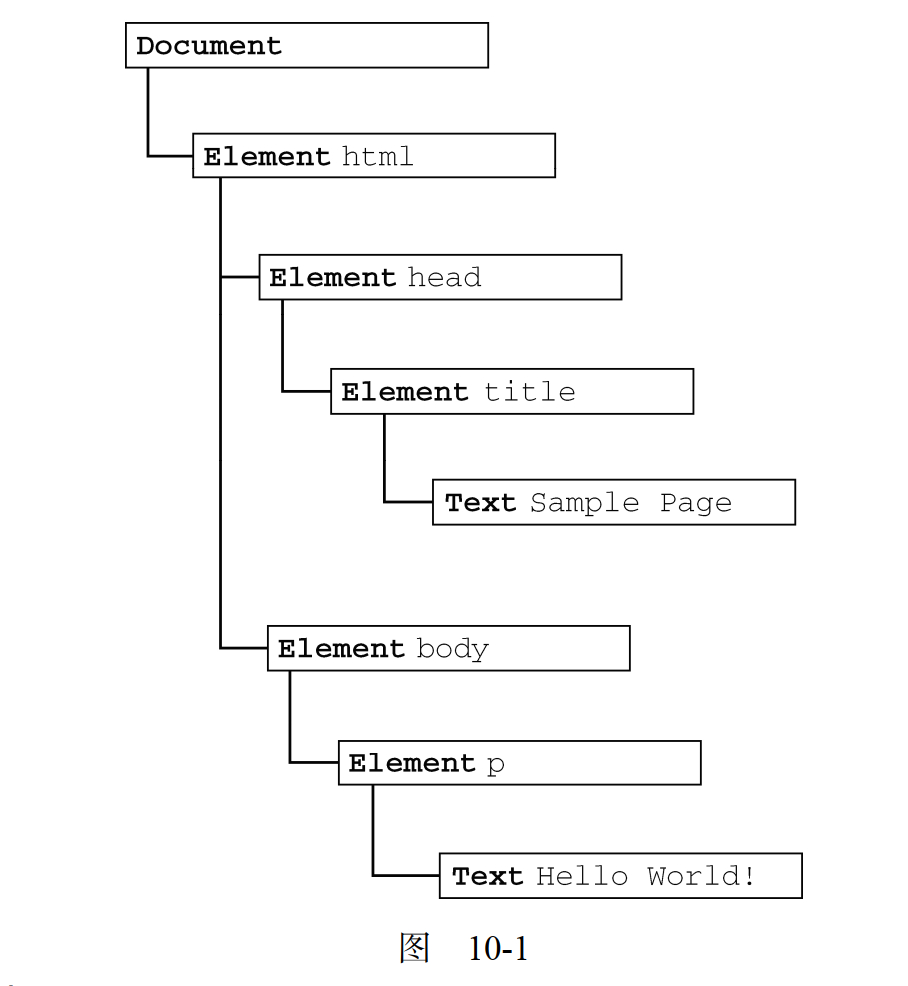

# 第 10 章 -- DOM

## 本章目录(Catalog)
- 10.1 节点层级
    + 10.1.1 `Node` 类型
    + 10.1.2 `Document` 类型
    + 10.1.3 `Element` 类型
    + 10.1.4 `Text` 类型
    + 10.1.5 `Comment` 类型
    + 10.1.6 `CDATASection` 类型
    + 10.1.7 `DocumentType` 类型
    + 10.1.8 `DocumentFragment` 类型
    + 10.1.9 `Attr` 类型
- 10.2 DOM 操作技术
    + 10.2.1 动态脚本
    + 10.2.2 动态样式
    + 10.2.3 操作表格
    + 10.2.4 使用 NodeList
- 10.3 小结


## 生词(New Words)


## Content
- DOM(Document Object Model 文档对象模型) 是针对 HTML 和 XML 文档的一个
  API(应用程序编程接口). DOM 描绘了一个层次化的节点树, 允许开发人员添加,
  移除和修改页面的某一部分. 
### 10.1 节点层级
- DOM 可以将任何 HTML 或 XML 文档描绘成一个由多层节点构成的结构.
  节点分为几种不同的类型, 每种类型分别表示文档中不同的信息及 (或) 标记.
  每个节点都拥有各自的特点, 数据和方法, 另外也与其他节点存在某种关系.
  节点之间的关系构成了层次, 而所有页面标记则表现为一个以特定节点为根节点的树形结构.
  以下面的 HTML 为例: 
  ```html
    <html>
    <head>
        <title>Sample Page</title>
    </head>

    <body>
        <p>Hello World!</p>
    </body>
    </html>
  ```
  可以将这个简单的 HTML 文档表示为一个层次结构, 如图 10-1 所示. 
  
  

  `文档节点`是每个文档的**根节点**. 在这个例子中, 文档节点只有一个子节点,
  即 `<html>` 元素, 我们称之为文档元素. 文档元素是文档的最外层元素,
  文档中的其他所有元素都包含在文档元素中. 每个文档只能有一个文档元素.
  在 HTML 页面中, 文档元素始终都是`<html>`元素. 在 XML 中, 没有预定义的元素,
  因此任何元素都可能成为文档元素. 每一段标记都可以通过树中的一个节点来表示:
  HTML 元素通过元素节点表示, 特性( attribute)通过特性节点表示,
  文档类型通过文档类型节点表示, 而注释则通过注释节点表示. 总共有 12 种节点类型,
  这些类型都继承自一个基类型. 
#### 10.1.1 `Node` 类型
- DOM1 级定义了一个 Node 接口, 该接口将由 DOM 中的所有节点类型实现. 这个 Node
  接口在 js 中是作为 Node 类型实现的; js 中的所有节点类型都继承自 Node 类型,
  因此所有节点类型都共享着相同的基本属性和方法. 
  
  每个节点都有一个 `nodeType(节点类型)` 属性, 用于表明节点的类型. 节点类型由在
  Node 类型中定义的下列 12 个数值常量来表示, 任何节点类型都必居其一:
    + `Node.element_node(1)`;
    + `Node.attribute_node(2)`;
    + `Node.text_node(3)`;
    + `Node.cdata_section_node(4)`;
    + `Node.entity_reference_node(5)`;
    + `Node.entity_node(6)`;
    + `Node.processing_instruction_node(7)`;
    + `Node.comment_node(8)`;
    + `Node.document_node(9)`;
    + `Node.document_type_node(10)`;
    + `Node.document_fragment_node(11)`;
    + `Node.notation_node(12)`; 
  
  确定一个元素是哪种节点类型:
  ```js
    // - 即取得元素的 nodeType 属性值和 12 个数值常量相比较
    if (someNode.nodeType === 1) {
        console.log();
    }
  ```
- (1). **`nodeName(节点的标签名)` 和 `nodeValue(节点值)` 属性**:
  
  要了解节点的具体信息, 可以使用 `nodeName` 和 `nodeValue` 这两个属性.
  这两个属性的值完全取决于节点的类型. 在使用这两个值以前,
  最好是像下面这样先检测一下节点的类型. 
  ```js
    if (someNode.nodeType == 1){
        // - nodeName 的值是元素的标签名
        value = someNode.nodeName; 
    }
  ```
  在这个例子中, 首先检查节点类型, 看它是不是一个元素. 如果是, 则取得并保存
  `nodeName` 的值. 对于元素节点, `nodeName` 中保存的始终都是元素的标签名,
  而 `nodeValue` 的值则始终为 `null`.

- (2) **节点关系**
  
  文档中所有的节点之间都存在这样或那样的关系.
  节点间的各种关系可以用传统的家族关系来描述, 相当于把文档树比喻成家谱. 在 HTML 中,
  可以将 `<body>` 元素看成是 `<html>` 元素的子元素; 相应地, 也就可以将
  `<html>` 元素看成是 `<body>` 元素的父元素. 而 `<head>` 元素,
  则可以看成是 `<body>` 元素的同胞元素, 因为它们都是同一个父元素 `<html>`
  的直接子元素. 每个节点都有一个 `childNodes` 属性, 其中保存着一个 NodeList
  对象.  NodeList 是一种类数组对象, 用于保存一组有序的节点,
  可以通过位置来访问这些节点. 请注意, 虽然可以通过方括号语法来访问 NodeList 的值,
  而且这个对象也有 `length` 属性, 但它并不是 `Array` 的实例. NodeList
  对象的独特之处在于, 它实际上是基于 DOM 结构动态执行查询的结果, 因此 DOM
  结构的变化能够自动反映在 NodeList 对象中. 我们常说,  NodeList 是有生命,
  有呼吸的对象, 而不是在我们第一次访问它们的某个瞬间拍摄下来的一张快照. 

#### 10.1.2 `Document` 类型
- JavaScript 通过 Document 类型表示文档. 在浏览器中, `document`
  对象是 `HTMLDocument`(继承自 Document 类型)的一个实例, 表示整个 `HTML` 页面.
  而且, `document` 对象是 `window` 对象的一个属性, 因此可以将其作为全局对象来访问.
  Document 节点具有下列特征: 
    + `nodeType` 的值为 9; 
    + `nodeName` 的值为 "#document"; 
    + `nodeValue` 的值为 null; 
    + `parentNode` 的值为 null; 
    + `ownerDocument` 的值为 null; 
    + 其子节点可能是一个 DocumentType(最多一个), Element(最多一个),
      ProcessingInstruction 或 Comment. 
  
  Document 类型可以表示 HTML 页面或者其他基于 XML 的文档. 不过,
  最常见的应用还是作为 HTMLDocument 实例的 document 对象. 通过这个文档对象,
  不仅可以取得与页面有关的信息, 而且还能操作页面的外观及其底层结构.
##### 10.1.1 文档的子节点
- 虽然 DOM 标准规定 Document 节点的子节点可以是 DocumentType、 Element、
  ProcessingInstruction 或 Comment, 但还有两个内置的访问其子节点的快捷方式.
    + 第一个就是 `documentElement` 属性, 该属性始终指向 HTML 页面中的 `<html>`
      元素. 
    + 另一个就是通过 `childNodes` 列表访问文档元素, 但通过 `documentElement`
      属性则能更快捷、更直接地访问该元素.  以下面这个简单的页面为例.

  ```html
    <html>
        <body></body>
    </html>
  ```
  这个页面在经过浏览器解析后,其文档中只包含一个子节点, 即 `<html>`元 素.
  可以通过 `documentElement` 或 `childNodes` 列表来访问这个元素, 如下所示:
  ```js
    var html = document.documentElement;            // 取得对<html>的引用
    console.log(html === document.childNodes[0]);   // true
    console.log(html === document.firstChild);      // true
  ```
  这个例子说明, `documentElement`, `firstChild` 和 `childNodes[0]` 的值相同,
  都指向 `<html>` 元素.  
  
  作为 HTMLDocument 的实例,  document 对象还有一个 `body` 属性, 直接指向
  `<body>` 元素. 其用法如下.  
  ```js
    var body = document.body;               // 取得对 <body> 的引用
  ```
  所有浏览器都支持 `document.documentElement` 和 `document.body` 属性.

  Document 另一个可能的子节点是 DocumentType. 通常将 `<!DOCTYPE>`
  标签看成一个与文档其他部分不同的实体, 可以通过 `doctype` 属性(在浏览器中是
  `document.doctype`) 来访问它的信息.  
  ```js
    var doctype = document.doctype;         // 取得对<!DOCTYPE>的引用
  ```
##### 10.1.2 文档信息
##### 10.1.3 查找元素
##### 10.1.4 特殊集合
##### 10.1.5 文档写入


#### 10.1.3 `Element` 类型
- 除了 Document 类型之外, Element 类型就要算是 Web 编程中最常用的类型了.
  Element 类型用于表现 XML 或 HTML 元素, 提供了对元素标签名, 子节点及特性的访问.
  Element 节点具有以下特征: 
    + nodeType 的值为 1;
    + nodeName 的值为元素的标签名;
    + nodeValue 的值为 null;
    + parentNode 可能是 Document 或 Element;
    + 其子节点可能是 Element, Text, Comment, ProcessingInstruction,
      CDATASection 或 EntityReference. 
  
  要访问元素的标签名, 可以使用 nodeName 属性, 也可以使用 tagName 属性;
  这两个属性会返回相同的值(使用后者主要是为了清晰起见). 以下面的元素为例: 
  ```html
    <div id="myDiv"></div>
  ```
  可以像下面这样取得这个元素及其标签名: 
  ```js
    var div = document.getElementById("myDiv");
    // - 在 HTML 中, 标签名始终都以全部大写表示;
    console.log(div.tagName); //"DIV"
    console.log(div.tagName == div.nodeName); //true
  ```
- (1) **HTML 元素**
- (2) **取得特性** <br/>
  每个元素都有一个或多个特性(attribute), 这些特性的用途是给出相应元素或内容的附加信息.
  操作特性的 DOM 方法主要有 3个, 分别是
    + `getAttribute()`
    + `setAttribute()`
    + `removeAttribute()`

  attribute 的其他讲解见: `../Chapter06-面向对象的程序设计/DOM元素的特性(attribute)和属性(property).md`
- (3) **设置特性**
- (4) **attributes 属性** <br/>
  ......

  一般来说, 由于前面介绍的 attribute 的方法不够方便, 因此开发人员更多的会使用
  `getAttribute()`, `removeAttribute()`, `setAttribute()` 方法.

  不过, 如果想要遍历元素的特性, attribute 属性倒是可以派上用场.

- (5) **创建元素**
  ```js
    // - 创建元素
    document.createElement('div');

    // - 创建文本
    document.createTextNode('I am created by createTextNode function')
  ```
- (6) **元素的子节点** <br/>
  元素可以有任意数目的子节点和后代节点, 因为元素可以是其他元素的子节点.
  元素的 `childNodes` 属性中包含了它的所有子节点, 这些子节点有可能是元素,
  文本节点, 注释或处理指令. 不同浏览器在看待这些节点方面存在显著的不同......

#### 10.1.4 `Text` 类型
#### 10.1.5 `Comment` 类型
#### 10.1.6 `CDATASection` 类型
#### 10.1.7 `DocumentType` 类型
#### 10.1.8 `DocumentFragment` 类型
#### 10.1.9 `Attr` 类型
- 元素的特性在 DOM 中以 Attr 类型来表示. 在所有浏览器中(包包括 IE8),
  都可以访问 Attr 类型的构造函数和原型. 从技术角度讲, 特性就是存在于元素的
  attributes 属性中的节点. 特性节点具有下列特征:
    + nodeType 的值为 2; 
    + nodeName 的值是特性的名称; 
    + nodeValue 的值是特性的值; 
    + parentNode 的值为 null; 
    + 在 HTML 中不支持(没有)子节点; 
    + 在 XML 中子节点可以是 Text 或 EntityReference. 

  尽管它们也是节点, 但特性却不被认为是 DOM 文档树的一部分. 开发人员最常使用的是
  `getAttribute()`, `setAttribute()` 和 `removeAttribute()` 方法,
  很少直接引用特性节点. 

### 10.2 DOM 操作技术
#### 10.2.1 动态脚本
#### 10.2.2 动态样式
#### 10.2.3 操作表格
#### 10.2.4 使用 NodeList


### 10.3 小结

