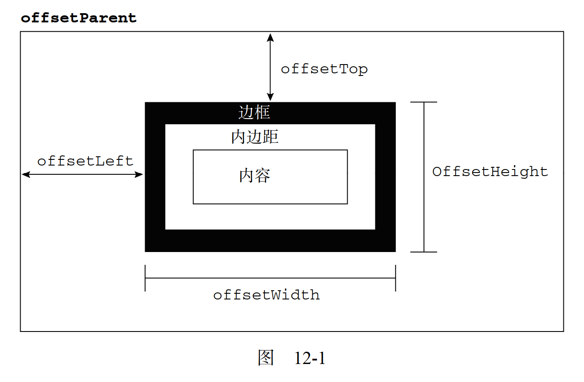
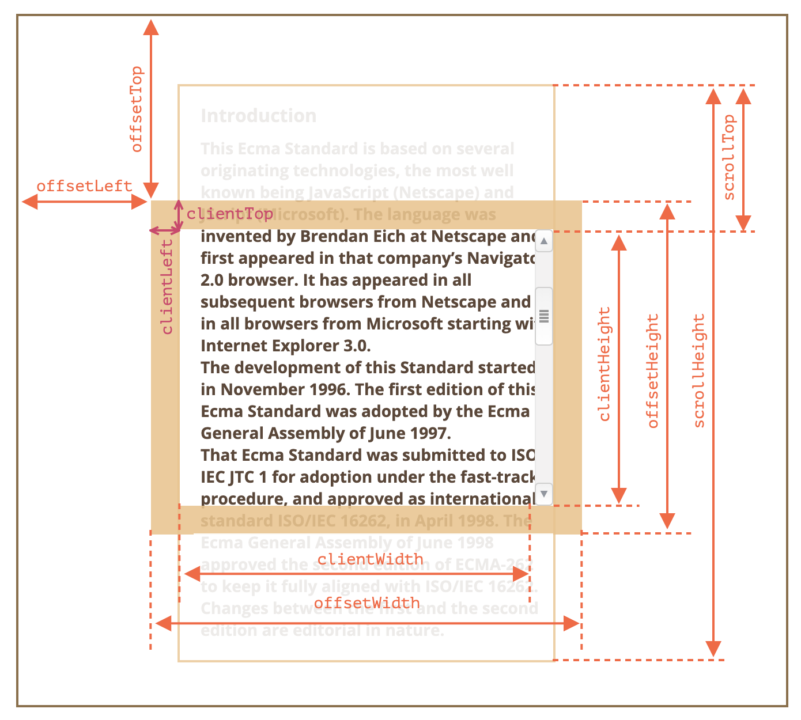
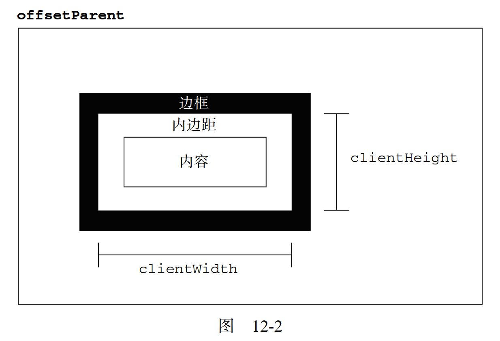
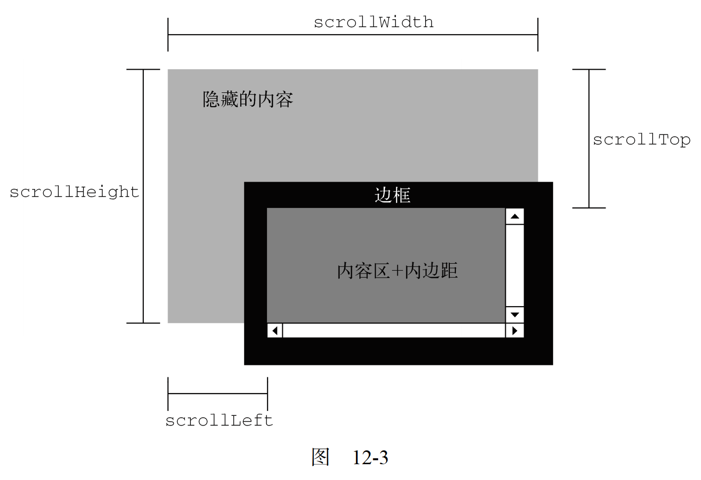
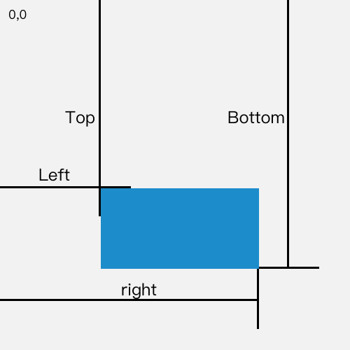

# 第 12 章 -- DOM2 和 DOM3


## Catalog
- 12.1 DOM 变化
    + 12.1.1 针对 XML 命名空间的变化
    + 12.1.2 其他方面的变化
- 12.2 样式
    + 12.2.1 访问元素的样式
    + 12.2.2 操作样式表
    + 12.2.3 元素大小
- 12.3 遍历
    + 12.3.1 NodeIterator
    + 12.3.2 TreeWalker
- 12.4 范围
    + 12.4.1 DOM 中的范围
    + 12.4.2 IE8 及更早版本中的范围
- 12.5 小结


## New Words
- **sheet [ʃit] --n.工作表; 床单; 一张; 薄板**
    + get between the sheets. 钻进被窝/上床就寝
    + change the sheets on a bed. 换床单.
    + a sheet of wrapping paper. 一张包装纸.
    + He looked at the sheet of paper. 他看着那张纸.
- **offset ['ɒfset]/[ˌɔf'sɛt] --vt.抵消; 补偿.**
  **--n.[计]偏移量; 抵销...的东西,弥补.**
    + This will offset(vt) the loss. 这可以弥补损失.
    + Domestic losses were offset(vt) by developing foreign markets.
      用开发国外市场来弥补国内的损失.
    + We offset(vt) the better roads against the greater distance.
      我们以较好的道路来弥补较远距离带来的不便.
- **dimension [daɪ'mɛnʃən]{UK}/[dɪ'menʃ(ə)n]{US}  --n.尺寸, 维, 尺度**
    + What are the two dimensions of music ? 音乐的两个维度是什么？
    + intrinsic dimension 内在维度
- **actual ['æktʃuəl] --adj.实际的; 现实的; 目前的**
    + an actual example. 实例
    + actual life. 实际生活
    + the actual state[condition]. 实际状况.
- **bound [baʊnd] --n.界, 范围, 跳跃  vi.跳；回弹  vt.给...划界, 限制** 
    + [时态: bounded, bounding, bounds]
    + upper bound 上界, 最大值
    + lower bound 下界
    + I think he was out of bounds. 我想他出界了. 
    + You should bound your desires by reason. 你应该以理性来限制你的欲望. 
- **rectangle ['rektæŋg(ə)l] --n.矩形, 长方形**
    + **get bounding client rect** 取得边界客户端矩形


## Content
- DOM1 级主要定义的是 HTML 和 XML 文档的底层结构.  DOM2 和 DOM3
  级则在这个结构的基础上引入了更多的交互能力, 也支持了更高级的 XML 特性. 为此, 
  DOM2 和 DOM3 级分为许多模块(模块之间具有某种关联), 分别描述了 DOM
  的某个非常具体的子集. 这些模块如下. 
    + DOM2 级核心(DOM Level 2 Core): 在 1 级核心基础上构建, 
      为节点添加了更多方法和属性. 
    + DOM2 级视图(DOM Level 2 Views): 为文档定义了基于样式信息的不同视图. 
    + DOM2 级事件(DOM Level 2 Events): 说明了如何使用事件与 DOM 文档交互. 
    + DOM2 级样式(DOM Level 2 Style): 定义了如何以编程方式来访问和改变 CSS
      样式信息. 
    + DOM2 级遍历和范围(DOM Level 2 Traversal and Range): 引入了遍历 DOM
      文档和选择其特定部分的新接口. 
    + DOM2 级 HTML(DOM Level 2 HTML): 在 1 级 HTML 基础上构建,
      添加了更多属性、方法和新接口. 
  
  本章探讨除 "DOM2 级事件" 之外的所有模块, "DOM2 级事件" 模块将在第 13
  章进行全面讲解. 
  **Hint:** DOM3 级又增加了 "XPath" 模块和 "加载与保存"(Load and Save)模块.
  这些模块将在第 18 章讨论. 
### 12.1 DOM 变化
- DOM2 级和 3 级的目的在于扩展 DOM API, 以满足操作 XML 的所有需求, 
  同时提供更好的错误处理及特性检测能力. 从某种意义上讲, 
  实现这一目的很大程度意味着对命名空间的支持. "DOM2 级核心" 没有引入新类型, 
  它只是在 DOM1 级的基础上通过增加新方法和新属性来增强了既有类型.
  "DOM3 级核心" 同样增强了既有类型, 但也引入了一些新类型. 
  
  类似地, "DOM2 级视图" 和 "DOM2 级 HTML" 模块也增强了 DOM 接口, 
  提供了新的属性和方法. 由于这两个模块很小, 因此我们将把它们与 "DOM2 级核心"
  放在一起, 讨论基本 JavaScript 对象的变化.
  可以通过下列代码来确定浏览器是否支持这些 DOM 模块:
  ```js
    var supportsDOM2Core = document.implementation.hasFeature("Core", "2.0");
    var supportsDOM3Core = document.implementation.hasFeature("Core", "3.0");
    var supportsDOM2HTML = document.implementation.hasFeature("HTML", "2.0");
    var supportsDOM2Views = document.implementation.hasFeature("Views", "2.0");
    var supportsDOM2XML = document.implementation.hasFeature("XML", "2.0");
  ```
  本章只讨论那些已经有浏览器实现的部分, 任何浏览器都没有实现的部分将不作讨论. 
#### 12.1.1 针对 XML 命名空间的变化
- 略
#### 12.1.2 其他方面的变化
- 略

### 12.2 样式
- 在 HTML 中定义样式的方式有 3 种:
    + (1) 通过 `<link/>` 元素包含外部样式表文件;
    + (2) 使用 `<style/>`元素定义嵌入式样式;
    + (3) 以及使用 `style` 特性定义针对特定元素的样式(行内样式).
    
    
  
  "DOM2 级样式" 模块围绕这 3 种应用样式的机制提供了一套 API.
  要确定浏览器是否支持 DOM2 级定义的 CSS 能力, 可以使用下列代码. 
  ```js
    var supportsDOM2CSS = document.implementation.hasFeature("CSS", "2.0");
    var supportsDOM2CSS2 = document.implementation.hasFeature("CSS2", "2.0");
  ```
#### 12.2.1 访问元素的样式
- 任何支持 `style` 特性的 HTML 元素在 JavaScript 中都有一个对应的 `style` 属性.
  这个 `style` 对象是 CSSStyleDeclaration 的实例, 包含着通过 HTML 的 `style`
  特性指定的所有样式信息, 但不包含与**外部样式表**或**嵌入样式表**经层叠而来的样式.
  在 `style` 特性中指定的任何 CSS 属性都将表现为这个 `style` 对象的相应属性.
  对于使用短划线（分隔不同的词汇, 例如 background-image）的 CSS 属性名, 
  必须将其转换成驼峰大小写形式, 才能通过 JavaScript 来访问. 

  多数情况下, 都可以通过简单地转换属性名的格式来实现转换. 其中一个不能直接转换的
  CSS 属性就是 `float`. 由于 `float` 是 JavaScript 中的保留字, 
  因此不能用作属性名. "DOM2 级样式" 规范规定样式对象上相应的属性名应该是
  `cssFloat`; Firefox、 Safari、 Opera 和 Chrome 都支持这个属性, 而 IE
  支持的则是 `styleFloat`.
  
  只要取得一个有效的 DOM 元素的引用, 就可以随时使用 JavaScript 为其设置样式.
  以下是几个例子. 
  ```js
    var myDiv = document.getElementById("myDiv");
    // - 设置背景颜色
    myDiv.style.backgroundColor = "red";
    // - 改变大小
    myDiv.style.width = "100px";
    myDiv.style.height = "200px";
    // - 指定边框
    myDiv.style.border = "1px solid black";
  ```
  在以这种方式改变样式时, 元素的外观会自动被更新.

  通过 style 对象同样可以取得在 style 特性中指定的样式. 以下面的 HTML 代码为例.
  ```html
    <div id="myDiv" style="background-color:blue; width:10px; height:25px"></div>
  ```
  在 `style` 特性中指定的样式信息可以通过下列代码取得. 
  ```js
    console.log(myDiv.style.backgroundColor);     // "blue"
    console.log(myDiv.style.width);               // "10px"
    console.log(myDiv.style.height);              // "25px"
  ```
  如果没有为元素设置 style 特性, 那么 style 对象中可能会包含一些默认的值,
  但这些值并不能准确地反映该元素的样式信息.
##### 12.2.1.1 DOM 样式属性和方法
- "DOM2 级样式" 规范还为 style 对象定义了一些属性和方法.
  这些属性和方法在提供元素的 style 特性值的同时, 也可以修改样式. 
  下面列出了这些属性和方法. 
    + `cssText`: 如前所述, 通过它能够访问到 style 特性中的 CSS 代码. 
    + `length`: 应用给元素的 CSS 属性的数量. 
    + `parentRule`: 表示 CSS 信息的 CSSRule 对象. 本节后面将讨论 CSSRule 类型. 
    + `getPropertyCSSValue(propertyName)`: 返回包含给定属性值的 CSSValue 对象. 
    + `getPropertyPriority(propertyName)`: 如果给定的属性使用了!important 设置,
      则返回 "important"; 否则, 返回空字符串. 
    + `getPropertyValue(propertyName)`: 返回给定属性的字符串值. 
    + `item(index)`: 返回给定位置的 CSS 属性的名称. 
    + `removeProperty(propertyName)`: 从样式中删除给定属性. 
    + `setProperty(propertyName,value,priority)`: 将给定属性设置为相应的值,
      并加上优先权标志("important" 或者一个空字符串).
  
   下面的内容省略......

   **Tip:** 上面 "DOM2 级样式" 添加的几个属性和方法中只有 `cssText`
   在开发中有较多的使用, 其他的几个使用量很小.
   ```js
    myDiv.style.cssText = "width: 25px; height: 100px; background-color: green";
    console.log(myDiv.style.cssText);
   ```
##### 12.2.1.2 计算的样式
- 虽然 `style` 对象能够提供支持 `style` 特性的任何元素的样式信息, 
  但它不包含那些从其他样式表层叠而来并影响到当前元素的样式信息.  "DOM2 级样式"
  增强了 `document.defaultView`, 提供了 `getComputedStyle()` 方法. 
  这个方法接受两个参数:
    + (1) 要取得计算样式的元素
    + (2) 和一个伪元素字符串(例如 "`:after`"). 如果不需要伪元素信息,
      第二个参数可以是 null.
  
  `getComputedStyle()` 方法返回一个 `CSSStyleDeclaration` 对象(与 style
  属性的类型相同), 其中包含当前元素的所有计算的样式.

  ...... 省略部分内容

  IE 不支持 `getComputedStyle()` 方法, 但它有一种类似的概念. 在 IE 中, 
  每个具有 `style` 属性的元素还有一个 `currentStyle` 属性. 这个属性是
  `CSSStyleDeclaration` 的实例, 包含当前元素全部计算后的样式. 
  ```js
    var myDiv = document.getElementById("myDiv");
    var computedStyle = myDiv.currentStyle;
    console.log(computedStyle.backgroundColor);   // "red"
    console.log(computedStyle.width);             // "100px"
    console.log(computedStyle.height);            // "200px"
    console.log(computedStyle.border);            // undefined
  ```

  与 DOM 版本的方式一样,  IE 也没有返回 border 样式, 因为这是一个综合属性. 
  
  无论在哪个浏览器中, 最重要的一条是要记住所有计算的样式都是只读的；
  不能修改计算后样式对象中的 CSS 属性(tip: 如果实现想修改某个属性,
  就使用 `el.style.xx` 覆盖就可以了, 因为 `style` 内联样式的优先级最高). 
  此外, 计算后的样式也包含属于浏览器内部样式表的样式信息, 因此任何具有默认值的
  CSS 属性都会表现在计算后的样式中. 
  
  例如, 所有浏览器中的 visibility 属性都有一个默认值, 但这个值会因实现而异. 
  在默认情况下, 有的浏览器将 visibility 属性设置为"visible", 
  而有的浏览器则将其设置为"inherit". 换句话说, 不能指望某个 CSS
  属性的默认值在不同浏览器中是相同的. 如果你需要元素具有某个特定的默认值, 
  应该手工在样式表中指定该值. 

  这里给出可计算样式的通用写法:
  ```js
    function getStyle(el, attr) {
        return el.current ? el.current[attr] : getComputedStyle(el, null)[attr];
    }

    // - 因为 IE 现在也换成 Chromium 内核了, 如果没有太高的兼容性要求, 可以简写
    function getStyle(el, attr) {
        return window.getComputedStyle(el, null)[attr];
    }
  ```

#### 12.2.2 操作样式表
- > **Hint:** 正常来说, 在实际的开发中, 操作样式表的语法很少使用.
- `CSSStyleSheet` 类型表示的是样式表, 包括通过 `<link>`
  元素包含的样式表和在 `<style>` 元素中定义的样式表. 有读者可能记得,
  这两个元素本身分别是由 `HTMLLinkElement` 和 `HTMLStyleElement` 类型表示的,
  但是, `CSSStyleSheet` 类型相对更加通用一些, 它只表示样式表,
  而不管这些样式表在 HTML 中是如何定义的. 此外, 上述两个针对元素的类型允许修改
  HTML 特性, 但 CSSStyleSheet 对象则是一套只读的接口(有一个属性例外).
  
  `CSSStyleSheet` 继承自 `StyleSheet`, 后者可以作为一个基础接口来定义非
  CSS 样式表. 从 `StyleSheet` 接口继承而来的属性如下. 
    + `disabled`: 表示样式表是否被禁用的布尔值. 这个属性是可读/写的,
      将这个值设置为 true 可以禁用样式表. 
    + `href`: 如果样式表是通过 `<link>` 包含的, 则是样式表的 URL;
      否则, 是 null. 
    + `media`: 当前样式表支持的所有媒体类型的集合. 与所有 DOM 集合一样, 
      这个集合也有一个 `length` 属性和一个 `item()` 方法. 
      也可以使用方括号语法取得集合中特定的项. 如果集合是空列表,
      表示样式表适用于所有媒体. 在 IE 中,  `media` 是一个反映 `<link>` 和
      `<style>` 元素 `media` 特性值的字符串. 
    + `ownerNode`: 指向拥有当前样式表的节点的指针, 样式表可能是在 HTML
      中通过 `<link>` 或 `<style/>` 引入的(在 XML 中可能是通过处理指令引入的).
      如果当前样式表是其他样式表通过 `@import` 导入的, 则这个属性值为 null.
      IE 不支持这个属性. 
    + `parentStyleSheet`: 在当前样式表是通过 `@import` 导入的情况下, 
      这个属性是一个指向导入它的样式表的指针. 
    + `title`:  ownerNode 中 title 属性的值. 
    + `type`: 表示样式表类型的字符串. 对 CSS 样式表而言, 这个字符串是
      "`type/css`". 
  
  除了`disabled` 属性之外, 其他属性都是只读的. 在支持以上所有这些属性的基础上,
  `CSSStyleSheet` 类型还支持下列属性和方法: 
    + `cssRules`: 样式表中包含的样式规则的集合.  IE 不支持这个属性, 
      但有一个类似的 `rules` 属性. 
    + `ownerRule`: 如果样式表是通过 `@import` 导入的, 这个属性就是一个指针,
      指向表示导入的规则; 否则, 值为 null.  IE 不支持这个属性. 
    + `deleteRule(index)`: 删除 `cssRules` 集合中指定位置的规则. 
      IE 不支持这个方法, 但支持一个类似的 `removeRule()` 方法. 
    + `insertRule(rule,index)`: 向 cssRules 集合中指定的位置插入
      rule 字符串.  IE 不支持这个方法, 但支持一个类似的 addRule()方法. 

  应用于文档的所有样式表是通过 `document.styleSheets` 集合来表示的. 
  通过这个集合的 `length` 属性可以获知文档中样式表的数量, 而通过方括号语法或
  `item()` 方法可以访问每一个样式表. 来看一个例子. 
  ```js
    var sheet = null;
    for (var i=0, len=document.styleSheets.length; i < len; i++){
        sheet = document.styleSheets[i];
        console.log(sheet.href);
    }
  ```
  以上代码可以输出文档中使用的每一个样式表的 `href` 属性(`<style>`
  元素包含的样式表没有 `href` 属性).
  
  不同浏览器的 document.styleSheets 返回的样式表也不同. 所有浏览器都会包含
  `<style>`元素和 `rel` 特性被设置为 "stylesheet" 的 `<link>`元素引入的样式表.  IE 和 Opera 也包含 rel 特性被设置
  
  也可以直接通过 `<link>`或 `<style>` 元素取得 `CSSStyleSheet` 对象. DOM
  规定了一个包含 `CSSStyleSheet` 对象的属性, 名叫 `sheet`; 除了 IE,
  其他浏览器都支持这个属性.  IE 支持的是 `styleSheet` 属性.
  要想在不同浏览器中都能取得样式表对象, 可以使用下列代码. 
  ```js
    function getStyleSheet(element){
        return element.sheet || element.styleSheet;
    }
    // - 取得第一个 <link/>元 素引入的样式表
    var link = document.getElementsByTagName("link")[0];
    var sheet = getStylesheet(link);
  ```
  这里的 getStyleSheet() 返回的样式表对象与 `document.styleSheets`
  集合中的样式表对象相同.
##### 12.2.2.1 CSS 规则
- CSSRule 对象表示样式表中的每一条规则. 实际上, CSSRule
  是一个供其他多种类型继承的基类型, 其中最常见的就是 CSSStyleRule 类型, 
  表示样式信息(其他规则还有 `@import`、 `@font-face`、`@page` 和 `@charset`,
  但这些规则很少有必要通过脚本来访问). CSSStyleRule 对象包含下列属性. 
    + `cssText`: 返回整条规则对应的文本. 由于浏览器对样式表的内部处理方式不同,
      返回的文本可能会与样式表中实际的文本不一样. IE 不支持这个属性. 
    + `parentRule`: 如果当前规则是导入的规则, 这个属性引用的就是导入规则；
      否则, 这个值为 null.  IE 不支持这个属性. 
    + `parentStyleSheet`: 当前规则所属的样式表.  IE 不支持这个属性. 
    + `selectorText`: 返回当前规则的选择符文本.
      由于浏览器对样式表的内部处理方式不同,返回的文本可能会与样式表中实际的文本不一样.
    + `style`: 一个 CSSStyleDeclaration 对象, 
      可以通过它设置和取得规则中特定的样式值. 
    + `type`: 表示规则类型的常量值. 对于样式规则, 这个值是 1. 
      IE 不支持这个属性. 
  
  其中三个最常用的属性是 `cssText`、 `selectorText` 和 `style`. `cssText`
  属性与 `style.cssText` 属性类似, 但并不相同.
  前者包含选择符文本和围绕样式信息的花括号, 后者只包含样式信息(类似于元素的
  `style.cssText`). 此外, `cssText` 是只读的, 而 `style.cssText`
  也可以被重写.

  大多数情况下, 仅使用 `style` 属性就可以满足所有操作样式规则的需求了.
  这个对象就像每个元素上的 `style` 属性一样, 可以通过它读取和修改规则中的样式信息.
  以下面的 CSS 规则为例. 
  ```css
    div.box {
        background-color: blue;
        width: 100px;
        height: 200px;
    }
  ```
  假设这条规则位于页面中的第一个样式表中, 而且这个样式表中只有这一条样式规则, 
  那么通过下列代码可以取得这条规则的各种信息. 
  ```js
    var sheet = document.styleSheets[0];
    var rules = sheet.cssRules || sheet.rules; //取得规则列表
    var rule = rules[0]; //取得第一条规则
    console.log(rule.selectorText); //"div.box"
    console.log(rule.style.cssText); //完整的 CSS 代码
    console.log(rule.style.backgroundColor); //"blue"
    console.log(rule.style.width); //"100px"
    console.log(rule.style.height); //"200px"
  ```
##### 12.2.2.2 创建规则
- 略
##### 12.2.2.3 删除规则
- 略

#### 12.2.3 元素大小
##### 12.2.3.1 <span style="color: red">偏移量(offset dimension)</span>
- 首先要介绍的是属性是元素的**偏移量(offset dimension)**,
  它包括**元素在屏幕上占用的所有可见的空间**.
  元素的可见大小由其: 高度(height), 宽度(width) 决定, 包括所有内边距(padding),
  滚动条(scroll bar) 和 边框(border)大小 [注意: 不包括外边距(margin)].
  通过下面 4 个属性可以取得元素的偏移量:
    + `offsetHeight`: 元素在垂直方向上占用的空间大小, 以像素计. 包括元素的高度,
      (可见的)水平滚动条的高度, 元素上下边框的高度.
    + `offsetWidth`: 元素在水平方向上占用的空间大小, 以像素计. 包括元素的宽度,
      (可见的)垂直滚动条的宽度, 元素左右边框的宽度.
    + `offsetLeft`: 元素的左外边框至包含元素的左内边框之间的像素距离.
    + `offsetTop`: 元素的上外边框至包含元素的上内边框之间的像素距离.
  
  其中, `offsetLeft` 和 `offsetTop` 属性与包含元素有关,
  包含元素的引用保存在 `offsetParent` 属性中. `offsetParent` 属性不一定与
  `parentNode` 的值相等. (例如: `<td>` 元素的 `offsetParent`
  是作为其祖先元素的 `<table>` 元素, 因为 `<table>` 是在 DOM 层次中距 `<td>`
  最近的一个具有大小的元素. 
  
  图 12-1 形象地展示了上面几个属性表示的不同大小. 
  
  

  
  
  要想知道某个元素在页面上的偏移量, 将这个元素的 `offsetLeft` 和 `offsetTop`
  与其 `offsetParent` 的相同属性相加, 如此循环直至**根元素**(标准模式下为 `html`;
  quirks 模式下为 `body`), 就可以得到一个基本准确的值.
  下面是获取元素偏移量的封装代码:
  ```js
    // - 获取元素的偏移量: 调用方式 getEleOffset(ele).left/top
    var getEleOffset = function(ele) {
        var actualLeft = ele.offsetLeft;
        var actualTop = ele.offsetTop;
        var current = ele.offsetParent;
        while(current !== null) {
            actualLeft += current.offsetLeft;
            actualTop += current.offsetTop;
            current = current.offsetParent;
        }
        return {left: actualLeft, top: actualTop;}
    }
  ```
  当然, 如果你只需要得到元素相对于根元素的左偏移量或上偏移量,
  我们可以把这个函数拆分成如下两个函数:
  ```js
    function getEleLeft(ele) {
        var actualLeft = ele.offsetLeft;
        var current = ele.offsetParent;
        while(current !== null) {
            actualLeft += current.offsetLeft;
            current = current.offsetParent;
        }
        return actualLeft;
    }
  
    function getEleTop(ele) {
        var actualTop = ele.offsetTop;
        var current = ele.offsetParent;
        while(current !== null) {
            actualTop += current.offsetTop;
            current = current.offsetParent;
        }
        return actualTop;
    }
  ```
  这两个函数利用 `offsetParent` 属性在 DOM 层次中逐级向上回溯,
  将每个层次中的偏移量属性合计到一块. 对于简单的 CSS 布局的页面, 这 2
个函数可以得到非常精确的结果.
  
  **Hint:** 所有这些偏移量属性都是只读的, 而且每次访问他们都需要重新计算. 因此,
  应该尽量避免重复访问这些属性; 如果需要重复使用其中某些属性的值,
  可以将他们保存在局部变量中, 以提高性能.
  
  (Note: 所以从这里可以看出, 我们第一个 `getEleOffset()` 函数,
  从性能角度来说并不好, 因为我们同时计算了元素的 2 个偏移量, 而在开发环境中,
  一般只需要元素的上偏移量.)
  
##### 12.2.3.2 <span style="color: red">客户区大小(client dimension)</span>
- 元素的客户区大小(client dimension), **指的是元素内容及其内边距所占据的空间大小**.
  有关客户区大小的属性有 2 个:
    + (1) `clientWidth`: clientWidth 属性是元素内容区宽度加上左右内边距宽度;
    + (2) `clientHeight`: clientHeight 属性时元素内容区高度加上上下内边距高度.
        + **Notice:** `clientWidth`/`clientHeight`
          是不包含**滚动条**的宽度和高度的, 但是上面的
          `offsetWidth`/`offsetHeight` 却包含滚动条的宽和高.
          所以从这里可以看出, 计算滚动条的宽/高是:
          ```js
            var scrollBarWidth = ele.offsetWidth - ele.clientWidth;
            var scrollBarHeight = ele.offsetHeight - ele.clientHeight;
          ```
          下图可以清晰看出:
          
          Tip: `element.clientLeft`:元素的左边框的宽度;
          `element.clientTop`:元素的上边框的宽度.

          
          
          图片来源: [Element size and scrolling - javascript.info](https://javascript.info/size-and-scroll)
  
  图 12-2 说明了这些属性表示的大小

  
  
  从字面上看, 客户区大小就是元素内部的空间大小, 因此滚动条占用的空间不计算在内.
  最常用到这些属性的情况, 就是像第 8 章讨论的确定浏览器视口大小的时候. (tip:
  浏览器视口大小讲解见第 8 章笔记).
  
##### 12.2.3.3 <span style="color: red">滚动大小(scroll dimension)</span>
- `滚动大小(scroll dimension)`, 指的是包含滚动内容的元素的大小.
  有些元素(例如 `<html>` 元素), 即使没有执行任何代码也能自动地添加滚动条;
  但另外一些元素, 则需要通过 CSS 的 `overflow` 属性进行设置才能滚动. 以下是 4
  个与滚动大小相关的属性.
    + `scrollHeight`: 在没有滚动条的情况下, 元素内容的总高度,
      是元素的内容区加上内边距在加上任何溢出内容的尺寸.
    + `scrollWidth`: 在没有滚动条的情况下, 元素内容的总宽度,
      是元素的内容区加上内边距再加上任何溢出内容的尺寸.
    + `scrollLeft`: 被隐藏的内容区左侧的像素数.
      通过设置这个属性可以改变元素的滚动位置.
    + `scrollTop`: 被隐藏在内容区上方的像素数.
      通过设置这个属性可以改变元素的滚动位置.
  
  `scrollWidth` 和 `scrollHeight` 主要用于确定元素内容的实际大小. 例如,
  通常认为 `<html>` 元素是在 Web 浏览器的视口中滚动的元素. 因此,
  带有垂直滚动条的页面总高度就是 `document.documentElement.scrollHeight`.

  对于不包含滚动条的页面而言, `scrollWidth` 和 `scrollHeight` 与
  `clientWidth` 和 `clientHeight` 之间的关系并不十分清晰.
  
  
  
  因此在确定文档的总高度时(包括基于视口的最小高度时), 必须取得 `scrollWidth`/
  `clientWidth` 和 `scrollHeight`/`clientHeight` 中的最大值,
  才能保证在跨浏览器的环境下得到精确的结果. 示例代码如下:
  ```js
    var docHeight = Math.max(document.documentElement.scrollHeight,
                        document.documentElement.clientHeight);
    var docWidth = Math.max(document.documentElement.scrollWidth,
                        document.documentElement.clientWidth);
  ```
  通过 `scrollLeft` 和 `scrollTop` 属性既可以确定元素当前滚动的状态,
  也可以设置元素的滚动位置. 在元素尚未被滚动时, 这两个属性的值都等于 0.
  如果元素被 垂直/水平 滚动了, 这两个值都会大于零. 同时, 这两个值也是可以设置的,
  将元素的 `scrollLeft` 和 `scrollTop` 设置为 0, 就可以重置元素的滚动位置.
  下面这个函数会检测元素是否位于顶部, 如果不是就将其回滚到顶部.
  ```js
    function scrollTop(ele) {
        if (ele.scrollTop != 0) {
            ele.scrollTop = 0;
        }
    }
  ```
  这个函数即取得了 `scrollTop` 的值, 也设置了它的值.

  **Additional Info:** 除了上面说到的设置 `scrollLeft` 和 `scrollTop`
  来让元素滚动外, window 对象的 `scrollTo()` (和其同义词 `scroll()`)也可以做到,
  它接收一个文档坐标并作为滚动条的偏移量去设置他们,
  也就是说窗口滚动到指定的点出现的视口的左上角. 

  以下代码可以让浏览器滚动到文档最底部:
  ```js
    // - document.documentElement 取得对 `<html>` 的引用
    var docHeight = document.documentElement.offsetHeight;
    var viewportHeight = document.documentElement.clientHeight;
    window.scrollTo(0, docHeight - viewportHeight);
  ```
  window 的 `scrollBy()` 和 `scrollTo()`、`scroll()`类似,
  不过他的参数是相对的, 并在当前滚动条的偏移量上增加. 例如每秒向下滚动 10 像素:
  ```js
    setInterval(function() {
        scrollBy(10);
    }, 1000);
  ```
  
##### 12.2.3.4 <span style="color: red">确定元素大小</span>
- 浏览器为每个元素都提供了一个 `getBoundingClientRect()` 方法.
  这个方法会返回一个矩形对象, 包含 4 个属性: `left`, `top`, `right`, `bottom`.
  这些属性是元素在页面中**相对于视口的位置**, 即 `视口坐标`.
  (注: 现在浏览器将视口左上角的位置 `(0, 0)` 作为起点坐标.)
  其返回的坐标包含边框和内边距, 但不包含外边距. 另外,
  这个方法返回的坐标是一个快照版本, 不会实时更新.

  `left`, `top`, `right`, `bottom` 它们对应到元素上是这样的:
  
  

  为了将其转化为文档坐标, 需要加上浏览器滚动条的大小(见上面 `12.2.3.2`).
  ```js
    function getBoundingClientRect(ele) {
        var rect = ele.getBoundingClientRect();
        return {
            left: rect.left,
            right: rect.right,
            top: rect.top,
            bottom: rect.bottom
        }
    }
  ```

### 12.3 遍历
#### 12.3.1 NodeIterator
#### 12.3.2 TreeWalker


### 12.4 范围
#### 12.4.1 DOM 中的范围
#### 12.4.2 IE8 及更早版本中的范围


### 12.5 小结


