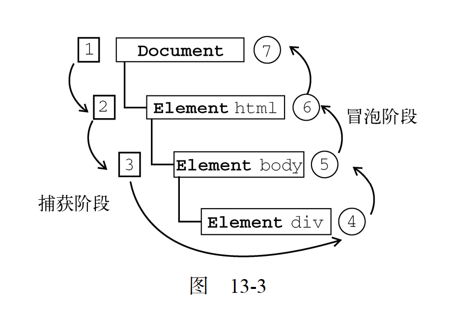
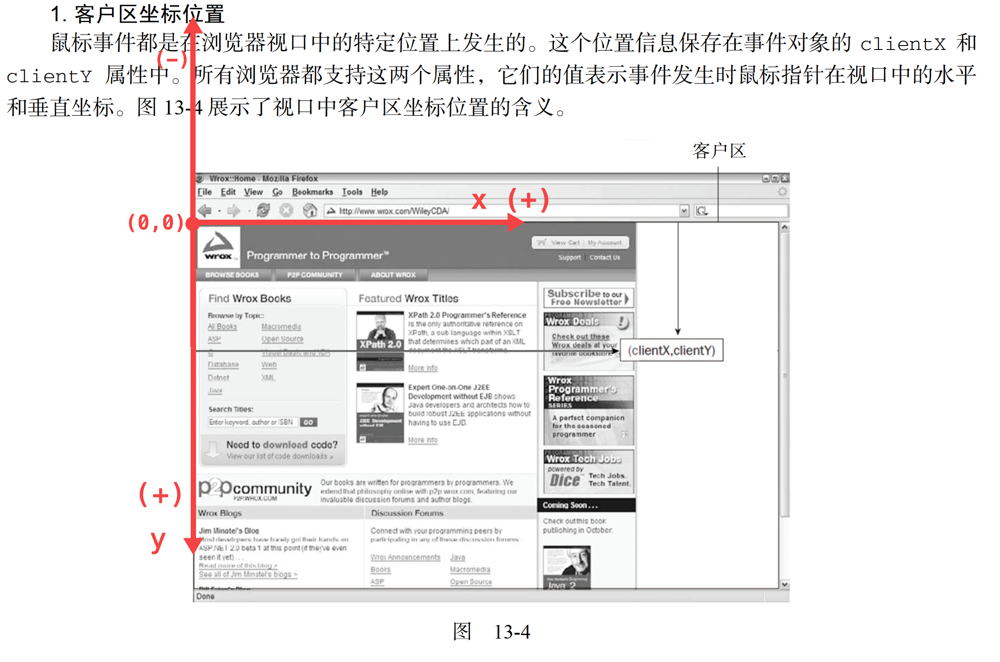

# 第 13 章 - 事件


## 目录(Catalog)
+ 13.1 事件流
    - 13.1.1 事件冒泡
    - 13.1.2 事件捕获
    - 13.1.3 DOM 事件流
+ 13.2 事件处理程序
    - 13.2.1 HTML 事件处理程序
    - 13.2.2 DOM0 级事件处理程序
    - 13.2.3 DOM2 级事件处理程序
    - 13.2.4 IE 事件处理程序
    - 13.2.5 跨浏览器的事件处理程序
+ 13.3 事件对象
    - 13.3.1 DOM 中的事件对象
    - 13.3.2 IE 中的事件对象
    - 13.3.3 跨浏览器的事件对象
+ 13.4 事件类型
    - 13.4.1 UI 事件
    - 13.4.2 焦点事件
    - 13.4.3 鼠标与滚轮事件
    - 13.4.4 键盘与文本事件
    - 13.4.5 复合事件
    - 13.4.6 变动事件
    - 13.4.7 <a href="#html5-events">HTML5 事件</a>
    - 13.4.8 设备事件
    - 13.4.9 触摸与手势事件
+ 13.5 内存和性能
    - 13.5.1 事件委托
    - 13.5.2 移除事件处理程序
+ 13.6 模拟事件
    - 13.6.1 DOM 中的事件模拟
    - 13.6.2 IE 中的事件模拟
+ 13.7 小结


## 生词(New Words)
- **prevent [pri'vɛnt] --vt.防止; 预防; 阻止; 避免;**
    + prevent progress. 妨碍进步[进行].
    + prevent traffic accidents. 防止交通事故.
    + We prevented the fire from spreading. 我们阻止火势蔓延.
    + I was prevented from attending by a cold. 感冒使得我不能出席.
    + Business prevented his going = Business prevented him going.
      他因有事而不能去.
- **propagation [ˌprɒpə'ɡeɪʃən] --n.传播; 繁殖;**
    + the propagation of the principles of science. 
        科学原理的传播.
- **passive ['pæsɪv] --adj.被动的, 消极的, 被动语态的.  --n.被动语态**
    + passive DNS. 被动 DNS
    + passive smoking 被动吸烟; 吸二手烟
    + We should translate this sentence in passive voice.
      我们应该用被动语态翻译这个句子. 


## 内容(Content)
### 13.1 事件流
##### 13.1.1 事件冒泡
##### 13.1.2 事件捕获
##### 13.1.3 DOM 事件流
- "DOM2级事件" 规定的事件流包括三个阶段: `事件捕获阶段`, `处于目标阶段` 和
  `事件冒泡阶段`. 首先发生的是事件捕获, 为截获事件提供了机会.
  然后是实际的目标接收到事件. 最后一个阶段是冒泡阶段, 可以在这个阶段对事件做出响应.
  以前面简单的 HTML 页面为例, 单击 `<div>` 元素会按照图 13-3 所示顺序触发事件.

  


### 13.2 事件处理程序
##### 13.2.1 HTML 事件处理程序
##### 13.2.2 DOM0 级事件处理程序
##### 13.2.3 DOM2 级事件处理程序
- "DOM2 级事件" 定义了两个方法,用于处理指定和删除事件处理程序的操作:
  `addEventListener()`(添加事件监听器) 和 `removeEventListener()`.
  所有 DOM 节点中都包含这两个方法,并且它们都接受 3 个参数:
  
    + (1) 要处理的事件名,
    + (2) 作为事件处理程序的函数和一个布尔值.
    + (3) 最后这个布尔值参数如果是 `true`,
        表示在"捕获阶段(capture)"调用事件处理程序; 如果是 `false`,
        表示在"冒泡阶段(bubble)"调用事件处理程序. 
  
  要在按钮上为 click 事件添加事件处理程序, 可以使用下列代码:
  ```js
    var btn = document.getElementById("myBtn");
    btn.addEventListener("click", function(){
        console.log(this.id);
    }, false);
  ```
- **Added:** 此处的添加来自
  [MDN-addEventListener](https://developer.mozilla.org/zh-CN/docs/Web/API/EventTarget/addEventListener)
  原因是 `addEventListener` 方法的第 3 个参数有更新:
  
    + (1) `EventTarget.addEventListener()` 方法将指定的监听器注册到
      `EventTarget`(事件对象) 上, 当该对象触发指定的事件时,
      指定的回调函数就会被执行. 事件目标可以是一个文档上的元素 `Element`,
      `Document` 和 `Window` 或者任何其他支持事件的对象 (比如 `XMLHttpRequest`).
      
      `addEventListener()` 的工作原理是将实现 `EventListener`(事件监听器)
      的函数或对象添加到调用它的 `EventTarget` 上的指定事件类型的事件侦听器列表中.
    + (2) 语法:
      ```js
        // - tip: listener 在没有参数的情况下, 直接写函数名即可, 我想
        //   addEventListener 函数内部也大致使用: fn.apply(context, arguments)
        //   这种方式调用的 listener.
        target.addEventListener(type, listener, options);
        target.addEventListener(type, listener, useCapture);
        // Gecko/Mozilla only
        target.addEventListener(type, listener, useCapture, wantsUntrusted);
      ```
    + (3) 参数:
        + <1> `type`: 表示监听 **事件类型的字符串**. (tip: 明显上面
          JS高程上说的更通俗易懂: **要处理的事件名**).
        + <2> `listener`: 作为事件处理程序的函数(from: JS高程).
          (MDN 文档: 当所监听的事件类型触发时, 会接收到一个事件
          (实现了 `Event` 接口的对象) 对象. `listener` 必须是一个实现了
          `EventListener` 接口的对象或者是一个函数. 有关回调本身的详细信息,
          请参阅 [The event listener callback]()) 
        + <3> `options` (可选): 一个指定有关 `listener` 属性的可选参数选项.
          可用的选项如下:
            - (1) `capture`: `Boolean`.
                + `true` 表示在 "捕获阶段(capture)" 调用事件处理程序;
                + `false`表示在 "冒泡阶段(bubble)" 调用事件处理程序.
            - (2) `once`: `Boolean`. 表示 `listener` 在添加之后最多只调用一次.
              如果是 `true`, `listener` 会在其被调用之后自动移除.
            - (3) `passive`: `Boolean`. 设置为 `true` 时, 表示 `listener`
              永远不会调用 `preventDefault()`. 如果 `listener`
              仍然调用了这个函数, 客户端将会忽略它并抛出一个控制台警告.
            - (4) $\divideontimes$ `mozSystemGroup`: 只能在 Firefox' Chrome
              或 XBL 中使用, 这是个 `Boolean`, 表示 `listener` 别添加到
              system group.
        + <3-2> `useCapture` 可选. 略
        + <4> `wantsUntrusted` 可选. 略. 
    + 使用示例:
      ```js
        const capture = {capture: true};
        const noneCapture = {capture: false};
        const once = {once : true};
        const noneOnce = {once : false};
        const passive = {passive : true};
        const nonePassive = {passive : false};
        
        outer .addEventListener('click', onceHandler, once);
        outer .addEventListener('click', noneOnceHandler, noneOnce);
        middle.addEventListener('click', captureHandler, capture);
        middle.addEventListener('click', noneCaptureHandler, noneCapture);
        inner1.addEventListener('click', passiveHandler, passive);
        inner2.addEventListener('click', nonePassiveHandler, nonePassive);
      ```
##### 13.2.4 IE 事件处理程序
##### 13.2.5 跨浏览器的事件处理程序    


### 13.3 事件对象
##### 13.3.1 DOM 中的事件对象
##### 13.3.2 IE 中的事件对象
##### 13.3.3 跨浏览器的事件对象


### 13.4 事件类型
##### 13.4.1 UI 事件
##### 13.4.2 焦点事件
##### 13.4.3 鼠标与滚轮事件
- 在 JavaScript 中我们获取鼠标的 `客户区坐标位置 (clientX, clientY)`,
  `页面坐标位置(pageX, pageY)` 都是根据直角坐标系来表述相对应的概念; 但在浏览器中,
  **坐标轴的原点 `(0, 0)` 是在浏览器视口的左上角**,
  而且 **Y 轴的正/负朝向和数学的直角坐标系统是相反的**, 如下图:

  

##### 13.4.4 键盘与文本事件
##### 13.4.5 复合事件
##### 13.4.6 变动事件
##### 13.4.7 <span id="html5-events">HTML5 事件</span>
- (1) `contextmenu`(上下文菜单) 事件
- (2) `beforeunload` 事件
- (3) `DOMContentLoaded` 事件
- (4) `readystatechange` 事件
- (5) `pageshow` 和 `pagehide` 事件
- (6) `hashchange`(哈希改变) 事件
    + HTML5 新增了 `hashchange` 事件, 以便在 URL 的参数列表(即 URL 中 `#`
      号后面的所有字符串) 发生变化时通知开发人员. 之所以新增这个事件, 是因为在 Ajax
      应用中, 开发人员经常要利用 URL 参数列表来保存状态或导航信息.

      必须要把 `hashchange` 事件处理程序添加给 `window` 对象, 然后 URL
      参数列表只要变化就会调用它. 此时的 `event` 对象应该额外包含 2 个属性:
      `oldURL` 和 `newURL`. 这 2 个属性分别保存着参数列表变化前后的完成 URL.
      例如:
      ```js
        window.addEventListener('hashchange', function(event) {
            console.log('old URL: ' + event.oldURL + '\nNew URL: ' +
            event.newURL);
        }, false)
      ```
##### 13.4.8 设备事件
##### 13.4.9 触摸与手势事件


### 13.5 内存和性能
##### 13.5.1 事件委托
##### 13.5.2 移除事件处理程序


### 13.6 模拟事件
##### 13.6.1 DOM 中的事件模拟
##### 13.6.2 IE 中的事件模拟


### 13.7 小结
