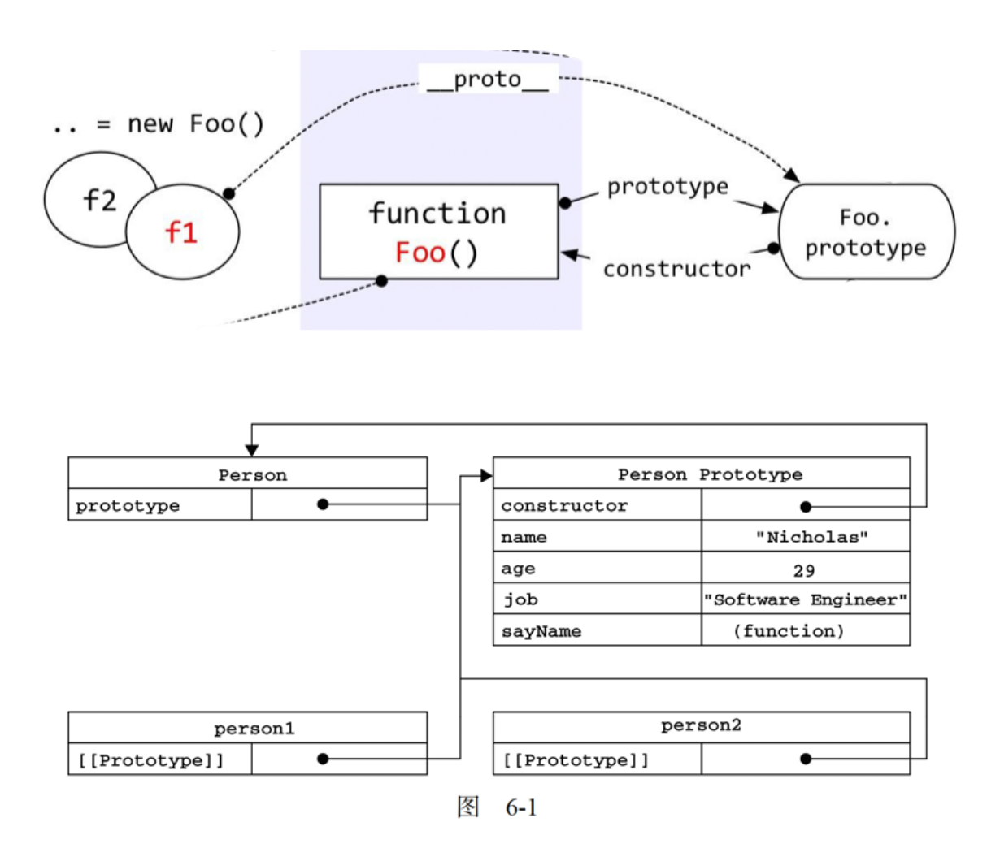
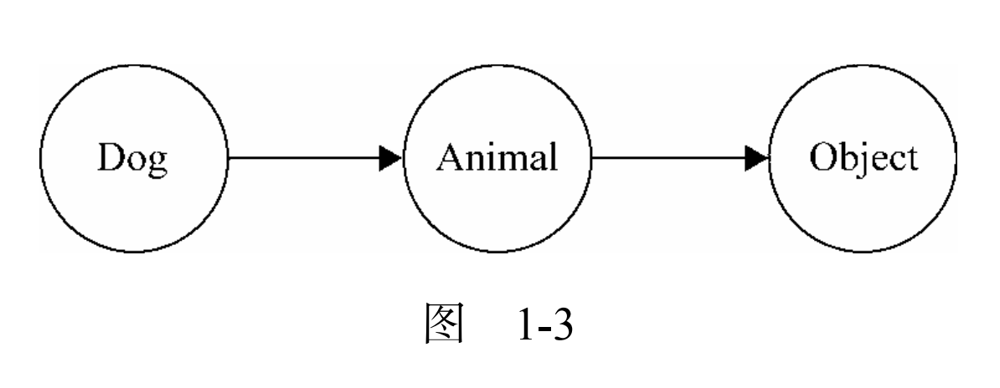
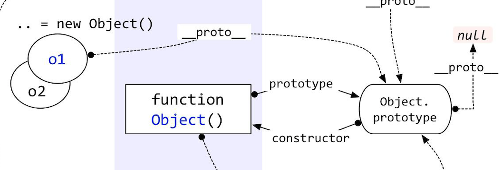

# 第1章 -- 面向对象的 javascript

## Catalog
- 1.1 动态类型语言和鸭子类型
- 1.2 多态
    + 1.2.1 一段 "多态" 的 Javascript 代码
    + 1.2.2 对象的多态性
    + 1.2.3 类型检查和多态
    + 1.2.4 使用继承得到多态效果
    + 1.2.5 Java Script 的多态
    + 1.2.6 多态在面向对象程序设计中的作用
    + 1.2.7 设计模式与多态
- 1.3 封装
    + 1.3.1 封装数据
    + 1.3.2 封装实现
    + 1.3.3 封装类型
    + 1.3.4 封装变化
- 1.4 原型模式和基于原型继承的 Javascript 对象系统
    + 1.4.1 使用克隆的原型模式
    + 1.4.2 克陸是创建对象的手段
    + 1.4.3 体验 Io 语言
    + 1.4.4 原型编程范型的一些规则
    + 1.4.5 Javascript 中的原型继承
    + 1.4.6 原型继承的未来
    + 1.4.7 小结


## New Words
- **abstract ['æbstrækt] --n.抽象, 摘要, 文摘.  --v.提取  --adj.抽象的**
    + an abstract concept. 抽象概念. 
    + Your words are so abstract to me. 你的话对我来说太抽象了. 
    + Well, it can get really abstract. 这东西太抽象了. 
- **execute ['ɛksɪkjut] --vt.执行; 实行; 进行**
    + execute a command [scheme]. 执行命令 [计划]
    + execute plan. 执行计划


## Additional Content
### 模式在不同语言之间的区别
   - 《设计模式》一书的副标题是"可复用面向对象软件的基础. "
   - 在 Java 这种静态编译型语言中, 无法动态地给已存在的对象添加职责, 
     所以一般通过包装类的方式来实现装饰着模式. 但在 Javascript
     这种动态解释型语言中, 给对象动态添加职责是再简单不过的事情. 
     这就造成了 javascript 语言的装饰者模式不在关注于给对象动态添加职责, 
     而是关注于给函数动态添加职责. 

### 对 js 设计模式的误解
   - 实际上, 在 java 等静态类型语言中, 让子类来 "决定"
     创建何种对象的原因是为了让程序迎合 **依赖倒置原则** (DIP). 
     在这些语言中创建对象时, 先解开对象类型之间的耦合关系非常重要, 
     这样才有机会在将来让对象表现出多态性. 
   - 而在 js 这种类型模糊的语言中, 对象多态性是天生的, 一个变量既可以指向一个类, 
     又可以随时指向另外一个类.  js 不存在类型耦合的问题, 自然也没有必要刻意去把对象
     "延迟" 到子类创建, 也就是说,  js 实际上不需要工厂方法模式的. 


## Content

- JavaScript 没有提供传统面向对象语言中的类式继承, 
  而是通过原型委托的方式来实现对象与对象之间的继承. 
  JavaScript 也没有在语言层面提供对抽象类和接口的支持. 

> 1. 设计模式的定义是: 在面向对象软件设计过程中针对特定问题的简洁而优雅的解决方案. 

### 1.1 动态类型语言和鸭子类型
- 编程语言按照数据类型大体可以分为两类: 一类是 `静态类型语言`; 另一类是`动态类型语言`.
  静态类型语言在编译时便已确定变量的类型, 
  而动态类型语言的变量类型要到程序运行的时候, 待变量被赋予某个值之后, 才会具有某种类型. 
- 在 JavaScript 中, 当我们对一个变量赋值时, 显然不需要考虑它的类型, 因此, 
  JavaScript 是一门典型的动态类型语言. 
  
  动态类型语言对变量类型的宽容给实际编码带来了很大的灵活性. 由于无需进行类型检测,
  我们可以尝试调用任何对象的任意方法, 而无需去考虑它原本是否被设计为拥有该方法. 
  
  这一切都建立在 `鸭子类型(duck typing)` 的概念上, 鸭子类型的通俗说法是:
  "如果它走起路来像鸭子, 叫起来也是鸭子, 那么它就是鸭子."

  我们可以通过一个小故事来更深刻地了解鸭子类型. 
  
  *从前在 JavaScript 王国里, 有一个国王, 他觉得世界上最美妙的声音就是鸭子的叫声,*
  *于是国王召集大臣, 要组建一个 1000 只鸭子组成的合唱团. 大臣们找遍了全国, *
  *终于找到 999 只鸭子, 但是始终还差一只, 最后大臣发现有一只非常特别的鸡, *
  *它的叫声跟鸭子一模一样, 于是这只鸡就成为了合唱团的最后一员. *

  这个故事告诉我们, 国王要听的只是鸭子的叫声, 这个声音的主人到底是鸡还是鸭并不重要.
  鸭子类型指导我们只关注对象的行为, 而不关注对象本身, 也就是关注 `HAS-A`,
  而不是 `IS-A`. 

  下面我们用代码模拟这个故事:
  ```js    
    var duck = {
        duckSinging: function() {
            console.log('嘎嘎嘎');
        }
    };
    var chicken = {
        duckSinging: function() {
            console.log('嘎嘎嘎');
        }
    }
    var choir = [];     // - 合唱团
    var joinChoir = function(animal) {
        if (animal && typeof animal.duckSinging === 'function') {
            choir.push(animal);
            console.log('恭喜加入合唱团');
            console.log('合唱团的成员数量: ' + choir.length);
        }
    };
    joinChoir(duck);        // 恭喜加入合唱团
    joinChoir(chicken);     // 恭喜加入合唱团 
  ```
  我们看到, 对于加入合唱团的动物, 大臣们根本无需检查它们的类型,
  而是只需要保证它们拥有 `duckSinging` 方法. 如果下次期望加入合唱团的是一只小狗, 
  而这只小狗刚好也会鸭子叫, 我相信这只小狗也能顺利加入. 
  
  在动态类型语言的面向对象设计中, 鸭子类型的概念至关重要. 利用鸭子类型的思想, 
  我们不必借助超类型的帮助, 就能轻松地在动态类型语言中实现一个原则:
  **"面向接口编程, 而不是面向实现编程".** 例如, 一个对象若有 `push` 和
  `pop` 方法, 并且这些方法提供了正确的实现, 它就可以被当作栈来使用. 
  一个对象如果有 `length` 属性, 也可以依照下标来存取属性(最好还要拥有
  `slice` 和 `splice` 等方法), 这个对象就可以被当作数组来使用. 

  在静态类型语言中, 要实现 "面向接口编程" 并不是一件容易的事情,
  **往往要通过抽象类或者接口等将对象进行向上转型.
  当对象的真正类型被隐藏在它的超类型身后, 这些对象才能在类型检查系统的 "监视"
  之下互相被替换使用. 只有当对象能够被互相替换使用, 才能体现出对象多态性的价值.**

  "面向接口编程" 是设计模式中最重要的思想, 但在 JavaScript 语言中,
  "面向接口编程" 的过程跟主流的静态类型语言不一样, 因此, 在 JavaScript
  中实现设计模式的过程与在一些我们熟悉的语言中实现的过程会大相径庭. 


### 1.2 多态
- "多态"一词源于希腊文 polymorphism, 拆开来看是 poly（复数） + morph（形态）+ ism,
  从字面上我们可以理解为复数形态. 
  
  **多态的实际含义是: 同一操作作用于不同的对象上面, 
  可以产生不同的解释和不同的执行结果. ** 换句话说, 给不同的对象发送同一个消息的时候, 
  这些对象会根据这个消息分别给出不同的反馈. 

  从字面上来理解多态不太容易, 下面我们来举例说明一下. 

  *主人家里养了两只动物, 分别是一只鸭和一只鸡, 当主人向它们发出"叫"的命令时, 
  鸭会"嘎嘎嘎"地叫, 而鸡会"咯咯咯"地叫. 这两只动物都会以自己的方式来发出叫声. 
  它们同样"都是动物, 并且可以发出叫声", 但根据主人的指令, 它们会各自发出不同的叫声.*

  其实, 其中就蕴含了多态的思想. 下面一节我们通过代码进行具体的介绍.

- js 多态--实际上也就是对象的多态 【P8.js 对象的多态性是与生俱来的】: 多态最根本的作用
  就是通过把过程化的条件分支语句转化为对象的多态性, 从而消除这些条件分支语句.
  ```javascript
    // - 类式多态
    const makeSound = function (animal) {
        // 此处调用对象下的 sound() 方法
        animal.sound();
    };
    const Duck = function () {};
    Duck.prototype.sound = function () {
        console.log("嘎嘎嘎");
    };
    const Chicken = function () {};
    Chicken.prototype.sound = function () {
        console.log("咯咯咯");
    };
    makeSound(new Duck());
    makeSound(new Chicken());
    const Dog = function () {};
    Dog.prototype.sound = function () {
        console.log("汪汪汪");
    };
    makeSound(new Dog());

    // js - 多态示例
    const googleMap = {
        show: function () {
            console.log("开始渲染谷歌地图");
        }
    };
    const baiduMap = {
        show: function () {
            console.log("开始渲染百度地图");
        }
    };
    const renderMap = function (map) {
        if (map.show instanceof Function) {
            map.show();
        }
    };
    renderMap(googleMap);
    renderMap(baiduMap);
    const sogouMap = {
        show: function () {
            console.log("开始渲染百度地图");
        }
    };
    renderMap(sogouMap);
  ```


#### 1.2.1 一段 "多态" 的 Javascript 代码
- 我们把上面的故事用 JavaScript 代码实现如下：
  ```js
    var makeSound = function( animal ){
        if ( animal instanceof Duck ){
            console.log( '嘎嘎嘎' );
        } else if ( animal instanceof Chicken ){
            console.log( '咯咯咯' );
        }
    };
    var Duck = function(){};
    var Chicken = function(){};
    makeSound( new Duck() );    // 嘎嘎嘎
    makeSound( new Chicken() ); // 咯咯咯
  ```
  多态背后的思想是将"做什么"和"谁去做以及怎样去做"分离开来, 也就是将
  "不变的事物" 与 "可能改变的事物" 分离开来. 在这个故事中, 动物都会叫, 这是不变的, 
  但是不同类型的动物具体怎么叫是可变的. 把不变的部分隔离出来, 把可变的部分封装起来, 
  这给予了我们扩展程序的能力, 程序看起来是可生长的, 也是符合开放—封闭原则的, 
  相对于修改代码来说, 仅仅增加代码就能完成同样的功能, 这显然优雅和安全得多. 

#### 1.2.2 对象的多态性
- 下面是改写后的代码, 首先我们把不变的部分隔离出来, 那就是所有的动物都会发出叫声:
  ```js
    var makeSound = function() {
        animal.sound();
    };
    // - 然后把可变的部分各自封装起来, 我们刚才谈到的多态性实际上指的是对象的多态性:
    var Duck = function() {}
    Duck.prototype.sound = function() {
        console.log('嘎嘎嘎');
    };

    var Chicken = function(){}
    Chicken.prototype.sound = function(){
        console.log( '咯咯咯' );
    };

    makeSound( new Duck() );    // 嘎嘎嘎
    makeSound( new Chicken() ); // 咯咯咯
  ```
  现在我们向鸭和鸡都发出"叫唤"的消息, 它们接到消息后分别作出了不同的反应. 
  如果有一天动物世界里又增加了一只狗, 这时候只要简单地追加一些代码就可以了, 
  而不用改动以前的 makeSound 函数, 如下所示:
  ```js
    var Dog = function(){}
    Dog.prototype.sound = function(){
        console.log( '汪汪汪' );
    };
    makeSound( new Dog() ); // 汪汪汪
  ```

#### 1.2.3 类型检查和多态
- 类型检查是在表现出对象多态性之前的一个绕不开的话题, 但 JavaScript
  是一门不必进行类型检查的动态类型语言, 为了真正了解多态的目的, 我们需要转一个弯,
  从一门静态类型语言说起. 
  
  我们在 `1.1 节` 已经说明过静态类型语言在编译时会进行类型匹配检查. 以 Java 为例,
  由于在代码编译时要进行严格的类型检查, 所以不能给变量赋予不同类型的值,
  这种类型检查有时候会让代码显得僵硬, 代码如下:
  ```java
    String str;
    str = "abc";    // - 没有问题
    // str = 2;     // - 报错
    
    // - 现在我们尝试把上面让鸭子和鸡叫的例子换成 Java 代码:

    // - 鸭子类
    public class Duck {
        public void makeSound() {
            // - 在Java语言中, 标准输入输出流使用 `println`(print line).
            // - C 语言 中 "stdio.h" 库中的标准函数 "printf()" (print format)
            System.out.println('嘎嘎嘎');
        }
    }

    // - 鸡类
    public class Chicken {
        public void makeSound() {
            System.out.println('咯咯咯');
        }
    }

    // - AnimalSound 动物叫的类
    public class AnimalSound {
        public void makeSound(Duck duck) {  // {1}
            duck.makeSound()
        }
    }

    public class Test {
        public static void main(String args[]) {
            AnimalSound animalSound = new AnimalSound();
            Duck duck = new Duck();
            animalSound.makeSound(duck);    // 输出: 嘎嘎嘎
        }
    }
  ```
  我们已经顺利地让鸭子可以发出叫声, 但如果现在想让鸡也叫唤起来, 
  我们发现这是一件不可能实现的事情. 因为 `行 {1}` 处 AnimalSound 类的
  makeSound 方法, 被我们规定为只能接受 Duck 类型的参数:
  ```java
    public class Test {
        public static void main(String args[]) {
            AnimalSound animalSound = new AnimalSound();
            Chicken chicken = new Chicken();
            animalSound.makeSound(chicken); // 报错, 只能接受 Duck 类的参数
        }
    }
  ```
  某些时候, 在享受静态语言类型检查带来的安全性的同时, 我们亦会感觉被束缚住了手脚.
  为了解决这一问题, 静态类型的面向对象语言通常被设计为可以 `向上转型`:
  **当给一个类变量赋值时, 这个变量的类型既可以使用这个类本身,
  也可以使用这个类的超类.** 这就像我们在描述天上的一只麻雀或者一只喜鹊时, 通常说 
  "一只麻雀在飞" 或者 "一只喜鹊在飞". 但如果想忽略它们的具体类型, 那么也可以说
  "一只鸟在飞".
  
  同理, 当 Duck 对象和 Chicken 对象的类型都被隐藏在超类型 Animal 身后,
  Duck 对象和 Chicken对象就能被交换使用, 这是让对象表现出多态性的必经之路,
  而多态性的表现正是实现众多设计模式的目标. 

#### 1.2.4 使用继承得到多态效果
- **使用继承来得到多态效果, 是让对象表现出多态性的最常用手段.** 继承通常包括
  `实现继承` 和 `接口继承`. 本节我们讨论实现继承, 接口继承的例子请参见第 21 章.

  我们先创建一个 Animal 抽象类, 再分别让 Duck 和 Chicken 都继承自 Animal 抽象类,
  下述代码中 `行{1}` 和 `行{2}` 出的赋值语句显然是成立的, 因为鸭子和鸡也是动物:
  ```java
    // - 创建一个抽象类 Animal
    public abstract class Animal {
        abstract void makeSound();  // - 抽象方法
    }
    public class Chicken extends Animal {
        public void makeSound() {
            System.out.println('咯咯咯');
        }
    }
    public class Duck extends Animal {
        public void makeSound() {
            System.out.println('嘎嘎嘎');
        }
    }
    Animal duck = new Duck();       // {1}
    Animal chicken = new Chicken(); // {2}
  ```
  现在剩下的就是让 AnimalSound 类的 makeSound 方法接受 Animal 类型的参数,
  而不是具体的 Duck 类型或者 Chicken 类型:
  ```java
    public class AnimalSound {
        // - 接受 Animal 类型的参数
        public void makeSound(Animal animal) {
            animal.makeSound();
        }
    }
    public class Test {
        public static void main(String args[]) {
            AnimalSound animalSound = new AnimalSound();
            Animal duck = new Duck();
            Animal chicken = new Chicken();
            animalSound.makeSound(duck);    // 输出 嘎嘎嘎
            animalSound.makeSound(chicken); // 输出 咯咯咯
        }
    }
  ```

#### 1.2.5 Java Script 的多态
- 从前面的讲解我们得知, 多态的思想实际上是把 "做什么 " 和"谁去做" 分离开来,
  要实现这一点, 归根结底先要消除类型之间的耦合关系. 如果类型之间的耦合关系没有被消除,
  那么我们在 makeSound 方法中指定了发出叫声的对象是某个类型,
  它就不可能再被替换为另外一个类型. 在 Java 中, 可以通过向上转型来实现多态. 

  而 JavaScript 的变量类型在运行期是可变的. 一个 JavaScript 对象,
  既可以表示 Duck 类型的对象, 又可以表示 Chicken 类型的对象, 
  这意味着 **JavaScript 对象的多态性是与生俱来的**. 
  
  这种与生俱来的多态性并不难解释. JavaScript 作为一门动态类型语言, 
  它在编译时没有类型检查的过程, 既没有检查创建的对象类型, 又没有检查传递的参数类型.
  在 1.2.2 节的代码示例中, 我们既可以往 makeSound 函数里传递 duck 对象当作参数,
  也可以传递 chicken 对象当作参数. 
  
  由此可见, 某一种动物能否发出叫声, 只取决于它有没有 makeSound 方法,
  而不取决于它是否是某种类型的对象, 这里不存在任何程度上的 "类型耦合".
  这正是我们从上一节的鸭子类型中领悟的道理. 在 JavaScript 中,
  并不需要诸如向上转型之类的技术来取得多态的效果. 

#### 1.2.6 多态在面向对象程序设计中的作用
- 有许多人认为, 多态是面向对象编程语言中最重要的技术. 但我们目前还很难看出这一点,
  毕竟大部分人都不关心鸡是怎么叫的, 也不想知道鸭是怎么叫的.
  让鸡和鸭在同一个消息之下发出不同的叫声, 这跟程序员有什么关系呢?
  
  Martin Fowler 在《重构:改善既有代码的设计》里写到:
    + *多态的最根本好处在于, 你不必再向对象询问 "你是什么类型"
      而后根据得到的答案调用对象的某个行为 -- 你只管调用该行为就是了,
      其他的一切多态机制都会为你安排妥当.*
  
  换句话说, 多态最根本的作用就是通过把过程化的条件分支语句转化为对象的多态性,
  从而消除这些条件分支语句.

  利用对象的多态性, 对象应该做什么并不是临时决定的, 而是已经事先约定和排练完毕的. 
  每个对象应该做什么, 已经成为了该对象的一个方法, 被安装在对象的内部, 
  每个对象负责它们自己的行为. 所以这些对象可以根据同一个消息,
  有条不紊地分别进行各自的工作.

  将行为分布在各个对象中, 并让这些对象各自负责自己的行为, 这正是面向对象设计的优点. 
  
#### 1.2.7 设计模式与多态
- GoF 所著的《设计模式》一书的副书名是 "可复用面向对象软件的基础".
  该书完全是从面向对象设计的角度出发的, 通过对封装、继承、多态、组合等技术的反复使用,
  提炼出一些可重复使用的面向对象设计技巧. 而多态在其中又是重中之重,
  绝大部分设计模式的实现都离不开多态性的思想. 
- 拿 `命令模式`(参见第 9 章) 来说, 请求被封装在一些命令对象中,
  这使得命令的调用者和命令的接收者可以完全解耦开来, 当调用命令的 `execute` 方法时,
  不同的命令会做不同的事情, 从而会产生不同的执行结果.
  而做这些事情的过程是早已被封装在命令对象内部的, 作为调用命令的客户,
  根本不必去关心命令执行的具体过程. 
- 在 `组合模式`(参见第 10 章)中,
  多态性使得客户可以完全忽略组合对象和叶节点对象之间的区别,
  这正是组合模式最大的作用所在. 对组合对象和叶节点对象发出同一个消息的时候,
  它们会各自做自己应该做的事情, 组合对象把消息继续转发给下面的叶节点对象,
  叶节点对象则会对这些消息作出真实的反馈. 
- 在 `策略模式`(参见第 5 章)中, `Context` 并没有执行算法的能力,
  而是把这个职责委托给了某个策略对象. 每个策略对象负责的算法已被各自封装在对象内部.
  当我们对这些策略对象发出 "计算" 的消息时, 它们会返回各自不同的计算结果. 
- 在 JavaScript 这种 **将函数作为一等对象的语言中, 函数本身也是对象**,
  函数用来封装行为并且能够被四处传递. 当我们对一些函数发出 "调用" 的消息时, 
  这些函数会返回不同的执行结果, 这是 "多态性" 的一种体现,
  也是很多设计模式在 JavaScript 中可以用高阶函数来代替实现的原因. 

### 1.3 封装
- 封装的目的是将信息隐藏. 一般而言, 我们讨论的封装是封装数据和封装实现. 
  这一节将讨论更广义的封装, 不仅包括封装数据和封装实现, 还包括封装类型和封装变化
#### 1.3.1 封装数据
- 在许多语言的对象系统中, 封装数据是由语法解析来实现的, 这些语言也许提供了
  `private`、`public`、 `protected` 等关键字来提供不同的访问权限. 

  但 JavaScript 并没有提供对这些关键字的支持, 我们只能依赖变量的作用域来实现封装特性,
  而且只能模拟出 `public` 和 `private` 这两种封装性. 
  
  除了 ECMAScript 6 中提供的 `let` 之外, 一般我们通过函数来创建作用域:
  ```js
    var myObject = (function() {
        // - 私有(private) 变量
        var _name = 'sven'; 
        return {
            // - 公开(public) 方法
            getName: function() {
                return _name;
            }
        }
    })();

    console.log(myObject.getName());    // 输出: sven
    console.log(myObject._name);        // 输出: undefined
  ```
  值得一提的是, 在 ES6 中, 我们还可以使用 `Symbol` 创建私有属性. (tip: `Symbol`
  的更多语法见: `../../《深入理解ES6》/chapter06_Symbol和Symbol属性`)
#### 1.3.2 封装实现
- 上一节描述的封装, 指的是数据层面的封装. 有时候我们喜欢把封装等同于封装数据,
  但这是一种比较狭义的定义. 
  
  封装的目的是将信息隐藏, 封装应该被视为 "任何形式的封装", 也就是说,
  封装不仅仅是隐藏数据, 还包括隐藏实现细节、设计细节以及隐藏对象的类型等.

  从封装实现细节来讲, 封装使得对象内部的变化对其他对象而言是透明的, 也就是不可见的.
  对象对它自己的行为负责. 其他对象或者用户都不关心它的内部实现.
  封装使得对象之间的耦合变松散, 对象之间只通过暴露的 API 接口来通信.
  当我们修改一个对象时, 可以随意地修改它的内部实现, 只要对外的接口没有变化,
  就不会影响到程序的其他功能.
  
  封装实现细节的例子非常之多. 拿迭代器来说明,
  迭代器的作用是在不暴露一个聚合对象的内部表示的前提下,
  提供一种方式来顺序访问这个聚合对象. 我们编写了一个 `each` 函数,
  它的作用就是遍历一个聚合对象, 使用这个 `each` 函数的人不用关心它的内部是怎样实现的,
  只要它提供的功能正确便可以. 即使 `each` 函数修改了内部源代码,
  只要对外的接口或者调用方式没有变化, 用户就不用关心它内部实现的改变. 
#### 1.3.3 封装类型
- 封装类型是静态类型语言中一种重要的封装方式. 一般而言, 
  封装类型是通过抽象类和接口来进行的(tip: 例如 1.2 节的 Animal 示例). 
  把对象的真正类型隐藏在抽象类或者接口之后, 相比对象的类型, 客户更关心对象的行为. 
  在许多静态语言的设计模式中, 想方设法地去隐藏对象的类型, 
  也是促使这些模式诞生的原因之一. 比如工厂方法模式、组合模式等. 
  
  当然在 JavaScript 中, 并没有对抽象类和接口的支持.  JavaScript
  本身也是一门类型模糊的语言. 在封装类型方面,  JavaScript 没有能力, 
  也没有必要做得更多. 对于 JavaScript 的设计模式实现来说, 不区分类型是一种失色, 
  也可以说是一种解脱. 在后面章节的学习中, 我们可以慢慢了解这一点.
#### 1.3.4 封装变化(*)
- 从设计模式的角度出发, 封装在更重要的层面体现在`封装变化`.
  
  《设计模式》一书层提到如下文字:
    + *考虑你的设计中那些地方可能变化, 这种方式与关注会导致重新设计的原因相反.
      它不是考虑什么时候回迫使你的设计改变,
      而是考虑你怎样才能够在不重新设计的情况下进行改变.
      这里的关键在于封装发生变化的概念, 这也是许多设计模式的主题.*

  这段文字即是《设计模式》提到的 "找到变化并封装之". 
  《设计模式》一书中共归纳总结了 **23 种设计模式**. 从意图上区分,
  这 23 种设计模式分别被划分为 `创建型模式`、`结构型模式` 和 `行为型模式`. 
  
  拿 `创建型模式` 来说, 要创建一个对象, 是一种抽象行为, 
  而具体创建什么对象则是可以变化的, **创建型模式的目的就是封装创建对象的变化**. 
  而 `结构型模式` **封装的是对象之间的组合关系**. 
  `行为型模式` **封装的是对象的行为变化**. **通过封装变化的方式, 
  把系统中稳定不变的部分和容易变化的部分隔离开来**, 在系统的演变过程中, 
  我们只需要替换那些容易变化的部分, 如果这些部分是已经封装好的, 替换起来也相对
  容易. 这可以最大程度地保证程序的稳定性和可扩展性. 

  从《设计模式》副标题“可复用面向对象软件的基础”可以知道, 
  这本书理应教我们如何编写可复用的面向对象程序. 
  这本书把大多数笔墨都放在如何封装变化上面, 这跟编写可复用的面向对象程序是不矛盾的. 
  当我们想办法把程序中变化的部分封装好之后, 剩下的即是稳定而可复用的部分了. 

### 1.4 原型模式和基于原型继承的 Javascript 对象系统
- 在 Brendan Eich 为 JavaScript 设计面向对象系统时, 借鉴了 `Self` 和
  `Smalltalk` 这两门基于原型的语言. 选择基于原型的面向对象系统,
  是因为从一开始 Brendan Eich 就没有打算在 JavaScript 中加入类的概念. 

  在以类为中心的面向对象编程语言中, 类和对象的关系可以想象成铸模和铸件的关系, 
  对象总是从类中创建而来. 而在原型编程的思想中, 类并不是必需的, 
  对象未必需要从类中创建而来. **一个对象是通过克隆另外一个对象所得到的**. 
  
  原型模式不单是一种设计模式, 也被称为一种编程泛型. 
  本节我们将首先学习第一个设计模式——原型模式. 随后会了解基于原型的 Io 语言, 
  借助对 Io 语言的了解, 我们对 JavaScript 的面向对象系统也将有更深的认识. 
  在本节的最后, 我们将详细了解 JavaScript 语言如何通过原型来构建一个面向对象系统. 
#### 1.4.1 使用克隆的原型模式
- 从设计模式的角度讲, 原型模式是用于创建对象的一种模式, 如果我们想要创建一个对象,
  一种方法是先指定它的类型, 然后通过类来创建这个对象. 原型模式选择了另外一种方式, 
  我们不再关心对象的具体类型, 而是找到一个对象, 然后通过克隆来创建一个一模一样的对象.
- 原型模式的关键实现, 是语言本身是否提供了 `clone` 方法.  ECMAScript5 提供了
  `Object.create` 方法, 可以用来克隆对象. 代码如下: 
    + Object.create("要克隆的对象", "新对象定义额外属性的对象(可选,一般不写)")
    + 《js高程》P170 --> ECMAScript 5 通过新增 `Object.create()`
      方法规范化了原型式继承. 个方法接收两个参数：
        - (1) 用作新对象原型的对象. 
        - (2) 一个为新对象定义额外属性的对象(可选). 
      ```js
        const Plane = function () {
           this.blood = 100;
           this.attackLevel = 1;
           this.defenseLevel = 1;
        };
        
        let plane = new Plane();
        plane.blood = 500;
        plane.attackLevel = 10;
        plane.defenseLevel = 7;
        
        let clonePlane = Object.create(plane);
        console.log(clonePlane);            // Plane {}
        console.log(clonePlane.blood);      // 500
        console.log(clonePlane.attackLevel);// 10
      ```
  
    在不支持 `Object.create` 方法的浏览器中, 则可以使用以下代码:
    ```js
        Object.create = Object.create || function(obj) {
            var F = Function() {};
            F.prototype = obj;
            return  new F();
        }
    ```
#### 1.4.2 克陸是创建对象的手段
- 原型模式的真正目的并非在于需要得到一个一模一样的对象, 
  而是**提供了一种便捷的方式去创建某个类型的对象, 克隆只是创建这个对象的过程和手段.**

  在用 Java 等静态类型语言编写程序的时候, 类型之间的解耦非常重要. 
  依赖倒置原则提醒我们创建对象的时候要避免依赖具体类型, 而用 new XXX 
  创建对象的方式显得很僵硬. 工厂方法模式和抽象工厂模式可以帮助我们解决这个问题, 
  但这两个模式会带来许多跟产品类平行的工厂类层次, 也会增加很多额外的代码. 

  原型模式提供了另外一种创建对象的方式, 通过克隆对象, 
  我们就不用再关心对象的具体类型名字. 

  当然在 JavaScript 这种类型模糊的语言中, 创建对象非常容易, 
  也不存在类型耦合的问题. 从设计模式的角度来讲, 原型模式的意义并不算大. 
  但 JavaScript 本身是一门基于原型的面向对象语言, 
  它的对象系统就是使用原型模式来搭建的, 在这里称之为**原型编程范型**也许更合适. 

#### 1.4.3 体验 Io 语言
- 前面说过, 原型模式不仅仅是一种设计模式, 也是一种编程范型. 
  **JavaScript 就是使用原型模式来搭建整个面向对象系统的**.
  在 JavaScript 语言中不存在类的概念, 对象也并非从类中创建出来的
  **所有的 JavaScript 对象都是从某个对象上克隆而来的**.

  ......
#### 1.4.4 原型编程范型的一些规则
- Io 和 JavaScript 一样, 基于原型链的委托机制就是原型继承的本质. 

  ......
#### 1.4.5 Javascript 中的原型继承
- 刚刚我们已经体验过同样是基于原型编程的 Io 语言, 也已经了解了在 Io
  语言中如何通过原型链来实现对象之间的继承关系. 在原型继承方面, 
  JavaScript 的实现原理和 Io 语言非常相似, 
  JavaScript 也同样遵守这些原型编程的基本规则:
    + (1) 所有的数据都是对象.(tip:  `undefined` 不是對象) 
    + (2) 要得到一个对象, 不是通过实例化类, 而是找到一个对象作为原型并克隆它.
      (tip: 自定义的构造函数也是对象.)
    + (3) 对象会记住它的原型. 
    + (4) 如果对象无法响应某个请求, 它会吧这个请求委托给自己的原型. 

##### 下面我们来讨论 JavaScript 是如何在这些规则的基础上来构建它的对象系统的.
- (1).**所有的数据都是对象**.
  
  JavaScript 在设计的时候, 模仿 Java 引入了两套类型机制: 
    + 基本类型: 基本类型包括 `undefined`、`null`、`boolean`、`number`、
      `string`、`symbol` 从现在看来, 这并不是一个好的想法.
      按照 JavaScript 设计者的本意, 除了 `undefined` 之外, 一切都应是对象.
      为了实现这一目标, `number`、`boolean`、`string`
      这几种基本类型数据也可以通过 "包装类" 的方式变成对象类型数据来处理. 
      (tip: 这里说的"包装类"应该就是"js高程"上的基本包装类型 `Boolean`, `Number`, `String`)
    + 对象类型: 也就是引用类型 -- `Object`. (注: 书上这里讲解感觉有问题, Object肯定不是基本类型啊)

  事实上, JavaScript 中的根对象是 **`Object.prototype` 对象**.
  `Object.prototype` 对象是一个空的对象, 我们在 js 中遇到的每个对象,
  实际上都是从 `Object.prototype` 对象克隆而来的, `Object.prototype`
  对象就是他们的原型. 例如下面的 obj1 和 obj2 对象:
  ```js
    let obj1 = {};
    let obj2 = {};
    // 可以利用 ES5 提供的 Object.getPrototypeOf 来查看这两个对象的原型:
    console.log(Object.getPrototypeOf( obj1 ) === Object.prototype);  // true
    console.log(Object.getPrototypeOf( obj2 ) === Object.prototype);  // true
  ```

- (2). **要得到一个对象, 不是通过实例化类, 而是找到一个对象作为原型并克隆它.**
  
  在 Io 语言中, 克隆一个对象的动作非常明显, 我们可以在代码中清晰地看到 `clone`
  的过程, 比如如下代码:
  ```io
    Dog := Animal clone
  ```
  但在 JavaScript 语言里, 我们不需要关心克隆的细节, 因为这是引擎内部负责实现的.
  我们所需要做的知识显式第调用 `var obj1 = new Object()` 或者 `var obj2 = {}`.
  此时, 引擎内部就会从 `Object.prototype` 上面克隆一个对象出来,
  我们最终得到的就是这个对象.
  
  再来看看如何用 `new` 运算符从构造器中得到一个对象, 下面的代码我们再熟悉不过了:
  ```js
    function Person(name) {
        this.name = name;
    }

    Person.prototype.getName = function () {
        return this.name;
    };

    let person = new Person('Kew');
    console.log(person.name);
    console.log(person.getName());
    console.log(Object.getPrototypeOf(person) === Person.prototype);
    console.log('\n' +  '//' + ('*'.repeat(66)) + '\n');
  ```
  在 JavaScript 中没有类的概念, 这句话我们已经重复过很多次了. 但上面命名明明调用了
  `new Person()` 吗?
  
  **在这里 `Person` 并不是类, 而是构造函数, JavaScript 的函数既可以作为普通函数被调用, 
  也可以作为构造函数被调用`(Tip01)`. 当使用 `new` 运算符调用函数时,
  此时的函数就是一个构造器. 用 `new` 运算符来创建对象的过程, 实际上也只是先克隆
  `Object.prototype` 对象, 再进行一些其他额外操作的过程.** `(Tip02)`
    + `Tip01`: 我们平时都是用 `new` 操作符来调用**构造函数**, 但实际上在 JS
      中任何函数都允许使用 `new` 操作符调用, 这种方式只是一种约定习俗.
    + `Tip02`: JavaScript 是通过克隆 `Object.prototype` 来得到新的对象, 
      但实际上并不是每次都真正地克隆了一个新的对象.  从内存方面的考虑出发, 
      JavaScript 还做了一些额外的处理, 具体细节可以参阅周爱民老师编著的
      《JavaScript 语言精髓与开发实践》. 这里不做深入讨论, 
      我们暂且把创建对象的过程看成完完全全的克隆. 

  在 Chrome 和 Firefox 等向外暴露了 `__proto__` 属性的浏览器下,
  我们可以通过下面这段代码来理解 `new` 运算的过程:
  ```js
    function Person(name) {
        this.name = name;
    }
    Person.prototype.getName = function() {
        return this.name;
    }

    // - (A)
    var objectFactory = function() {
        // - (1) 从 Object.prototype 上克隆一个空的对象.
        var obj = new Object();

        // - (2) 取得外部传入的构造器, 此例是 Person.
        var Constructor = [].shift.call(arguments);

        // - (3) 执行正确的原型.
        // - tip: 我们根据 "JavaScript 原型图"(见下 "图(1)") 可以看出,
        //   obj.__proto__ 会指向它的构造函数的原型(Object.prototype),
        //   此处把 Constructor.prototype 赋值给 obj.__proto__ 是修正原型指向.
        obj.__proto__ = Constructor.prototype;

        // - (4) 借用外部传入的构造器给 obj 设置属性
        var ret = Constructor.apply(obj, arguments);

        // - (5) 确保构造器总是会返回一个对象
        return typeof ret === 'object' ? ret : obj;
    }

    let a = objectFactory(Person, "seven");

    console.log(a);     // Person { name: 'seven' }
    console.log(a.name);
    console.log(a.getName());
    console.log(Object.getPrototypeOf(a) === Person.prototype);

    // - 我们看到, 分别调用下面两句代码产生了一样的结果:
    var b = objectFactory(Person, 'sven');
    var bb = new Person('sven');
  ```

  

  图(-)

    + `(A)`: 在 《JavaScript 高级程序设计》内的 6.2.2 构造函数模式中, 
      对于使用 `new` 操作符, 调用创建构造函数的实例时, 是这样解说的:
      要创建 Person 的新实例, 必须使用 `new` 操作符. 
      以这种方式调用构造函数实际上会经历以下 4 个步骤:
        - (1) 创建一个新对象.  (即上面的代码中的 `(1)`)
        - (2) 将构造函数的作用域赋值给新对象 (`(2)` + `(3)`)
        - (3) 执行构造函数中的代码 (上面代码中的的 `(4)`)
        - (4) 返回新对象. (`(5)`)

- (3) **对象(即: 构造函数的实例) 会记住它的原型**
  如果请求可以在一个链条中依次往后传递, 那么每个节点都必须知道它的下一个节点. 
  同理, 要完成 Io 语言或者 JavaScript 语言中的原型链查找机制, 
  每个对象至少应该先记住它自己的原型. 
  
  目前我们一直在讨论 "对象的原型", 就 JavaScript 的真正实现来说, 
  其实并不能说对象有原型, 而**只能说对象的构造器有原型**. 对于
  "对象把请求委托给它自己的原型" 这句话,
  更好的说法是**对象把请求委托给它的构造器的原型**. 
  那么对象如何把请求顺利地转交给它的构造器的原型呢？

  JavaScript 给对象提供了一个名为 `__proto__` 的隐藏属性, 
  某个对象的 `__proto__` 属性默认会指向它的构造器的原型对象, 
  即 `{Constructor}.prototype`(e.g.: `Person.prototype`). 
  
  此处提供一张图来清晰的看一下它们的关系:

  

  上图中的 `f1.__proto__ = Foo.prototype`, 对应下面 《JS高程》中的截图就是:
  `person1.[[Prototype]] = Person.prototype`.
  
  在一些浏览器中, `__proto__` 被公开出来, 我们可以在 Chrome 或者 Firefox
  上用这段代码来验证:
  
  ```js
    var a = new Object();
    console.log ( a.__proto__=== Object.prototype ); // 输出： true
  ```
  实际上, `__proto__` 就是对象跟 "对象构造器的原型" 联系起来的纽带.
  正因为对象要通过 `__proto__` 属性来记住它的构造器的原型, 所以我们用上一节的
  `objectFactory` 函数来模拟用 `new` 创建对象时,  需要手动给 obj
  对象设置正确的 `__proto__` 指向. 
```js
    obj.__proto__ = Constructor.prototype;
```
  通过这句代码, 我们让 `obj.__proto__` 指向 `Person.prototype`, 
  而不是原来的 `Object.prototype`.

- (4) **如果对象无法响应某个请求, 它会把这个请求委托给它的构造器的原型**
  这条规则即是原型继承的精髓所在. 从对 Io 语言的学习中, 我们已经了解到, 
  当一个对象无法响应某个请求的时候, 它会顺着原型链把请求传递下去, 
  直到遇到一个可以处理该请求的对象为止. 

  JavaScript 的克隆跟 Io 语言还有点不一样,  Io 中每个对象都可以作为原型被克隆, 
  当 Animal 对象克隆自 Object 对象,  Dog 对象又克隆自 Animal 对象时, 
  便形成了一条天然的原型链, 如图

  

  而在 JavaScript 中, 每个对象都是从 `Object.prototype` 对象克隆而来的,
  如果是这样的话, 我们只能得到单一的继承关系, 即每个对象都继承自 `Object.prototype`
  对象, 这样的对象系统显然是非常受限的. 
  
  实际上, 虽然 JavaScript 的对象最初都是由 `Object.prototype` 对象克隆而来的,
  但对象构造器的原型并不仅限于 `Object.prototype` 上, 而是可以动态指向其他对象. 
  这样一来, 当对象 `a` 需要借用对象 `b` 的能力时, 可以有选择性地把对象 `a`
  的构造器的原型指向对象 `b`, 从而达到继承的效果. 
  下面的代码是我们最常用的原型继承方式:
  ```js
    var obj = {name: 'sven'};

    var A = function() {};
    A.prototype = obj;

    var a = new A();
    console.log(a.name);    // sven
  ```
  我们来看看执行这段代码的时候, 引擎做了哪些事情. 
    + (1) 首先, 尝试遍历对象 `a` 中的所有属性, 但没有找到 `name` 这个属性. 
    + (2) 查找 `name` 属性的这个请求被委托给对象 `a` 的构造器的原型, 它被
      `a.__proto__` 记录着并且指向 `A.prototype`, 而 `A.prototype`
      被设置为对象 `obj`. 
    + (2) 对象 `obj` 会根据原型链的原理, 首先检查自身是否有 `name` 属性,
      如果有就返回, 此处符合情况.
        - tip: 如果 `obj` 自身并无 `name` 属性, 它会根据原型链(即:
          `obj.__proto__`) 查找到 `Object.prototype` 上是否含有 `name` 属性,
          如果含有则返回, 没有直接返回 `undefined`. 下面是示例代码:
          ```js
            (function() {
                // - tip: 这种写法在生产环境几乎不会出现, 此处只是演示
                Object.prototype.name = 'Kew';

                var obj = {age: 31};

                var A = function() {};
                A.prototype = obj;

                var a = new A();
                console.log(a.name);    // Kew
            })();
          ```
          
          这里添加一下对应图片表述, 以便观察.
          
          

  当我们期望得到一个 "类" 继承自另一个 "类" 的效果时, 往往会用到下面的代码来模拟现实:
  ```js
    var A = function() {};
    A.prototype = {name: 'sven'};

    var B = function() {};
    B.prototype = new A();

    var b = new B();
    console.log(b.name);    // 输出: sven
  ```
  再看这段代码执行的时候, 引擎做了什么事情. 
    + (1) 首先, 尝试遍历对象 `b` 中的所有属性, 但没有找到 `name` 这个属性. 
    + (2) 查找 `name` 属性的请求被委托给对象 `b` 的构造器的原型, 它被
      `b.__proto__` 记录着并且指向 `B.prototype`, 而 `B.prototype`
       被设置为一个通过 `new A()` 创建出来的对象. 
    + (3) 在该对象中依然没有找到 `name` 属性,
      于是请求被继续委托给这个对象构造器的原型 `A.prototype`. 
    + (4) 在 `A.prototype` 中找到了 `name` 属性, 并返回它的值. 

  和把 `B.prototype` 直接指向一个字面量对象相比, 通过
  `B.prototype = new A()` 形成的原型链比之前多了一层. 但二者之间没有本质上的区别,
  都是将对象构造器的原型指向另外一个对象, 继承总是发生在对象和对象之间. 

  最后还要留意一点, 原型链并不是无限长的. 现在我们尝试访问对象 `a` 的 `address`
  属性. 而对象 `b` 和它构造器的原型上都没有 `address` 属性,
  那么这个请求会被最终传递到哪里呢？
  
  实际上, 当请求达到 `A.prototype`, 并且在 `A.prototype` 中也没有找到
  `address` 属性的时候, 请求会被传递给 `A.prototype` 的构造器原型
  `Object.prototype`, 显然 `Object.prototype` 中也没有 `address` 属性, 
  但 `Object.prototype` 的原型是 `null`, 说明这时候原型链的后面已经没有别的节点了. 
  所以该次请求就到此打住, `a.address` 返回 `undefined`. 
  ```js
    a.address // 输出： undefined
  ```

#### 1.4.6 原型继承的未来
- 另外,  ECMAScript 6 带来了新的 Class 语法. 这让 JavaScript
  看起来像是一门基于类的语言, 但其背后仍是通过原型机制来创建对象. 
  
  更多关于 ES6 的 `Class` 创建类的语法, 见:
  `../../《深入理解ES6》/chapter09_JavaScript中的类`


#### 1.4.7 小结
- 本节讲述了本书的第一个设计模式——原型模式. 原型模式是一种设计模式,
  也是一种编程泛型, 它构成了 JavaScript 这门语言的根本. 
