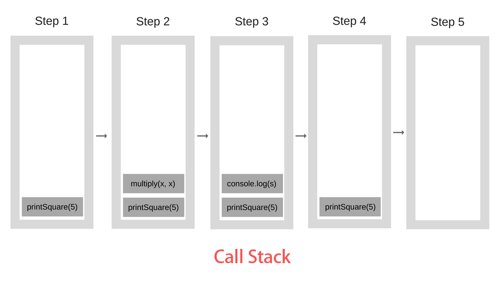

# 11. 执行上下文(Execution Context) 和 执行栈(Call Stack)

- Tip: 这一章节的内容, 为几篇文章的混合.
- Tip02: `执行上下文` 有的文章也叫 `"执行环境"` 本文按照汤姆老师的称呼来.
- 参考文章有:  
    + [11.执行上下文](https://www.cnblogs.com/TomXu/archive/2012/01/13/2308101.html)
    + [深入理解JS中的执行环境和执行栈](http://lht.ren/article/18/)
    + [解读 JS引擎、运行时和堆栈调用](https://www.itcodemonkey.com/article/1597.html)


## 目录 (Catalog)
- 11.1 什么是执行上下文和执行栈? 
- 11.2 什么是可执行代码 (Executable Code)?
- 11.3 执行上下文的类型
    + 11.3.1 全局执行上下文
    + 11.3.2 函数执行上下文
    + 11.3.3 eval 函数执行上下文 
- 11.4 执行栈(Call Stack)


## 生词 (New Words)
- **heap [hiːp] --n.堆, 积累**
    + Heap sort 堆排序
    + Heap memory 堆内存
    + heaps of: 大量；许多
    + a heap of: [口]一大堆, 许多
    + heap up: 堆积
    + Not to say these things, here to do what heap ah!
        这些东西说了不要了, 堆在这里做什么啊！
- **stack [stæk] --n.堆; [常 -s] 大量[of]; 堆栈,栈.  --v.堆放, 堆积**
    + a stack of firewood. 一堆木材. 
    + stacks of work. 堆积如山的工作
    + a stack of boxes. 一堆盒子. 
    + call stack. 调用栈, 调用堆栈
    + Mathematics Stack Exchange 数学堆栈交换
- **execution [ˌeksɪ'kjuːʃ(ə)n] --n.执行, 实行**
    + execution context 执行上下文
    + execution command 执行指令
    + break execution 中断执行
- **executable ['eksikju:təbl] --adj.可执行的, 实行的**
    + C++ Executable  C++ 可执行文件
- **recursive [rɪ'kɜːsɪv] --adj.递归的；循环的** 
    + recursive algorithm 递归算法
    + recursive function 递归函数


## 内容 (Content)

### 11.1 什么是 执行上下文(Execution Context )和 执行栈(Call Stack)? 
- `执行上下文` 也可以理解为当前代码的执行环境.
- 每次当 控制器 转到 ECMAScript 可执行代码的时候, 即会进入一个
  `执行上下文(Execution Context, EC)`. 
- 标准规范没有从技术实现的角度定义 `Execution Context` 的准确类型和结构,
  这应该是具体实现 ECMAScript 引擎时要考虑的问题.
  (Tip: `执行上下文` 和 `执行栈` 都是 JS 引擎实现的功能.)
- `活动的执行上下文组(active execution context group)` 在逻辑上组成一个`堆栈`,
  即 `执行栈(Call Stack)`. 堆栈底部永远都是 `全局上下文(global context)`,
  而顶部就是当前(活动)的上下文, 堆栈在执行上下文类型进入和退出的时候被修改
  (推入(push) 或 弹出(pop)).

### 11.2 什么是可执行代码 (executable code)?
- Added 内容: ([资料来源](https://www.cnblogs.com/yuanjiangw/p/10482542.html)) 
    + 可执行代码是指将 `目标代码(object code)` 连接后形成的代码,
      简单来说就是机器能够直接执行的代码.
    + `目标代码` 指计算机中编译器或汇编器处理源代码后生成的代码,
      它一般由机器代码或接近于机器语言的代码组成. 在计算机科学中, `可执行代码`
      是指将目标代码连接后形成的代码, 简单来说是机器能够直接执行的代码.
      `可执行代码` 一般是可执行文件的一部分.
- `可执行代码` 的类型这个概念与 `执行上下文` 的概念是有关系的. 在某些时刻,
  `可执行代码` 与 `执行上下文` 完全有可能是等价的.  
- 例如, 我们可以定义 `执行上下文堆栈(Execution Context Stack)` 是一个数组:  
  Tip: `执行上下文堆栈` 也即是下面要讲的 `执行栈`, 浏览器中称作 `Call Stack`.
  ```js
    ExecutionContextStack =  [];
  ```
### 11.3 执行上下文的类型有 3 种:
#### 11.3.1 全局执行上下文(global context): 
- JS 引擎执行时首先进入的环境, 全局执行上下文首先会创建一个`全局对象`
  (浏览器中是 `window`, Node 中是 `global`), 并把 `this` 的值设置到此全局对象中.
  程序中只存在一个全局执行上下文. 
- 这种类型的代码是在 "程序" 级处理的: 例如加载外部的 JS 文件 或者 本地
  `<script></script>` 标签内的代码. **全局代码不包含任何 function 体内的代码.** 
- 在初始化 (程序启动) 阶段, ExecutionContextStack 是这样的:
  ```base
    ExecutionContextStack = [
        globalContext
    ];
  ```
#### 11.3.2 函数执行上下文(function context)
- 每个函数都有自己的执行上下文, 但函数执行上下文只在函数被调用的时候才会被创建. 
  JS引擎内可以有任意多个函数执行上下文.
- 当函数被调用时, 函数代码被推入(push)到 执行上下文堆栈(ExecutionContextStack)中
  [Tip: 也即是浏览器中的 "执行栈 (Call Stack)"]. 需要注意的是,具体的函数代码
  不包括内部函数(inner functions)代码. 如下所示, 我们使用递归(recursive)使函数
  自己调用自己一次: 
  ```js
    (function foo(flag) {
        // - 如果 flag 为 true 退出函数执行
        if (flag) {
            return;
        }
        foo(true);
    })();
  ```
  那么, ExecutionContextStack 如下方式被改变 (伪代码, 展示执行原理):
  ```base
    // - 第一次 foo 被调用时(tip: 第一次 foo 是函数自执行的 ()();)
    ExecutionContextStack = [
        <foo> functionContext,
        globalContext
    ];

    // - foo 的递归被调用时
    ExecutionContextStack = [
        <foo> functionContext - recursively
        <foo> functionContext
        globalContext
    ];
  ```
  每次 return 的时候, 都会退出当前执行上下文, 相应的函数会被从执行上下文堆栈中弹出,
  栈指针会自动移动位置, 这是一个典型的堆栈实现方式 一个抛出的异常如果没被截获的话也有可能
  从一个或多个执行上下文退出. 相关代码执行完毕后, 执行上下文栈只会包含全局执行上下文,
  一直到整个应用程序结束.
#### 11.3.3 eval 函数执行环境
- 在 eval 函数中执行代码也会获得它自己的执行环境, 但是eval并不常用, 所以不讨论, 
- eval 代码有点儿意思, 它有一个概念: 调用上下文(calling context). 例如, eval函数
  调用的时候产生的上下文, eval(变量或函数声明)活动会影响调用上下文(calling context), 
- 下面内容省略...

### 11.4 执行栈(Call Stack)
- Note: 执行栈也即是上面讲的 "执行上下文栈(Execution Context Stack)", 上面不够详细,
  这里补充说明.
- 执行栈, 在其他编程语言中也被称为调用栈, 它是一种 LIFO (后进先出, 和数组类似) 的数据结构,
  被用于在代码执行阶段存储所有创建过的执行环境.
  + Tip: 关于栈数据结构的详细讲解见:
    `《学习JavaScript数据结构与算法》/chapter04-栈/chapter04-栈.md`
- 现在来看 3 个示例:
#### (1) 基本示例, 不牵扯到闭包
- 示例代码:
  ```js
    function multiply(x, y) {   // {1}
        return x * y;
    }
    function printSquare(x) {   // {2}
        let s = multiply(x, x); // {3}
        console.log(s);         // {4}
    }
    printSquare(5);             // {5}
  ```
- 执行顺序解说: 
    + (0) JS 代码执行首先把 全局执行下文(`global context`) 推入(push)到执行栈
      (`Call Stack`) 中 (tip: 下图略过了 `globalContext`).
    + (1) 接着执`行{5}` 调用 `printSquare()` 函数, 函数被调用便会立即创建函数执行上下文
      (`functionContext`), 接着便把函数推入到执行栈中, 即下图的 `Step1`.
    + (2) 函数入栈后便会开始执行函数体内的代码, `行{3}` 被执行, 来看一下`行{3}`代码:
      调用 `multiply` 函数, 并把返回值赋值给变量 `s`; 既然 `multiply` 函数被调用, 
      便会创建相应的函数执行上下文, 接着此函数被推入到执行栈中(即下图的 `Step2`),  
      然后执行 `multiply` 函数体内的代码, `multiply` 函数体内只有一行代码,
      `return` 一个返回值并把返回值赋值给变量 `s` , 这样 `行{3}执`行完毕, `multiply`
      函数被推出(`pop)`执行栈, 同时退出当前函数执行上下文.
    + (3) 接着执行 `行{4}`, 由于 console 是浏览器引擎内置的对象, 所以 console.log(s)
      也被推入到执行栈(即下图的 `Step3`). (Tip: console 对象是 `Web API` 提供的接口,
      `log()` 方法的源码我们看不到, 暂时先不表, 在下面的示例三中会进一步解说.)
    + (4) `console.log` 入栈执行输出后完毕, 接着被推出执行栈(即下图的 `Step4`).
    + (5) `行{4}` 执行完之后, `printSquare()` 函数体内代码执行完, 函数执行上下文被释放,
      然后被推出执行栈(即下图的 `Step5`); 至此执行栈中只有全局执行上下文, 
      若此时 JS 代码被完全执行, 全局执行上下文随程序一起结束.
- 执行图:
  
  
#### (2) **带有闭包的执行栈示例**
- 示例代码: (tip: 此代码来自《JavaScript设计模式与开发实践》)
  ```js
    Function.prototype.before = function(beforefn) {// {1}
        let _self = this;                           // {2}
        return function() {                         // {3} - 匿名函数标记为 r1 
            beforefn.apply(this, arguments);        // {4}
            return _self.apply(this, arguments);    // {5} - 标记为 r2
        }
    };
    Function.prototype.after = function(afterfn) {  // {6}
        let _self = this;                           // {7}
        return function() {                         // {8} - 标记为 r3
            let ret = _self.apply(this, arguments); // {9}
            afterfn.apply(this, arguments);         // {10}
            return ret;                             // {11} - 标记为 r4
        }
    };
    let func = function() {                         // {12} - 标记为 f2
        console.log(2);                             // {13}
    };
    func = func.before(                             // {14}
        function() {                                // {15} - 标记为 f1
            console.log(1);
        }   
    );      
    func = func.after(                              // {16}
        function() {                                // {17} - 标记为 f3
            console.log(3)                          // {18}
        }   
    );
    func();                                         // {19}
  ```
  
- 执行顺序解说:
    + (0) 代码执行首先创建`全局执行上下文`并推入到`执行栈`中(下图: **`Step1`**);  
      `行{1}` 和 `行{6}` 为构造函数 Function 的原型上添加 `before` 和 `after` 方法.
    + (1) 然后看 `行{12}` 使用函数表达式定义一个函数 `func`. 也即是创建了一个 `Function`
      构造函数的实例, 但是目前构造函数的实例还没有被调用, 所以不会被推入到执行栈.
        - Note01: 补充说明, 在《JavaScript高级程序设计》的 `5.5 Function 类型`
          一节中指出: `在 ECMAScript 中函数实际上是对象. 每个函数都是 Function`
          `类型的实例, 而且都与其他引用类型一样具有属性和方法.` `行{12}` 使用 Function
          构造函数定义函数的方式可以写成: `let func = new Function("console.log(2)")`
          但书上不建议此种方式定义函数, `因为这样会导致解析 2 次代码 (第一次是解析常规`
          `ECMAScript 代码, 第二次是解析传入构造函数中的字符串从而影响性能.)` 不过,
          这种语法对于理解 "`函数是对象, 函数名是指针`" 的概念是非常直观的.  
    + (2) 接下来到 `行{14}`, `func.before()` 表示我们调用 `func` 实例上的
      `before()`方法, `func` 实例被调用, 那么就会创建对应的`函数执行上下文`并推入到
      `执行栈` (下图: **`Step2`**), 由于 `func` 实例上没有 `before()` 方法, 
      实例会顺着原型链向上查找, 在 `Function` 构造函数的原型上找到 `before()` 方法,
      调用 `before()` 方法, 创建对应的函数执行上下文并推入到执行栈中(下图: **`Step3`**);
      现在我们进入 `before()` 方法内, 看看其内部代码的执行, 首先 `行{2} `声明一个 
      `_self` 变量用来保存 `this` (`行{12}` Function构造函数的实例(即:`f2`)), 
      接着执行 `return` 语句.
        - Tip01: 注意, 此处 return 返回的是一个闭包 
          (`闭包: 即有权访问另一个函数作用域中变量的函数`), 因为闭包的存在, 
          `func.before()` 函数的执行上下文不会被释放, 所以此时不会从执行栈中弹出,
        - Tip02: 在 return 返回的匿名函数(即:`r1`) 内部 `行{3}` 和 `行{4}`
          引用的 `this` 都指向 `window`, 原因是返回的函数(`r1`)被放在了全局执行上下文中; 
    + (3) 继续往下看到 `行{16}`, `Function.prototype` 上的 after() 方法被调用,
      立即创建当前函数的执行上下文并推入到执行栈中(下图的 **`Step4`**);
      同样我们进入 `after()` 方法内部去, 首先是 `行{6}`, `行{6}` 和 `行{2} `代码一样,
      但注意 `_self` 指向的` this` 却是不同的, 这里的 `this` 指向是 `Function.prototype`
      上的 `before()` 方法执行完毕后返回的匿名函数(即:`r1`) [在代码中 console 查看],
      然而 `before()` 方法内的 this 指向的是 `行{12}` (即:`f2`); 
      接下来 return 照样返回一个匿名函数(即:`r3`)到全局执行上下文中, 由于 r3
      存在对外围 `after()` 函数的引用, 所以 `after()` 的函数执行上下文也不会被释放,
      因此也不会从执行栈中弹出函数.
    + (4) 调用 `func()`, 创建函数执行上下文并推入到执行栈中. en... 现在执行 `func()`
      该执行什么??? ~~~莫慌, 我们回头来看一下代码: 
      ```js
        let func = function() {};
        func = func.before();
        func = func.after();
        func();
      ```
      这几行代码实际上是使用了设计模式中的--`装饰者模式`, 关于装饰者模式的详细讲解见仓库:
      `JS-book-learning/《Javascript设计模式与开发实践》/第2部分--设计模式`
      `/chapter15-装饰者模式`, 当我们调用 `func()` 时, 执行顺序是
      `func.after() --> func.before() --> func`, 我们知道 `func.after()`
      虽然已经执行了, 但是返回的匿名函数 `r3` 却存在全局执行上下中却并没有调用,
      所以现在我们调用 `func()` 首先会调用匿名函数 `r3`, 那么就明了了, 接下来先创建
      `r3` 的函数上下文后推入到执行栈中, 即下图的 **`Step5`**.
    + (5) 现在我们进入到 `r3` 函数的代码执行体内, 首先是 `行{9}`, 以 `_self.apply()`
      的方式调用上面 `before()` 方法的返回值函数(即: `r1`), 并把 `r1`
      函数的返回值赋值给变量 `let`, 既然调用 `r1` 那么就立马创建 `r1` 函数的执行上下文,
      并推入到执行栈中(即下图: **`Step6`**)
    + (6) 上一步调用 `r1` 函数, 现在进入函数内部, 首先是 `行{4}`
      `beforefn.apply(this, arguments);` 即参数 `beforefn`(即:`f1`) 利用 `apply`
      的方式自调用, 那么我们创建此函数(`f1`)的执行上下文并推入到执行栈(下图: **`Step7`**).
    + (7) 接上一步我们进入 `f1` 函数内部, `f1` 函数执行体就一行代码, 输出 1 到控制台,
      我们把 `console.log(1)` 推入到执行栈 (下图 **`Step8`**).
      
        - Hint: 这里牵扯到 `Web API` 的调用, 省略.
    + (8) `console.log(1)` 执行完毕后再弹出执行栈(下图 **`Step9`**)
    + (9) 经过第(8)和第(9)步的执行, `f1` 函数此时也执行完毕, 我们现在把 `f1` 推出执行栈
      (下图 **`Step10`**).
    + (10) 现在返回到 `r1` 函数内部看 `行{5},` `_self` 保存的是 `行{12}` 的 `f2` 函数,
      `_self.apply()` 调用 `f2` 函数, 创建函数(`f2`)执行上下文后推入到执行栈
      (下图 **`Step11`**),
    + (11) 执行 `f2` 函数执行体内的代码和第(8) 步相同, `console.log(2)` 执行,
      并推入执行栈(下图 **`Step12`**)
    + (12) 接上步, `console.log(2)` 执行完后推出执行栈 (**`Step13`**).
    + (13) 第(12) 步执行完毕后, `f2` 函数随即也执行完毕, 把 `f2`
      推出执行栈 (**`Step14`**)
    + (14) 第(14) 步执行完毕之后, `r1` 的代码执行完毕, `return` 退出当前函数执行上下文,
      并弹出执行栈 (**`Step15`**)
    + (15) 执行到此处我们的 `r3` 函数内的 `行{9}` 已经执行完毕了, 那么我们接着看 `行{10}`, 
      `afterfn` 为传入的匿名函数(即:`f3`), 由于这里的代码执行和上面的 `f2` 是一样的, 
      文字表述省略, 标记一下执行步骤:
        - **`Step16`**: 推入 `f3`
        - **`Step17`**: 推入 `console.log(3)`
        - **`Step18`**: 输出 3 后, 弹出 `console.log(3)`
        - **`Step19`**: `f3` 执行完毕, 弹出调用栈
    + (16) 现在我们来看 `行{11}`, `return ret` 以后 `r3` 函数执行完毕, 
      然后推出执行栈 (下图 **`Step20`**).
      
        - Question: return 的 ret 是什么一直没搞明白, 请教大神!!!
    + (17) `r3` 函数推出执行栈之后, 因闭包对 `func.after()` 的引用也不存在了,
      所以释放 `func.after()`, 从执行栈中弹出 (下图: **`Step21`**)
    + (18) 因为没有 `func.after()` 对 `func.before()` 的引用了, 所以从执行栈中推出.
      (下图: **`Step22`**)
    + (19) 同上, 从栈中弹出 `func` 实例 (下图: **`Step23`**)
    + (20) js 代码执行完毕, 退出程序, 全局执行上下文随程序一起结束(下图: **`Step24`**).
- 执行图:
  ```
          Step1                   Step2                   Step3
    +----------------+      +----------------+      +----------------+
    |                |      |                |      |                |
    |                |      |                |      | func.before()  |
    |                |      | func           |      | func           |
    | Global Context |      | Global Context |      | Global Context |
    +----------------+      +----------------+      +----------------+

          Step4                   Step5                   Step6
    +----------------+      +----------------+      +----------------+
    |                |      |                |      | r1()           |
    |                |      | r3()           |      | r3()           |
    | func.after()   |      | func.after()   |      | func.after()   |
    | func.before()  |      | func.before()  |      | func.before()  |
    | func           |      | func           |      | func           |
    | Global Context |      | Global Context |      | Global Context |
    +----------------+      +----------------+      +----------------+

          Step7                   Step8                   Step9
    +----------------+      +----------------+      +----------------+
    |                |      | console.log(1) |      |                |
    | f1()           |      | f1()           |      | f1()           |
    | r1()           |      | r1()           |      | r1()           | 
    | r3()           |      | r3()           |      | r3()           |
    | func.after()   |      | func.after()   |      | func.after()   |
    | func.before()  |      | func.before()  |      | func.before()  |
    | func           |      | func           |      | func           |
    | Global Context |      | Global Context |      | Global Context |
    +----------------+      +----------------+      +----------------+

          Step10                  Step11                   Step12
    +----------------+      +----------------+      +----------------+
    |                |      |                |      | console.log(2) |
    |                |      | f2()           |      | f2()           |
    | r1()           |      | r1()           |      | r1()           | 
    | r3()           |      | r3()           |      | r3()           |
    | func.after()   |      | func.after()   |      | func.after()   |
    | func.before()  |      | func.before()  |      | func.before()  |
    | func           |      | func           |      | func           |
    | Global Context |      | Global Context |      | Global Context |
    +----------------+      +----------------+      +----------------+

          Step13                  Step14                   Step15
    +----------------+      +----------------+      +----------------+
    |                |      |                |      |                |
    | f2()           |      |                |      |                |
    | r1()           |      | r1()           |      |                | 
    | r3()           |      | r3()           |      | r3()           |
    | func.after()   |      | func.after()   |      | func.after()   |
    | func.before()  |      | func.before()  |      | func.before()  |
    | func           |      | func           |      | func           |
    | Global Context |      | Global Context |      | Global Context |
    +----------------+      +----------------+      +----------------+

          Step16                  Step17                   Step18
    +----------------+      +----------------+      +----------------+
    |                |      | console.log(3) |      |                |
    | f3()           |      | f3()           |      | f3()           |
    | r3()           |      | r3()           |      | r3()           |
    | func.after()   |      | func.after()   |      | func.after()   |
    | func.before()  |      | func.before()  |      | func.before()  |
    | func           |      | func           |      | func           |
    | Global Context |      | Global Context |      | Global Context |
    +----------------+      +----------------+      +----------------+

          Step19                  Step20                   Step21
    +----------------+      +----------------+      +----------------+
    |                |      |                |      |                |
    | r3()           |      |                |      |                |
    | func.after()   |      | func.after()   |      |                |
    | func.before()  |      | func.before()  |      | func.before()  |
    | func           |      | func           |      | func           |
    | Global Context |      | Global Context |      | Global Context |
    +----------------+      +----------------+      +----------------+

          Step22                  Step23                   Step24
    +----------------+      +----------------+      +----------------+
    |                |      |                |      |                |
    | func           |      |                |      |                |
    | Global Context |      | Global Context |      |                |
    +----------------+      +----------------+      +----------------+
  ```

#### (3) **带有回调函数(异步)的执行栈示例**


