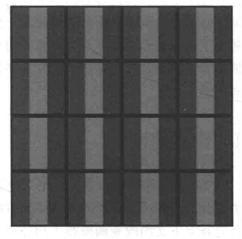
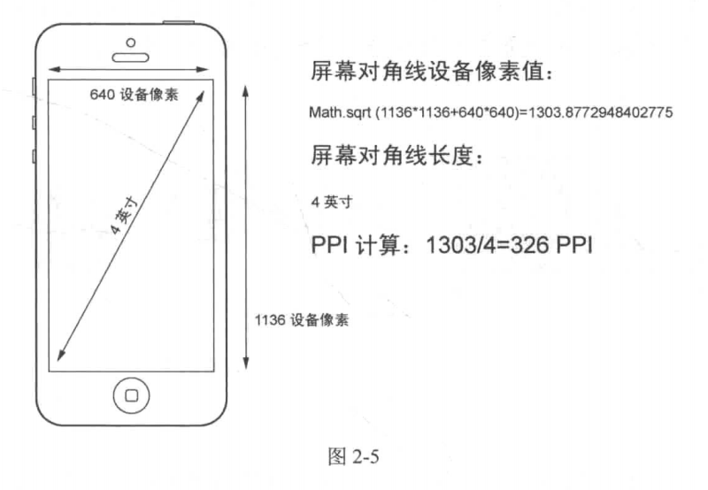

# 第 2 章 -- 响应式中要面对的问题

## 本站目录 (Catalog)
- 2.1 像素密度
- 2.2 CSS 像素
- 2.3 视口
    + 2.3.1 桌面浏览器的视口
    + 2.3.2 移动设备浏览器的视口
    + 2.3.3 设备宽度

## 生词 (New Words)
- **density ['densɪtɪ] --n.密度, 浓度**
    + population density. 人口密度
    + a population density of 50 per square kilometer.  
      每平方公里 50 人的人口密度

## 本章内容 (Content)
### 2.1 像素密度
- 在这里我们只谈论 PPI 作为设备屏幕特征的情况.
- `PPI (Pixel Per Inch)` 直译为 `像素每英寸"`; 也可以直译为 `像素密度` (在维基百科中,
  PPI 这个名词也是归属于 Pixel density). 表达的是某个量在指定面积内的密集情况.
- 你是否想过上面一直在谈论的像素究竟指的是什么? “呃, 像素不就是在书写样式时使用的
  单位`px`吗?” 其实不尽然。我们姑且把这一类像素称为`CSS像素`,留作下一节讨论。
  在谈论它们之前，我们先看看另一类像素 -- `设备像素`。
- 设备像素在英文中对应为 device pixel 或 physical pixel,所以也可译为`物理像素`。
  无论是早期的CRT显示器还是如今的 LCD 显示器，现实的原理都是通过将一系列的矩形小点排列成
  一个大的矩形，让不同的小点呈现不同的颜色，最终来组成一幅完整的图像。例如，图2-3 所示
  就是 LCD 显示器上一个 4x4 个设备像素排列成的矩阵。  
    
- 图 2-3 中的每一个“点”(dot) 就是设备像素。在LCD显示器中，每一个设备像素又是由 3 个
  分别显示红绿蓝的子像素(subpixel)组成. LCD显示器的显示功能是通过调整每一个设备像素的
  子像素明暗来实现的，具体原理如图 2-4 所示。
- **像素密度中所指的像素是设备像素**，鉴于设备像素亦可称为物理点，所以 PPI 也可以称为
  `DPI`(dots per inch, 每英寸点数)。但请注意这样的等价只有在描述显示设备的特征时才成立。
  在其他行业的上下文中两者含义并不同。
- 设备像素密度的计算方式正如它英文定义的一样所见即所得: 使用对角线上的设备像素值, 除以对角线
  的长度(英寸), 即为像素密度. 图 2-5 为 iPhone 5 对应的计算像素密度的图解.  
  
- 在高清设备中, 为了解决设备像素过小的问题, `系统分辨率`下每个像素会等于多少个设备像素, 
  而这个比值称为 `设备像素比 (Device Pixel Ratio, DPR)`.
- 从另一个方面来说，iPhone 3GS和iPhone 4都保持了相同的系统分辨率一480x320，但是
  iPhone 4的设备像素达到 960*640，每一个系统分辨率下的像素由 2 个设备像素组成。这样就能
  容纳更多的细节。
- 请再次注意，放大素材的前提是被放大的素材最好有足够的尺寸和像素，否则多余的像素只能由
  系统计算出来而导致看上去模糊。这也是高清设备常常被诟病的地方。
### 2.2 CSS 像素
### 2.3 视口
- 2.3.1 桌面浏览器的视口
- 2.3.2 移动设备浏览器的视口
- 2.3.3 设备宽度