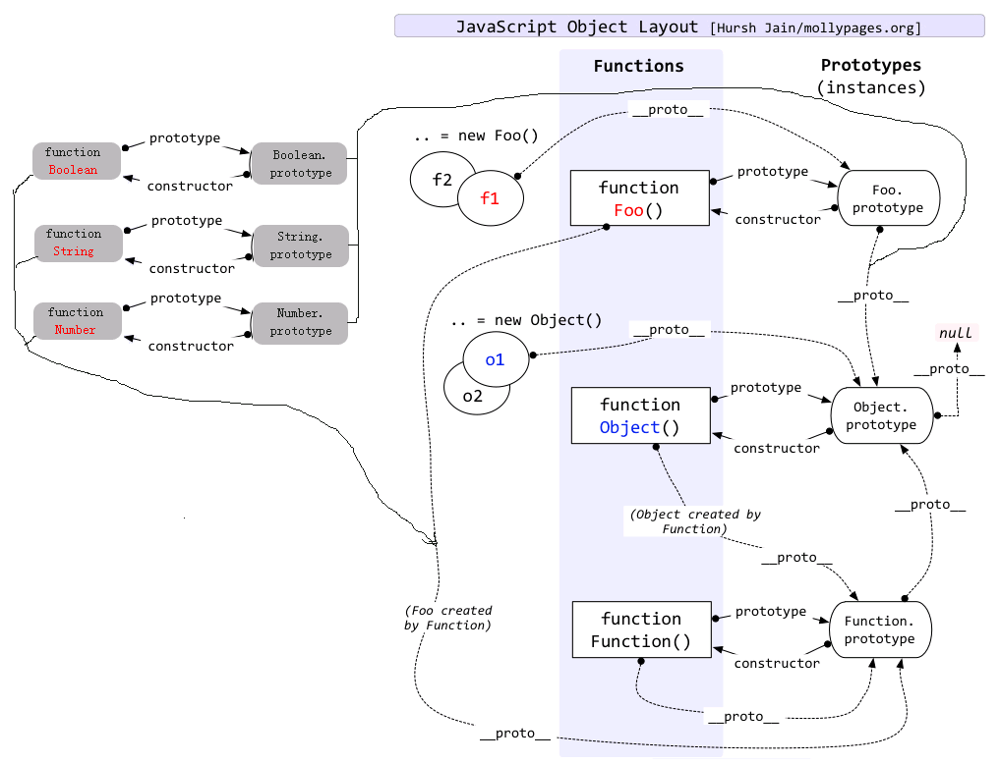

## Created On: 201609023

#### 0.如果在"提交"按钮上绑定了事件(弹出窗口之类)，"提交"按钮就不能用`</button>` 和 `<input type="submit" value="提交">`这两种写法，button和type="submit"这种方法，在点击之后会刷新页面，所以弹出提示的窗口会在闪出一瞬间消失，正确写法可以这样`<input type="button" value="登录"/>`。

#### 1.页面 input 中的内容通过 form 交到服务器，必须放在 `<form action="" method="post"></form>`标签对里。

#### 2.总要: 关于在浏览器中获取 "当前页面的可视高度" 和 "文档的总高度"的jq和js方法总结:
  - (1).jq方法:
    + ```javascript
        // jq获取当前可视窗口的高度和宽度:
        $(window).height();  $(window).width();
        // jq获取文档高度和宽度
        $(document).height();  $(document).height();
      ```
  - (2).js方法:
    + ```javascript
       // js获取当前页面可视窗口的高度和宽度(前提 `<!DOCTYPE html>` 是这种写法，以前古老的写法除外) IE,FF,Chrome 统一是:
       document.body.clientHeight;
       // IE9+, FF, Chrome 确定浏览器窗口大小(可视窗口大小)有两个新属性:
       window.innerHeight;  window.innerWidth;
       // 获取文档的高度和宽度兼容IE8的写法是:
       Math.max(document.documentElement.clientHeight, document.body.scrollHeight, document.documentElement.scrollHeight);
      ```


#### 3.jq中获取当前元素的索引的方法: 代码如下
- ```javascript
     $(".selFun .closeFun").click(function(){ 
        $(this).css("backgroundColor", "#ccc");
        var nIndex = $(".selFun .closeFun").index(this);  //获取当前元素索引的方法
        $(".selFun li").eq(nIndex).css({"display":"none"});
     });
  ```

#### 4.关于清除浮动的问题:
  - (1).如果一个div或者ul没有设置高度，子元素又设置了float:left; 那么在子元素的最后加一个同级元素`<div class="clear"></div>`css中增加.clear{ clear:both; } <br/>
    因为只有这样才可以在试调的时候得到父级元素(div/ul)的高度，而且这种做法是最多使用的一种情况。 <br/>
  - (2).如果父级元素div/ul设置了高度，那么里面的子元素即使用了float也是不用添加clear清除浮动的，因为在父级元素上增加overflow:hidden;这样已经清除浮动了。<br/>
  - (3).不清楚浮动父级div/ul会出现的问题，一.背景不能显示。 二.边框不能撑开。 三.margin设置值不能正确显示。<br/>

#### 5.box-shadow属性:
  - box-shadow: 1px 1px 3px 2px #cfcecf; //横向阴影1px, 纵向阴影1px, 模糊半径3px, 阴影展开半径2px, 颜色值。
  - box-shadow: 0 .05em .25em rgba(0, 0, 0, .5);    //

#### 6. jquery的fadeIn()是展示，fadeOut()是隐藏

#### 7. js高程:
 - chapter5: 5.2.7 -- 位置方法 ES5 为数组实例添加了两个位置方法： indexOf() 和 lastIndexOf() 。
 - chapter5: 5.6.3 String: 有两个可以从字符串中查找子字符串的方法： indexOf() 和 lastIndexOf()。
    + 这两个方法都是从一个字符串中搜索给定的子字符串，然后返子字符串的位置（如果没有找到该子字符串，则返回 -1 ）。
    + 区别在于： indexOf() 方法从字符串的开头向后搜索子字符串，而 lastIndexOf() 方法是从字符串的末尾向前搜索
        子字符串 (注意: 查找是一个从前一个从后，但是我们输出当前项时索引都是从前开始数的)。
    ​
#### 8. Chrome 中 select 下的 option 不支持 click 事件，但是支持 change 事件
$("#countryCodeObj").change(function () {
    var current = this.options[this.selectedIndex].value;
    $("#countryCode").val(current);
});

#### 9. js高程: chapter5: join()方法：数组方法。只接收一个参数，即用作分隔符的字符串，然后返回包含所有数组项的字符串
    var colors = ["red", "green", "blue"];
    alert(colors.join(",")); //red,green,blue
    alert(colors.join("||")); //red||green||blue

#### 10. js高级 5.5.5函数属性和方法 apply()和call(): 这两个方法的用途是在特定的作用域中调用函数，实际上等于设置函数体内this对象的值。
 - call 和 apply 的用途 : 《js编程实践和设计模式》

 - apply() 接受2个参数，第一个参数制定了函数体内 this 对象的指向。第二个参数为一个带下标的集合，这个集合可以是数组，也可以为类数组， **apply 方法把这个集合中的元素作为参数传递给被调用的函数。**
    + ```javascript
         var func = function(a, b, c) {
             console.log([a, b, c]);
         };
         // 如果传入的第一个参数为 null, 函数体内的 this 会指向默认的宿主对象，在浏览器中则是 window.
         // 参数 1，2，3 被放在数组中一起传入 func 函数，他们分别对应 func 参数列表中的 a,b,c。
         func.apply(null, [1, 2, 3]);
      
         // 有时候我们使用 call 或者 apply 的目的不在于指定 this 指向，
         // 而是另有用途，比如借用其他对象的方法，那么我们可以传入 null 来代替某个具体的对象:
         Math.max.apply(null, [1, 2, 5, 3, 6]);	// 输出 6
       ```
    + (1).改变 this 指向: 最常见的用途是改变函数内部的 this 指向
        - 更多见示例: ECMAScript6-Study\Javascript设计模式与编程实践\第一部分--基础知识\第2章\P33-借用其他对象的方法.js
        - ```javascript
            var obj1 = { name: "sven" };
            var obj2 = { name: "anne" };
            window.name = "Window";
            var getName = function () { console.log( this.name ); };
            getName();
            getName.call( obj1 );	// sven
            getName.apply( obj2 );	// anne
          
            document.getElementById("div1").onclick = function () {
                var func = function () {
                    console.log( this.id );	// div1
                };
                func.call( this );
            }
          ```
    + (2.) Function.prototype.bind
        - 示例见: ECMAScript6-Study\Javascript设计模式与编程实践\第一部分--基础知识\第2章\P32-Function.prototype.bind实现.js
    + (3.) 借用其他对象的方法
        - ```javascript
            (function () {
                Array.prototype.push.call( arguments, 3 );
                console.log( arguments );	// [ 1, 2, 3 ]
            })(1, 2)
          ```

 - **示例:使用call方法调用父构造函数**
    + ```javascript
         function Product(name, price){
             this.name = name;
             this.price = price;
             if(price < 0){
                 throw RangeError("Cannot create product" + this.name + "with a negative price")
             }
         }
         function Food(name, price){
             Product.call(this, name, price);
             this.category = "food";
         }
         /*---上面Food()构造函数调用Product()构造函数 "等同于"(=) 下面这个写法---*/
  
         function Food(name, price){
             this.name = name;
             this.price = price;
             if(price < 0){
                 throw RangeError("Cannot create product" + this.name + "with a negative price")
             }
             this.category = "food";
         }
  
         /**使用call()方法调用匿名函数 : 在for循环内部，我们创建了一个匿名函数，通过调用该函数的call方法,将每个数组元素作为
            指定的this值执行了那个匿名函数。这个匿名函数的主要目的是给每个数组元素对象添加一个print方法，这个print
            方法可以打印出各元素在数组中的正确索引号。当然，这里不是必须得让数组元素作为this值传入那个匿名函数(普通参数就可以),
            目的是为了演示call的用法 **/
         var animals = [
             {species:"Lion", name: "XinBa"},
             {species:"Whale", name: "Blue"}
         ];
         for(var i=0; i<animals.length; i++){
             (function(i){
                 this.print = function(){
                     console.log("#" + i + "" + this.species + ":" + this.name);
                 }
             }).call(animals[i], i)
         }
  
         
         /**使用call()方法调用函数并且指定上下文的this :下面的例子中，当调用greet方法的时候，该方法的 this 值会绑定到 i 对象。**/
         function greet(){
             var reply = [this.person, "Is An Awesome", this.role].join(" ");
             console.log(reply);
         }
         var called= {
             person: "Nicholas C.Zakas",
             role: "Javascript Developer"
         };
         greet.call(called); //Nicholas C.Zakas Is An Awesome Javascript Developer
      ```


#### 11.表格清除格与格之前的间距的样式: border-collapse: collapse;

#### 12.手机端页面解决ios的button按钮的各种bug问题
   - 解决点击input textarea出现边框的问题
        + input:focus, input:active, input:link, input:visited{ outline:none;border:0;} <br/>
        + textarea:focus, textarea:active, textarea:link, textarea:visited{ outline:none;border:0;} <br/>

   - 解决ios苹果button圆角和渐变的问题
        + input[type=button], input[type=submit], input[type=file], button { cursor: pointer;  -webkit-appearance: none; } <br/>

   - 解决ios移动端点击按钮会出现暗色背景的问题
        + input{  -webkit-appearance:none; /*去除系统默认的样式*/ -webkit-tap-highlight-color: rgba(0, 0, 0, 0); /* 点击高亮的颜色*/ } <br/>
#### 12-2 解决 Chrome  下的问题
   - 取消chrome下input和textarea的聚焦边框：
        + input,button,select,textarea{outline:none}
   - 取消chrome下textarea可拖动放大：
        + textarea{resize:none}

#### 13.自己常用到的正则判断
  - 1. 判断手机号的: /^0?1[3|4|7|5|8][0-9]\d{8}$/
    ```javascript
        if(/^0?1[3|4|5|8][0-9]\d{8}$/.test(1866666666)){
    ​       return null;
        }
    ```
  - 2.判断验证码: `/^[0-9]{6}$/` 
  - 3.判断身份证: `/(^\d{15}$)|(^\d{17}([0-9]|X)$)/`
  - 4.判断银行卡: `/([0-9]{17}([0-9]|X|x))|([0-9]{15})/` 
  - 5.判断邮箱: `/^[a-z0-9]+([._\\-]*[a-z0-9])*@([a-z0-9]+[-a-z0-9]*[a-z0-9]+.){1,63}[a-z0-9]+$/`

#### 14.字体两端对齐
 - ```css
       .sty {
           text-align:justify;
           text-justify:distribute-all-lines;/*ie6-8*/
           text-align-last:justify;/* ie9*/
           -moz-text-align-last:justify;/*ff*/
           -webkit-text-align-last:justify;/*chrome 20+*/
       }
   ``` 
​

####  15.outerHTML 属性
 - ```base
    // 在读模式下， outerHTML 返回调用它的元素及所有子节点的 HTML 标签。在写模式下，
    // outerHTML会根据指定的 HTML 字符串创建新的 DOM子树，然后用这个DOM子树完全替换调用元素。下面是一个例子。
    <div id="content">
        <p>This is a <strong>paragraph</strong> with a list following it.</p>
        <ul>
            <li>Item 1</li>
            <li>Item 2</li>
            <li>Item 3</li>
        </ul>
    </div>
    var allContent = content.outerHTML;  // allContent 就输出上面所有的代码
   ```
####  16.cloneNode() 方法
 -  cloneNode() 方法不会复制添加到 DOM 节点中的 JavaScript 属性，例如事件处理程序等。
    这个方法只复制特性、（在明确指定的情况下也复制）子节点，其他一切都不会复制。

####  17.函数声明 函数表达式 和 匿名函数
 ```javascript 
   // 这段代码会导致语法错误，因为 js 将 function 关键字当作一个函数声明的开始，而函数声明后面不能跟圆括号。
   function(){
      //这里是块级作用域
   }();

   // 然而，函数表达式的后面可以跟圆括号。要将函数声明转换成函数表达式，只要像下面这样给它加上一对圆括号即可。
   (function(){
        //这里是块级作用域
   })();

   // 立即执行的匿名函数生命方式还有
   (function(){
   }());
 ```

####  18.响应式网页的头部
  - viewport 是网页默认的宽度和高度，网页宽度默认等于屏幕宽度 (width = device-width), 原始缩放比例 (initial-scale=1) 为1.0，
    即网页初始大小占屏幕面积的100%, maximum-scale允许用户缩放到的最大比例，user-scalable允许用户是否可以手动缩放* <br>
      `meta name="viewport" content="width=device-width, initial-scale=1, maximum-scale=1.0, user-scalable=no" `
      `meta http-equiv="X-UA-Compatible" content="IE=edge,chrome=1"`

  - 忽略将页面中的数字识别为电话号码，忽略android平台中对邮箱地 址的识别
    `meta content="telephone=no,email=no" name="format-detection"`

####  19.  media总结
  - @media only screen and (max-width:480px){ /* 不大于480px 包含了iphone 4, 5, 6, 6+ */} <br>
  - @media only screen and (min-width:480px) and (max-width:960px){ /*不小于480px不大于960px的判断*/ }
  - @media only screen and (min-width:960px) and (max-width:1440px){/*不小于960px不大于1440px的判断*/}
  - @media only screen and (min-width:1440px){} <br>
  - @media only screen and (min-width:2000px){} <br>

#### 20.String对象的 ★★★★ split()方法：基于制定的分隔符，把一个字符串分割为一个字符串数组。
 - ```javascript
       // 取得当前元素的className的数量
       function getClassNum(ele){
           //split()基于指定的分隔符将一个字符串分割成多个子字符串，并将结果放在一个数组中。
           return ele.className.split(/\s+/);
       }
    ```

#### 21.mouseover和mouseenter的区别：(js高级 13.4.3节)<br/>
  mouseenter ：在鼠标光标从元素外部首次移动到元素范围之内时触发。这个事件不冒泡，而且在光标移动到后代元素上不会触发。<br/>
  mousemove ：当鼠标指针在元素内部移动时重复地触发。


#### 22. $.ajaxSetup()方法设置全局ajax默认选项。
  为所有AJAX请求设置默认 URL 和 success 函数：
  `$("button).click(function(){
​	  $.ajaxSetup({
​		  url: "demo_ajxa_load.txt",
​		  success: function(result){
​			  $("div").html(result);
​		  }
​	  })
​	  $.ajax();
  })`
​
####  23.3.6.7 break 和 continue 语句: break和continue语句用于在循环中精确地控制代码的执行。
 - break 语句会立即退出循环，强制继续执行循环后面的语句。
    + ```javascript
        function breakExample() {
            var num = 0;
            for (var i =1; i < 10; i++) {
                if (i % 5 === 0) {
                    break;
                }
                num++;
            }
            return num;
        }
        console.log(breakExample())
      ``` 
 - continue 语句虽然也是立即退出循环，但退出循环后会从循环的顶部继续执行。
    + ```javascript
        function continueExample() {
            var num = 0;
            for (var i =1; i < 10; i++) {
                if (i % 5 === 0) {
                    continue;
                }
                num++;
            }
            return num;
        }
        console.log(continueExample())
      ``` 

#### 24.JSON 对象有两个方法： stringify() 和 parse() 在最简单的情况下，这两个方法分别用于把JavaScript对象序列化为 JSON 字符串和把 JSON 字符串解析为原生 JavaScript 值。

####  25.
 - ```javascript
       function a(){
           var i=0;
           function b(){
               console.log(++i);
           }
           return b;
        }
        var c = a();
        c();
        /*这里先调用函数a, 然后在a内部执行函数b()，
        由于作用域链存在(你也可以说成闭包)，b访问父级函数a的i，然后前置递增+1，
        最后return 返回 b函数的指针赋值给c, c后面加()调用*/
    ```

#### 26.确定一个值是哪种基本类型可以使用 typeof 操作符，而确定一个值是哪种引用类型可以使用 instanceof 操作符。

#### 27.最新的ECMSScript标准定义了7中数据类型: (17-5-21)
```base
    * 0. js高程--chapter3.4--数据类型
    *      + 6 种基本数据类型():
    *          - Undefined : Undefined类型，一个没有被赋值的变量会有一个默认值undefined.
    *          - Null      : Null类型只有一个值: null。
    *          - Boolean   : 布尔类型表示一个逻辑实体，可以有两个值: true和false
    *          - Number
    *          - String
    *          - Symbol (ECMAScript 6新定义)

    *      + 1 种复杂数据类型: Object
    *
    * 1. js高程--chapter5--应用类型：
    *      + (1.) Object   类型
    *      + (2.) Array    类型
    *      + (3.) Date     类型
    *      + (4.) RegExp   类型
    *      + (5.) Function 类型
    *      + (6.) 基本包装类型
    *              - Boolean 类型
    *              - Number  类型
    *              - String  类型
    *      + (7.) 单体内置对象
    *              - Global 对象
    *              - Math   对象
    *
    *
    * 2. 确定一个值是哪种基本类型可以使用 typeof 操作符， 而确定一个值是那种引用类型使用 instanceof 操作符
    *
    * 3. Object.prototype.toString.call(ele) :通过获取 Object 原型上的 toString 方法，让方法中的
    *  this 变为需要检测的数据类型，并且让方法执行。
    *      var obj = {name: "WANG"};
    *      var str =      "250";
    *      var bool =     true;
    *      var arr =      [20, 30];
    *      console.log(Object.prototype.toString.call(obj));     // [object Object]
    *      console.log(Object.prototype.toString.call(str));     // [object String]
    *      console.log(Object.prototype.toString.call(bool));    // [object Boolean]
    *      console.log(Object.prototype.toString.call(arr));     // [object Array]
```

#### 28."标准的"对象,和函数  (17-5-21)
  - (1.) 一个 Javascript 对象就是键和值之间的映射.。键是一个字符串（或者 Symbol） ，值可以是任意类型的值。 这使得对象非常符合 哈希表。
  - (2.) 函数是一个附带可被调用功能的常规对象。(觉得这个解说很好)

#### 29.css强制换行和超出隐藏实现
 - (1). word-break: break-all; 只对英文起作用，以字母作为换行依据。假设div宽度为450px，它的内容就会到450px自动换行，如果该行末端有个很长的英文单词，它会把单词截断，一部分保持在行尾，另一部分换到下一行。
 - (2). word-wrap: break-word; 只对英文起作用，以单词作为换行依据。例子与上面一样，但区别就是它会把整个单词看成一个整体，如果该行末端宽度不够显示整个单词，它会自动把整个单词放到下一行，而不会把单词截断。
 - (3). white-space: pre-wrap; 只对中文起作用，强制换行。

####  30. 合并2个数组到对象中，再把对象推入到数组中
- ```javascript
    // 合并2个数组到对象中，再把对象推入到数组中
    var types3 =  [];
    var arr1 = [ '公司类合作', '个人类合作', '混合类合作' ];
    var arr2 = [ 20, 21, 22 ];
    for(var i=0; i<arr1.length; i++){
        var obj = {};
        obj.label = arr1[i];
        obj.value = arr2[i];
        types3.push(obj);
    }
    console.log(types3);
  ```

#### 31 . 相對路徑:
  - ./  当前目录;
  - ../ 父级目录;
  - / 根目录。

#### 32 . js 表单提交: onlyForm.submit();
#### 33 . 日期格式化
 - ```javascript
    function getTime(time) {
        if (time !== "" || time !== undefined) {
            var data, year, month, day, hour, minute, second;
            data =  new Date(time);
            year =  data.getFullYear();
            month = data.getMonth() + 1;
            // month = month < 10 ? '0' + month : month;
            day =   data.getDate();
            // hour =  data.getHours();
            // minute = data.getMinutes();
            // second = data.getSeconds();
            return  year + "-" + month + "-" + day;
        }
    }
   ```
#### 34 . 给 placeholder 设置样式
 - input::-webkit-input-placeholder { letter-spacing:1px; }
 - input::-moz-placeholder { letter-spacing:1px; }
 - input:-ms-input-placeholder { letter-spacing:1px; }

#### 35、银行卡添加和删除空格
 - 见示例: js-sundry-goods\JS--方法总结\2019\20190218--表单数字添加空格.html
 - [在线示例](https://github.com/PayneW/js-sundry-goods/blob/master/JS--%E6%96%B9%E6%B3%95%E6%80%BB%E7%BB%93/2019/20190218--%E8%A1%A8%E5%8D%95%E6%95%B0%E5%AD%97%E6%B7%BB%E5%8A%A0%E7%A9%BA%E6%A0%BC.html)

#### 36. Array.prototype.
 - 0.将 arguments (类数组对象)转换为数组:  Array.prototype.slice(arguments)
 - 1.把 NodeList 对象转换为数组(比如一组li):  Array.prototype.slice.call(lis);
 - 2.取得 arguments 类数组的第一项: Array.prototype.shift.call(arguments);

#### 37. Object
  - ES5 - 提供了 Object.create 方法，可以用来克隆对象。 
      + Object.create("要克隆的对象", "新对象定义额外属性的对象(可选,一般不写)")
      + js高程-P170: ECMAScript 5 通过新增 Object.create() 方法规范化了原型式继承。这个方法接收两个参数：
        - 第 1 个: 用作新对象原型的对象。(在传入一个参数的情况下 Object.create() 与 object() 方法的行为相同。)
        - 第 2 个: 一个为新对象定义额外属性的对象(可选)。
        - ```javascript
             // 示例1 : javascript 高程 -- 6.3.4 原型式继承
             var person = {          
                 // 基本类型值属性
                name: "Nicholas",
                 // 引用类型值属性。(tips-P171: 不过不要忘了，包含引用类型值的属性始终都会共享相应的值，
                 // 就像使用原型模式一样。)
                 friends: ["Shelby", "Court", "Van"],
             };
             var anotherPerson = Object.create(person);
             anotherPerson.name = "Grey";
             anotherPerson.friends.push("Rob");
            
             var yetAnotherPerson = Object.create(person);
             yetAnotherPerson.name = "Linda";
             yetAnotherPerson.friends.push("Barbie");
             // person.friends 不仅属于 person 所有，而且会被 anotherPerson 以及 yetAnotherPerson 共享。
             // 实际上，这就相当于又创建了 person 对象的 2 个副本。
             console.log(person.friends);    // "Shelby,Court,Van,Rob,Barbie"
          ```
        - ```javascript
              // 示例2 : JS-book-learning/《js设计模式与编程实践》/第一部分--基础知识/第1章/1st-面向对象的Javascript.js
              const Plane = function () {
                  this.blood = 100;
                  this.attackLevel = 1;
                  this.defenseLevel = 1;
              };
              
              let plane = new Plane();
              plane.blood = 500;
              plane.attackLevel = 10;
              plane.defenseLevel = 7;
              
              let clonePlane = Object.create(plane);
              console.log(clonePlane);            // Plane {}
              console.log(clonePlane.blood);      // 500
              console.log(clonePlane.attackLevel);// 10
          ```
  - ES5 - Object.keys() 方法取得对象上所有可枚举的实例属性。 这个方法接受一个对象作为参数，返回一个包含所有可枚举属性的字符串数组。

      + 示例: github-clone\js-sundry-goods\js--A语法--MDN文档\js高程---Object.keys().js
  - ES5 - Object.getOwnPropertyNames(): 【取得自身的属性名】。 js高程 - Chapter 6
  - ES5 - Object.getPrototypeOf() 方法返回任意指定对象的原型。对象原型的真实值被存储在内部专用属性 [[Prototype]] 中，调用 getPrototypeOf() 方法返回存储在其中的值。
  - ES6 - Object.is(): [P76] 弥补全等运算符的不准确运算。 比如之前 +0等于-0, NaN不等于NaN
  - ES6 - Object.assign()
  - ES6 - Object.setPrototypeOf() 方法可以改变任意指定对象的原型。接受2个参数: 1.被改变原型的对象 2.替代第一个参数原型的对象。

      + 示例:《深入理解ES6》-学习笔记\4th chapter--扩展对象的功能性\4th-扩展对象的功能性.js

#### 38 .localStorage 对象
- ```javascript
     // 使用方法存储数据
     localStorage.setItem("name", "Nicholas");
     // 使用属性存储数据
     localStorage.book = "Professional JavaScript";

     // 使用方法读取数据
     var name = localStorage.getItem("name");
     // 使用属性读取数据
     var book = localStorage.book;
  ```

#### 39. Node.js 和 ES6 导入导出:
  + Node.js 导入 require(), 导出 exports || module.exports
 ```base
      1. 导出  exports || module.exports
         let funName = function () {
             return "The nam is ....";
         }
         exports.funName = funName;

         module.exports = { a: 2 }

      2. 导入: require 一個模块，赋值给变量
         let foo = require("./foo.js");
         console.log(foo.funName());

         console.log( foo.a );
 ```


   + ES6 导入 import， 导出 export
   ```base
          ---------------export.js

          // 0.导出基本语法见:
               13th chapter--用模块封装代码\1.export导出.js

          // 1. 导出默认值 :
          // (1). 导出一个函数: 由于函数被模块所代表，因而它不需要一个名称。
          export default function (num1, num2) {
               return num1 + num2;
          }

          // (2). 导出一个对象 ( Vue 框架中用的都此写法 )
          export default {
               // 实际上这个 name 属性不是必须的，原因同上。
               name: "App",
               components: {
                   BaseInputText, TodoListItem
               },
               data () {
                   return {
                       newTodoText: "",
                       odos: []
                   }
               },
               methods: {
                   addTodo () {},
                   removeTodo (idToRemove) {}
               }
          }


           -----------import.js
          // 0. 导入基本语法见:
                13th chapter--用模块封装代码\2.import导入.js

          // 1.导入默认值:
               import BaseInputText from "./BaseInputText.vue";
               import TodoListItem from "./TodoListItem.vue";

   ```
#### 40. 客户区坐标位置 ( clientX 和 clientY ):
  + 鼠标事件都是在浏览器视口中特定位置上发生的。这个位置信息保存在事件对象的 clientX 和 clientY 属性中。
    所有浏览器都支持这两个属性，他们的值标识事件发生时鼠标指针在视口中的水平和垂直坐标。 event.clientX , event.clientY
  + [clientX and clientY](./images/clientX%20and%20clientY.png)

#### 41. 上滑显示错误弹框
 ```javascript 
	var errBoxPosTop = getPosition(errBoxEleConfig.errorBoxWall).top;
	var scrollTop = document.documentElement.scrollTop || document.body.scrollTop;
	function scrollBarRoll() {
	  scrollTop = scrollTop - 12;
	  window.scrollTo(0, scrollTop);
	  if (parseInt(scrollTop) > parseInt(errBoxPosTop)) {
		  requestAnimationFrame( scrollBarRoll );
	  }
	  if (parseInt(scrollTop) < parseInt(errBoxPosTop) ) {
		  window.scrollTo(0, 0);
	  }
	}
	scrollBarRoll();
 ```

#### 42. js 经典原型图
 <div style="overflow: hidden; width: 600px; height: 700px;">
    
 </div>


#### 43 构造函数的方法内可以动态给构造函数添加属性
- ```javascript
    // Vue-study\Vue--文档+语法\Vue-双向数据绑定\Vue双向绑定-基础示例讲解\Vue双向数据绑定原理-2.html
    // 订阅者 Watcher
    function Watcher (vm, node, name, nodeType) {
        Dependence.target = this;
        this.name = name;
        this.node = node;
        this.vm = vm;
        this.nodeType = nodeType;

        // 函数内调用 update() 方法，给节点赋值
        this.update();

        Dependence.target = null;
    }
    Watcher.prototype = {
        update: function () {
            this.get();
            if (this.nodeType === "text") {
                this.node.nodeValue = this.value;
            }
            if (this.nodeType === "input") {
                this.node.value = this.value;
            }
        },
        get: function () {
            // 在方法内给构造函数添加 value 属性
            this.value = this.vm[this.name];
        }
    };
  ```